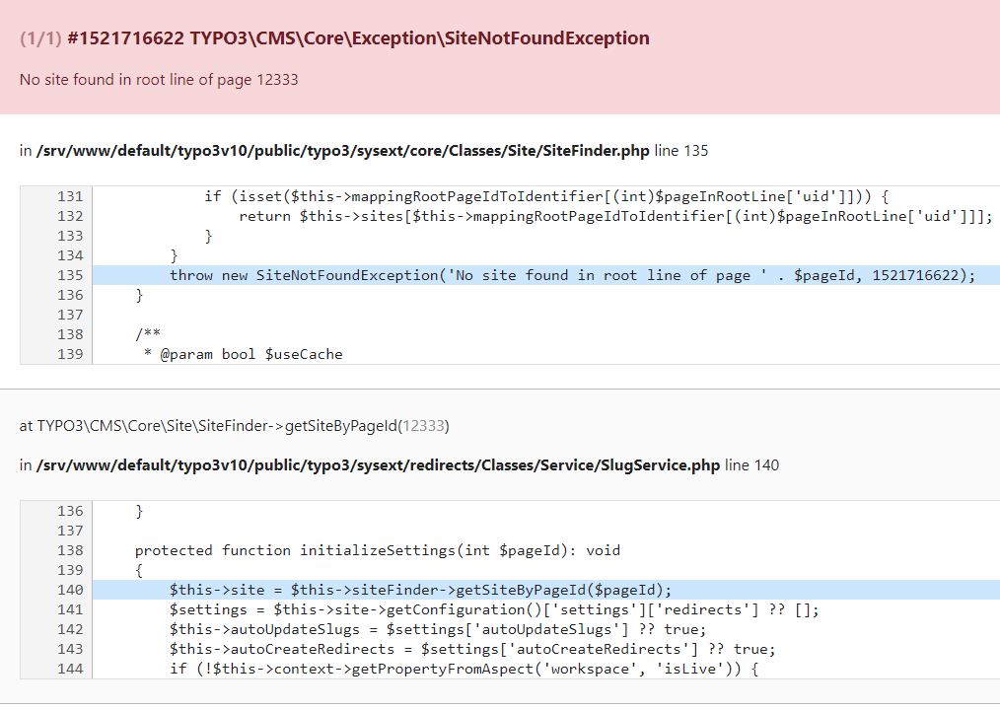

.. include:: /Includes.rst.txt

==========================
TYPO3 Exception 1521716622
==========================

.. note::
   If you encountered this exception, please help others by providing
   information about how you got this error. Especially if you have a solution,
   please add it to this page by following the :ref:`"Edit on GitHub" workflow
   <docs-contribute-github-method>`!

.. container::

   .. container::

      |Error-message.png|

      .. container::

         .. container::

When a page of type shortcut with external URL is created the slug that
is automatically created looks like this: "/https//wwwfacebookcom/...".

Changing this slug to something like "/my-company" is raising the
error-message shown on the screenshot.

