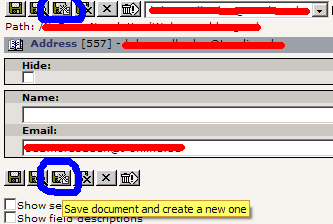

.. include:: /Includes.rst.txt

========================================
Extension Development, add user TSConfig
========================================

.. container::

   **Content Type:** `HowTo <https://wiki.typo3.org/Category:HowTo>`__
   [deprecated wiki link].

.. container::

   notice - Newer documentation available

   .. container::

      `TSconfig Reference » Using and setting
      TSconfig <https://docs.typo3.org/m/typo3/reference-tsconfig/master/en-us/UsingSetting/Index.html>`__

.. container::

   warning - No longer supported TYPO3 version

   .. container::

      This page contains information for older, no longer maintained
      TYPO3 versions. For information about TYPO3 versions, see
      `get.typo3.org <https://get.typo3.org>`__. For information about
      updating, see the `Installation & Upgrade
      Guide <https://docs.typo3.org/m/typo3/guide-installation/master/en-us/>`__

To add a button "Save and create new" to the tt_address table, add this
to your ext_tables.php file

.. container::

   .. container::

      |image1|

      .. container::

         .. container::

         "Save and create new"-Button

:

.. container::

   `PHP
   Script <https://wiki.typo3.org/wiki/Help:Contents#Syntax-Highlighting_for_PHP-Code>`__
   [deprecated wiki link]

.. container::

   ::

       // add save and new button to the form
       t3lib_extMgm::addUserTSConfig('options.saveDocNew.tt_address=1');

To find out more about TSconfig, look here:
https://docs.typo3.org/typo3cms/TSconfigReference/

