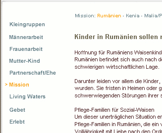

.. include:: /Includes.rst.txt

=======
Sandbox
=======

Here's the place you can try out everything what the `WikiWiki-Markup
makes possible <https://wiki.typo3.org/Help:Contents>`__ [deprecated
wiki link]! Have fun! --`Daniel
Brüßler <https://wiki.typo3.org/User:Patchworker>`__ [deprecated wiki
link] 10:27, 2 March 2007 (CET)

Test no-spam-mode
=================

capchta-check 日本語 !

Tolles Tool!

**Opstartsvirksomhed** Er du i færd med at etablere din egen virksomhed,
men mangler kapital og sparring til at komme videre, så kontakt os for
en fuldstændig uforpligtende samtale. Her vil vi på 1-3 timer gennemgå
din ide og plan med dig og sammen med dig finde ud af om vi kan være til
nytte for hinanden.

Test

Test utf-8 - edit test of the whole page with iPad
==================================================

äöüß

日本語 !

ĄĆĘŁŃÓŚŻŹ ąćęłńóśźż

Simple text section
===================

text before, text after this.

just testing, with my own username. testing as other user

external link simple
====================

-  `external link with target \_blank
   automatically <https://www.google.com>`__

Image with link
===============

|T3DD09 Developer days|

Forge and GitHub
================

some test values for GitHub issues
----------------------------------

-  An invalid issue number:

   -  [ERROR: Cannot get content for github "15200"]

-  Only a number:

   -  

      .. container::

         Use the github tag in this way:
         <github>GitHubUsername/RepoName/12345</github> or provide the
         full URL to an issue or a Pull Request

-  `1: TYPO3-Documentation/TYPO3CMS-Guide-Installation - Update
   Index.rst [closed; merged; assigned to
   fsuter] <https://github.com/TYPO3-Documentation/TYPO3CMS-Guide-Installation/pull/1>`__
-  `20: TYPO3-Documentation/TYPO3CMS-Reference-CodingGuidelines - Update
   Index.rst [closed; merged; assigned to
   sypets] <https://github.com/TYPO3-Documentation/TYPO3CMS-Reference-CodingGuidelines/pull/20>`__
-  `152: TYPO3/TYPO3.CMS - small change [closed; assigned to
   TYPO3IncTeam] <https://github.com/TYPO3/TYPO3.CMS/pull/152>`__
-  A full URL; merged:

   -  `163: TYPO3-Documentation/TYPO3CMS-Reference-Typoscript - Correct
      the <picture> descriptions [closed; merged; assigned to
      marble] <https://github.com/TYPO3-Documentation/TYPO3CMS-Reference-Typoscript/pull/163>`__

-  An issue (and no Pull Request) - should not have HASPATCH in tooltip.

   -  `48: TYPO3-Documentation/TYPO3CMS-Reference-Typoscript - Fix
      includeLibs example [closed; assigned to
      Chrissitopher] <https://github.com/TYPO3-Documentation/TYPO3CMS-Reference-Typoscript/issues/48>`__

-  Still open, so no "assigned to"

   -  `94: kaystrobach/TYPO3.piwikintegration - Support Matomo Tag
      Manager
      [open] <https://github.com/kaystrobach/TYPO3.piwikintegration/issues/94>`__

some test values for Forge issues
---------------------------------

-  An invalid issue number:

   -  

      .. container::

         Use the issue tag in this way: <issue>12345</issue>

-  [ERROR: Cannot get content for issue "981"] (no access)
-  [ERROR: Cannot get content for issue "168000"] (does not exist)
-  `3004: TYPO3 Core - Recycler: Versioned records are not handled by
   recycler [Closed] <https://forge.typo3.org/issues/3004>`__
-  `7459: TYPO3 Core - Filter allowed content element types by column
   [Closed; assigned to Jo
   Hasenau] <https://forge.typo3.org/issues/7459>`__
-  `10431: TYPO3 Core - Caching result
   [Closed] <https://forge.typo3.org/issues/10431>`__
-  `86776: TYPO3 Core - No UTF-8 with BOM files
   [Closed] <https://forge.typo3.org/issues/86776>`__
-  `25470: TYPO3 Core - $GLOBALS['TYPO3_CONF_VARS']['BE']['unzip_path']
   setting used with and without unzip command
   [Closed] <https://forge.typo3.org/issues/25470>`__
-  `3506: TYPO3 Core - Recycler: Possible security issue
   [Rejected] <https://forge.typo3.org/issues/3506>`__
-  `7889: forge.typo3.org - SVN repository not created for project
   [Closed] <https://forge.typo3.org/issues/7889>`__
-  `23386: TYPO3 Core - tt_news does not display ###FILE_LINK### in
   single view [Closed] <https://forge.typo3.org/issues/23386>`__
-  `13800: TYPO3 Core - Add user-agent header [Closed; assigned to
   Philipp Gampe] <https://forge.typo3.org/issues/13800>`__

other
=====

.. container::

   notice - Note

   .. container::

      Now please type in the answer of this questions:

      -  What shall be changed here?
      -  What is your name?

| 
| urlrewrite-test2

--------------

**Schalom Meiki!** You can try this for hebrew-parts ->

abcdef

::

   
abcdef

Best is to use it for **EVERY** section and not for the whole page.
Because somebody could delete the

::

   
 at the end of the page when one klicks on the last edit-button.

Other solutions is that: I could create a template for you to solve this
problem. So you would type {{HEB}} at the [beginning] of a page and
{{HEBEND}} at the end. --`Daniel
Brüßler <https://wiki.typo3.org/User:Patchworker>`__ [deprecated wiki
link] 12:10, 11 June 2007 (CEST)

Same hebrew text - using a p tag
--------------------------------

שלום

`W3C:Language information and text
direction <https://www.w3.org/TR/html401/struct/dirlang.html#h-8.2>`__

| But other Wiki directives do not work - maybe you can show me an
  example of a template ?
| Yours,
| Meiki

Overview
========

-  Button  one
-  Button two

Level 1 Überschrift
-------------------

-  Button three

   -  Button three.one

-  Button four

   -  Button four.one

      -  Button four.one.one

| 
| asdfsdfasdfasdfsadfsdafasdfa

Japanese text - now again utf8 - Edit Test with iPad
====================================================

日本語 !

So, let's See, if the iPad can handle the japanese UTF-8 chars in this
section ... Great, it **does** handle it properly! And: the JavaScript
of the simple-Editor works. The RichTextEditor does not work, it's not
possible to set the Cursor, because Safari "thinks" it has do move tho
whole page instead. But no problem, the simple Editor is enough.

Snippet title
=============

Ich glaub ich habs gerafft. External Link:
`[1] <http://blog.coupdeprojecteur.net/reseaux/la-sandbox.seo>`__ [not
available anymore]

Image, which links to a different page: |T3CON07.gif|

extension links to TER
======================

fast version: `cal <https://extensions.typo3.org/extension/cal/>`__

UPLOAD-tests
============

| `File:!test.pdf <files/!test.pdf>`__
| |Navigation.png|

Links
=====

| Link `typo3.org <http://www.typo3.org>`__
| `TYPO3 Association <http://association.typo3.org>`__

Code
====

.. container::

   `PHP
   Script <https://wiki.typo3.org/wiki/Help:Contents#Syntax-Highlighting_for_PHP-Code>`__
   [deprecated wiki link]

.. container::

   ::

      $exampleText = "Hello!";

PHP-Code
========

::

    <?php
    /**
     * Test
     */
    $x=1234;
    $zeit = time();
    $c=$zeit;
    if($zeit>$x){
      $c='abc'.$zeit; // Kommentar Apples [not available anymore]
      #path in &%$pj$ : C:\temp
    }
    ?>

Ext key
=======

-  Forge Team:
   `docteam <https://forge.typo3.org/projects/show/team-docteam>`__,
   `usability-design <https://forge.typo3.org/projects/show/usability-design>`__
   [not available anymore],
   `typo3cms-core <https://forge.typo3.org/projects/show/typo3cms-core>`__
-  Forge issue: [ERROR: Cannot get content for issue "7872"]
-  TER link:
   `rggooglemap <https://extensions.typo3.org/extension/rggooglemap/>`__

some other text

some other text

some other text

some other text

some other text

some other text

some other text

some other text

some other text

some other text

some other text

some other text

some other text

some other text

Wiki-Table
==========

== ==
h1 h2
c1 c2
c3 c4
== ==

Wiki-Table of a Navigation-menu
===============================

+-----------------------------------+-----------------------------------+
| Git & Gerrit                      |                                   |
+-----------------------------------+-----------------------------------+
| | `Getting started with           | `Troublesh                        |
|   Git <https://wiki.typo3.o       | ooting <https://wiki.typo3.org/wi |
| rg/wiki/index.php?title=Git_Intro | ki/index.php?title=TroubleShootin |
| duction&action=edit&redlink=1>`__ | g_(Git)&action=edit&redlink=1>`__ |
|   [not available anymore]         | [not available anymore]           |
| | General introduction to Git.    | Having trouble with Git and       |
|   Read this if you never used Git | Gerrit? Look if someone already   |
|   before.                         | solved it. Have solved an issue?  |
|                                   | Add it here for others to find.   |
| | `I just want a current          | | `Tips &                         |
|   trunk <https://wiki.            |                                   |
| typo3.org/wiki/index.php?title=Gi | Tricks <https://wiki.typo3.org/wi |
| t_Clone&action=edit&redlink=1>`__ | ki/index.php?title=Tips_and_Trick |
|   [not available anymore]         | s_(Git)&action=edit&redlink=1>`__ |
| | Find out how you can get the    |   [not available anymore]         |
|   latest development version of   | | Helpful hints, tips and tricks  |
|   TYPO3.                          |   that make your life with Git    |
|                                   |   and Gerrit easier.              |
| | `I want to                      |                                   |
|   contrib                         | | `Glossary <https://wiki.typo3   |
| ute <https://wiki.typo3.org/wiki/ | .org/wiki/index.php?title=Glossar |
| index.php?title=Contribution_Walk | y_(Git)&action=edit&redlink=1>`__ |
| through&action=edit&redlink=1>`__ |   [not available anymore]         |
|   [not available anymore]         | | Don't understand what all the   |
| | If you want to contribute to    |   new words mean? Have a look at  |
|   the TYPO3 project by submitting |   the glossary to find out.       |
|   and reviewing patches, click    |                                   |
|   here.                           |                                   |
|                                   |                                   |
| `Multiple branch                  |                                   |
| setup <https://wiki.typo3.org/wi  |                                   |
| ki/index.php?title=Multiple_Branc |                                   |
| h_Setup&action=edit&redlink=1>`__ |                                   |
| [not available anymore]           |                                   |
|                                   |                                   |
| | Working on multiple branches at |                                   |
|   the same time presents some     |                                   |
|   challenges. This page contains  |                                   |
|   more information.               |                                   |
+-----------------------------------+-----------------------------------+

Test of Geshi
=============

Normal text as a test to compare the size with the highlighted text.
Normal text as a test to compare the size with the highlighted text.
Normal text as a test to compare the size with the highlighted text.
Normal text as a test to compare the size with the highlighted text.
Normal text as a test to compare the size with the highlighted text.
Normal text as a test to compare the size with the highlighted text.
Normal text as a test to compare the size with the highlighted text.
Normal text as a test to compare the size with the highlighted text.
Normal text as a test to compare the size with the highlighted text.
Normal text as a test to compare the size with the highlighted text.
Normal text as a test to compare the size with the highlighted text.

.. container::

   ::

      10 = HTML
      10.value = <em>Beispielstext</em>
      10.value.case = upper
      # überschreibt "<em>Beispielstext</em>" durch den Inhalt des Feldes header aus dem Array $cObj->data-array
      10.value.field = header

Normal text as a test to compare the size with the highlighted text.
Normal text as a test to compare the size with the highlighted text.
Normal text as a test to compare the size with the highlighted text.
Normal text as a test to compare the size with the highlighted text.
Normal text as a test to compare the size with the highlighted text.
Normal text as a test to compare the size with the highlighted text.
Normal text as a test to compare the size with the highlighted text.
Normal text as a test to compare the size with the highlighted text.
Normal text as a test to compare the size with the highlighted text.

.. container::

   ::

      /**
       * This is in syntaxhighlight tags
       *
       * Color fix for member variables
       */
      .source-cpp .me1 { color:#499; }
      .source-cpp .me2 { color:#499; }

Normal text as a test to compare the size with the highlighted text.
Normal text as a test to compare the size with the highlighted text.
Normal text as a test to compare the size with the highlighted text.
Normal text as a test to compare the size with the highlighted text.

.. container::

   `CSS
   Styles <https://wiki.typo3.org/wiki/Help:Contents#Syntax-Highlighting_for_CSS>`__
   [deprecated wiki link]

.. container::

   ::

      /**
       * This is in CSS tags
       *
       * Color fix for member variables
       */
      .source-cpp .me1 { color:#499; }
      .source-cpp .me2 { color:#499; }

Normal text as a test to compare the size with the highlighted text.
Normal text as a test to compare the size with the highlighted text.
Normal text as a test to compare the size with the highlighted text.
Normal text as a test to compare the size with the highlighted text.

.. container::

   ::

      <?php
          $v = "string";    // syntaxhighlight tags
      ?>
      html text
      <?
          echo $v;         // end of php code
      ?>

Normal text as a test to compare the size with the highlighted text.
Normal text as a test to compare the size with the highlighted text.
Normal text as a test to compare the size with the highlighted text.
Normal text as a test to compare the size with the highlighted text.
Normal text as a test to compare the size with the highlighted text.
Normal text as a test to compare the size with the highlighted text.
Normal text as a test to compare the size with the highlighted text.
Normal text as a test to compare the size with the highlighted text.

.. container::

   `PHP
   Script <https://wiki.typo3.org/wiki/Help:Contents#Syntax-Highlighting_for_PHP-Code>`__
   [deprecated wiki link]

.. container::

   ::

      <?php
          $v = "string";    // PHP tags
      ?>
      html text
      <?
          echo $v;         // end of php code
      ?>

Just another test

.. container::

   `SQL <https://wiki.typo3.org/wiki/Help:Contents#Syntax-Highlighting_for_SQL>`__
   [deprecated wiki link]

.. container::

   ::

      SELECT MatrNr AS Matrikelnummer, Name
      FROM Student;

      SELECT Vorname, Name, StrasseNr, Plz, Ort
      FROM Student
      WHERE Plz = '20095'
      ORDER BY Name;

      SELECT [DISTINCT] Auswahlliste [AS Spaltenalias]
      FROM Quelle [ [AS] Tabellenalias]
      [WHERE Where-Klausel]
      [GROUP BY (Group-by-Attribut)+]
      [HAVING Having-Klausel]
      [ORDER BY (Sortierungsattribut [ASC|DESC])+];

.. container::

   `TS
   TypoScript <https://wiki.typo3.org/wiki/Help:Contents#Syntax-Highlighting_for_TypoScript>`__
   [deprecated wiki link]

.. container::

   ::

      10 = HTML
      10.value = <em>Beispielstext</em>
      10.value.case = upper
      # überschreibt "<em>Beispielstext</em>" durch den Inhalt des Feldes header aus dem Array $cObj->data-array
      10.value.field = header

Warning Test
============

.. container::

   warning - Message

   .. container::

      Is there a problem?

.. container::

   warning - Message

   .. container::

      I am CRAZZZZZZZZZZZZZZZYYYYYYYYYYYYYYYYYYYY

tagcloud
========

.. container::

   `2005 <https://wiki.typo3.org/Category:2005>`__ [deprecated wiki
   link]  `2006 <https://wiki.typo3.org/Category:2006>`__ [deprecated
   wiki link]  `2007 <https://wiki.typo3.org/Category:2007>`__
   [deprecated wiki link] 
   `2008 <https://wiki.typo3.org/Category:2008>`__ [deprecated wiki
   link]  `2009 <https://wiki.typo3.org/Category:2009>`__ [deprecated
   wiki link]  `2010 <https://wiki.typo3.org/Category:2010>`__
   [deprecated wiki link] 
   `2013 <https://wiki.typo3.org/Category:2013>`__ [deprecated wiki
   link] 
   `Administrator <https://wiki.typo3.org/Category:Administrator>`__
   [deprecated wiki link] 
   `Blueprints <https://wiki.typo3.org/Category:Blueprints>`__
   [deprecated wiki link]  `Core
   Team <https://wiki.typo3.org/Category:Core_Team>`__ [deprecated wiki
   link]  `Delete <https://wiki.typo3.org/Category:Delete>`__
   [deprecated wiki link] 
   `Developer <https://wiki.typo3.org/Category:Developer>`__ [deprecated
   wiki link]  `DocTeam <https://wiki.typo3.org/Category:DocTeam>`__
   [deprecated wiki link] 
   `Documentation <https://wiki.typo3.org/Category:Documentation>`__
   [deprecated wiki link] 
   `Draft <https://wiki.typo3.org/Category:Draft>`__ [deprecated wiki
   link]  `ECT <https://wiki.typo3.org/Category:ECT>`__ [deprecated wiki
   link]  `Events <https://wiki.typo3.org/Category:Events>`__
   [deprecated wiki link] 
   `Extension <https://wiki.typo3.org/Category:Extension>`__ [deprecated
   wiki link] 
   `ExtensionDocumentation <https://wiki.typo3.org/Category:ExtensionDocumentation>`__
   [deprecated wiki link] 
   `Extensions <https://wiki.typo3.org/Category:Extensions>`__
   [deprecated wiki link] 
   `HowTo <https://wiki.typo3.org/Category:HowTo>`__ [deprecated wiki
   link] 
   `Installation <https://wiki.typo3.org/Category:Installation>`__
   [deprecated wiki link] 
   `Note <https://wiki.typo3.org/Category:Note>`__ [deprecated wiki
   link]  `Outdated <https://wiki.typo3.org/Category:Outdated>`__
   [deprecated wiki link] 
   `Project <https://wiki.typo3.org/Category:Project>`__ [deprecated
   wiki link]  `T3Doc <https://wiki.typo3.org/Category:T3Doc>`__
   [deprecated wiki link] 
   `T3cmsDocumentation <https://wiki.typo3.org/Category:T3cmsDocumentation>`__
   [deprecated wiki link] 
   `Translation <https://wiki.typo3.org/Category:Translation>`__
   [deprecated wiki link] 
   `Tutorial <https://wiki.typo3.org/Category:Tutorial>`__ [deprecated
   wiki link] 
   `TypoScript <https://wiki.typo3.org/Category:TypoScript>`__
   [deprecated wiki link] 

*update tagcloud*

