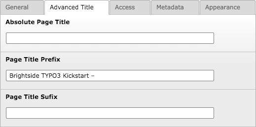

.. include:: /Includes.rst.txt

.. _advancedtitle:

=================
EXT/advancedtitle
=================

.. container::

   **Content Type:** `Extension
   Documentation </Category:ExtensionDocumentation>`__ [deprecated wiki
   link] (find more extensions in the `Extension
   Repository <https://extensions.typo3.org/extension/%7B%7B%7Bterkey%7D%7D%7D>`__
   [not available anymore])
   Using the Wiki for extension documentation is no longer recommended.
   You should add the documentation in the git repository of your
   extension and render it on docs.typo3.org or on the Git hoster, e.g.
   GitHub, see `How to document an
   extension <https://docs.typo3.org/m/typo3/docs-how-to-document/master/en-us/WritingDocForExtension/Index.html>`__
   and `Publish your
   extension <https://docs.typo3.org/m/typo3/reference-coreapi/master/en-us/ExtensionArchitecture/PublishExtension/Index.html>`__.

.. container::

   +-----------------------------------+-----------------------------------+
   | **Extension detail information**  |                                   |
   | `advanc                           |                                   |
   | edtitle <https://extensions.typo3 |                                   |
   | .org/extension/advancedtitle/>`__ |                                   |
   +-----------------------------------+-----------------------------------+
   |                                   | Advanced page title control with  |
   |                                   | prefix and sufix.                 |
   +-----------------------------------+-----------------------------------+
   | **documentation state**           | `stable </C                       |
   |                                   | ategory:Stable>`__\ **[deprecated |
   |                                   | wiki link]** |document state      |
   |                                   | list|                             |
   |                                   | `licence                          |
   |                                   | OCL <http:/                       |
   |                                   | /www.opencontent.org/openpub/>`__ |
   +-----------------------------------+-----------------------------------+
   | **forgeproject**                  |                                   |
   +-----------------------------------+-----------------------------------+
   | **mailinglist**                   |                                   |
   +-----------------------------------+-----------------------------------+
   | usergroups                        | |list of usergroups| forAdmins,   |
   |                                   | forDevelopers, forIntermediates   |
   +-----------------------------------+-----------------------------------+
   | author(s)                         | `Tanel                            |
   |                                   | Põld <htt                         |
   |                                   | ps://twitter.com/t3brightside>`__ |
   |                                   | [not available anymore]           |
   |                                   | `t3brightside                     |
   |                                   | .com <http://t3brightside.com>`__ |
   +-----------------------------------+-----------------------------------+
   | TER category                      | fe                                |
   +-----------------------------------+-----------------------------------+
   | dependency                        | TYPO3 6.2 – 7.6                   |
   +-----------------------------------+-----------------------------------+

<< Back to `Extension manuals </Overview_Extension_manuals>`__
[deprecated wiki link] page

`[edit] <https://wiki.typo3.org/wiki/index.php?title=EXT/advancedtitle&action=edit&section=0>`__
[deprecated wiki link]

**Simplistic page title manipulation by extending pages table and adding
TypoScript template.**

Features
========

-  Adds new "Advanced Title" tab to page preferences
-  TypoScript template to control title
-  tx_news single page article title support

Screenshot
==========

-  

   .. container::

      .. container::

         .. container::

            |image1|

      .. container::

         Advanced Page Title

Install
=======

-  Add TypoScript template
-  NOTE! It may interfere with other extensions manipulating the page
   title
-  Sets "page.headerData.10" and "config.noPageTitle = 2" in TypoScript
   template

.. |document state list| image:: files/Info.gif
   :target: /Template:Extension
.. |list of usergroups| image:: files/Usergroups.gif
   :target: /File:Usergroups.gif

