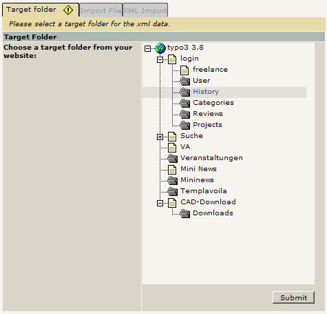

.. include:: /Includes.rst.txt
.. highlight:: php

===================================
Backend Programming, using treeview
===================================

.. container::

   notice - This information is outdated

   .. container::

      While some details may still apply in specific situations, this
      page was written for packages of TYPO3 that are no longer current.

.. container::

   warning - No longer supported TYPO3 version

   .. container::

      This page contains information for older, no longer maintained
      TYPO3 versions. For information about TYPO3 versions, see
      `get.typo3.org <https://get.typo3.org>`__. For information about
      updating, see the `Installation & Upgrade
      Guide <https://docs.typo3.org/m/typo3/guide-installation/master/en-us/>`__

.. container::

   Question:
   For which TYPO3 version does this Wiki page apply? - Sypets
   2020-04-17

   .. container::

   *Please remove "{{Question}}" when the problem is solved. See all
   questions [outdated wiki link].*

Recently I needed a possibility to let the user select a target folder
for importing a xml file in a web module. I wrote a browseable tree and
would like to share it with you. Thank you!

.. container::

   .. container::

      |image1|

      .. container::

         .. container::

         browseable tree with HTML-Eventhandler onMouseover, onMouseout
         and onClick

1) include t3lib_browsetree in your class file:

::

   require_once(PATH_t3lib.'class.t3lib_browsetree.php');

2) extend t3lib_browsetree wrapIcon and wrapTitle to add the
HTML-Eventhandler onMouseover, onMouseout and onClick to each tree
element:

::

   class localPageTree extends t3lib_browseTree {
    function wrapIcon($icon,$row)   {
     $cmd = ' onMouseover="rollover(\.$this->domIdPrefix.$row['uid'].'_'.$this->bank.'\')" onMouseout="rollout(\.$this->domIdPrefix.$row['uid'].'_'.$this->bank.'\')"';
     return '<a href="#"'.$cmd.'>'.$icon.'</a>';
    }  
    
    function wrapTitle($title,$row,$bank=0)    {       
     $cmd = ' onMouseover="rollover(\.$this->domIdPrefix.$row['uid'].'_'.$this->bank.'\')" onMouseout="rollout(\.$this->domIdPrefix.$row['uid'].'_'.$this->bank.'\')"';
     $aOnClick = 'mClick(\.$this->getId($row).'\',\.$this->domIdPrefix.$row['uid'].'_'.$this->bank.'\');';    return '<a href="#"'.$cmd.' onclick="'.htmlspecialchars($aOnClick).'">'.$title.'</a>';
    }
   }

3) include the javascript function rollover()(HTML-Eventhandler
onMouseover), function rollout()(HTML-Eventhandler onMouseout) and
function click()(HTML-Eventhandler onclick) in the document header (the
function click() select the current element and saves the id of the
element and the id of the page in a hidden form field):

::

   $this->doc->JScode = '
    <script language="javascript" type="text/javascript">                    
     function mClick(t,id) {
      old = document.getElementsByName("tx_myext[targetID]")[0].value;
      if (old) {
       identity=document.getElementById(old);
       identity.className="rolloutMain";
      }
      identity=document.getElementById(id);
      identity.className="rolloverMain";
      document.getElementsByName("tx_myext[targetFolder]")[0].value = t;
      document.getElementsByName("tx_myext[targetID]")[0].value = id;
     }                 
     function rollover(x) {                    
      identity=document.getElementById(x);
      identity.className="rolloverMain";                           
     }
     function rollout(x) {
      if (x != document.getElementsByName("tx_myext[targetID]")[0].value) {
       identity=document.getElementById(x);
       identity.className="rolloutMain";
      }
     }                 
     function refresh() {
      refresh = document.getElementsByName("tx_myext[targetID]")[0].value;
      if (refresh) {
       identity=document.getElementById(refresh);
       identity.className="rolloverMain";
      }                    
     }';

4) include the css-styles:

::

   $this->doc->inDocStyles='
    .rolloverMain  {                           
                    background-color:#e3dfdb;
     }
    .rolloutMain   {
    }
   ';

5) run the javascript function refresh() from the body onload() event to
refresh the current element after the form was submitted:

::

   $this->doc->bodyTagAdditions='onLoad=refresh()'; 

6) make an instance of the class localPageTree from the new class
definition, add icons to the tree ($ext_IconMode), set the path
($thisScript) to the script file (in web module usually index.php) and
run the function getBrowsableTree(). Save the incoming data in the
variable $output and wrap the result with a css box:

::

   $treeView = t3lib_div::makeInstance('localPageTree');
   $treeView->ext_IconMode = true;
   $treeView->thisScript = 'index.php';     
   $output = $treeView->getBrowsableTree();
   $output = '
'.$output.'
';

DISCUSS: There has to be a call to $treeView->init() before calling
$treeView->getBrowsableTree().

7) include 2 conditionals in the main function to check the incoming
data. In the form include 2 hidden fields to save the cursor position
($targetID) and the id of the selected page ($targetFolder):

::

   // get all GP data for extension
   $inData = t3lib_div::_GP('tx_myext');           
           
   if ($inData['targetFolder'] != "") {
    $targetFolder = $inData['targetFolder'];       
   }
   if ($inData['targetID'] != "") {
    $targetID = $inData['targetID'];
   }

   ...
    
   $row[] = '<input type="hidden" name="tx_myext[targetFolder]" value="'.$targetFolder.'" />';       
   $row[] = '<input type="hidden" name="tx_myext[targetID]" value="'.$targetID.'" />';

