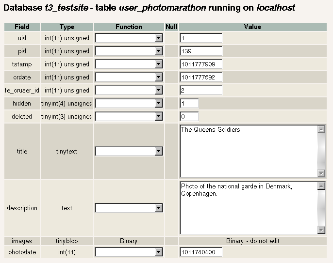

.. include:: /Includes.rst.txt
.. highlight:: php

===================
Backend Programming
===================

.. container::

   warning - No longer supported TYPO3 version

   .. container::

      This page contains information for older, no longer maintained
      TYPO3 versions. For information about TYPO3 versions, see
      `get.typo3.org <https://get.typo3.org>`__. For information about
      updating, see the `Installation & Upgrade
      Guide <https://docs.typo3.org/m/typo3/guide-installation/master/en-us/>`__

<< Back to Developer manuals [outdated wiki link] page

[edit] [outdated wiki link]

*Main editor:* Sylvain [outdated wiki link]

.. _backend-programming-1:

===================
Backend Programming
===================

Originally used on the snowboard tour 2002.

Copyright 2000-2002, Kasper Skårhøj, <kasper (at) typo3 (dot) com>

This document is published under the `Open Content
License <http://www.opencontent.org/openpub/>`__.

The content of this document is related to `TYPO3 <http://typo3.org>`__
- a GNU/GPL CMS/Framework.

This document has been imported manually, with the help of a vimscipt
[outdated wiki link], from the following URL, most image are link to
typo3.org web site.

-  https://docs.typo3.org/typo3cms/extensions/doc_tut_backend/

This document is under revision and can be greatly changed in the
future.

Introduction
============

This document deals with issues regarding customization of the TYPO3
backend. More specifically this involves:

#. adding a custom database table to be edited by TYPO3.
#. adding a module in the backend, in this case a submodule under the
   Web main module.
#. basing the whole thing on a standard TYPO3 installation to maintain
   upgradeability in the future.

| 
| This document does not deal with the frontend implementation (eg. the
  websites look and feel). This topic is covered by `"Templates,
  TypoScript and
  Beyond" <https://docs.typo3.org/typo3cms/extensions/doc_tut_frontend/>`__
  in addition to the document
  `"TSref" <https://docs.typo3.org/typo3cms/TyposcriptReference/>`__.

The document `"Inside
TYPO3" <https://docs.typo3.org/typo3cms/InsideTypo3Reference/>`__ is
used as a reference in this document and it's supposed to be the
authoritative reference in general regarding these backend related
issues.

The Photo Marathon case
-----------------------

The examples in this document is taken from the Photo Marathon on the
testsite you can download with TYPO3. So you should be able to keep
track of the events if you download the testsite and use that.

|Beprogscreenshot.jpg| |Beprogpagetree.gif|

The Photo Marathon example includes three main issues:

#. Automatic registration of frontend users. This is taken care of by
   the default module for this purpose.
#. Upload of and editing of meta data for images for each user. This is
   also taken care of through the powerful fe_adminLib from
   media/scripts/ (see TSref). The thing of particular interest here is
   that the upload happens to our own customly defined table!
   The upload process is combined with an approval process following
   thereafter.
#. Finally the display of the images.

First you register as a user and login:

|Beprognewuser.gif| |Beproglogin.gif|

Then upload an image:

|Beprogupload.gif| |Beprogpreview.gif|

In the backend's list module we now see the newly created record. So far
it's hidden (which it will be until the approval is done or we simply
unhide it!).

|Beproglistrecords.gif|

... and clicking the edit-icon (pencil), this is the form used for
rendering:

|Beprogeditform.gif|

Now, what you see here is an example of a custom table configured so
that TYPO3 knows how to handle it! Looking at the same record in eg.
phpMyAdmin looks like this:

|Beprogphpmyadmin.gif|

As you see everything except the text fields are pretty useless here.
The dates are in UNIX-time (seconds since 1970) and in particular TYPO3
handles the upload of files and integrity of their relations seemlessly
plus relations to other records - in this case the field "fe_cruser_id"
points to the Website user (uid=2 here) who created the record. Look at
the presentation in TYPO3 - here you get that information visually!

Now, this is not pointed out to downgrade phpMyAdmin which is a fine
application and in fact integrated as a third-party module inside TYPO3.
The point is that phpMyAdmin handles raw database values - TYPO3
provides you with a streamlined interface including certain layers to
proces the values - like keeping track of files and relations for you!
On the downside this comes at the cost of configuration.

Configuring a custom database table
===================================

user_photomarathon
------------------

This is the structure of the user_photomarathon table used on the
testsite:

::

    CREATE TABLE user_photomarathon (
       uid int(11) unsigned DEFAULT '0' NOT NULL auto_increment,
       pid int(11) unsigned DEFAULT '0' NOT NULL,
       tstamp int(11) unsigned DEFAULT '0' NOT NULL,
       crdate int(11) unsigned DEFAULT '0' NOT NULL,
       deleted tinyint(3) unsigned DEFAULT '0' NOT NULL,
       title tinytext NOT NULL,
       hidden tinyint(4) unsigned DEFAULT '0' NOT NULL,
       photodate int(11) DEFAULT '0' NOT NULL,
       description text NOT NULL,
       images tinyblob NOT NULL,
       fe_cruser_id int(11) unsigned DEFAULT '0' NOT NULL,
       PRIMARY KEY (uid),
       KEY parent (pid)
    );
    

Notice the red lines - those are fields which are not editable but
rather used for system information and the database index.

The remaining black lines are the fields configured for editing in the
backend.

The configuration of a custom table is officially done in
typo3conf/tables.php. However the best solution is to always use the
default tables.php file (found in t3lib/tables.php) and configure a
custom script to be included immediately after tables.php. In this
script you cannot only modify the $TCA array set in tables.php but also
add more tables as you like.

This is how the testsite typo3conf/localconf.php file is configured:

::

    $typo_db_extTableDef_script = "extTables.php";

... and in the file typo3conf/extTables.php this is what we find
(extract):

.. container::

   PHP Script [outdated wiki link]

.. container::

   ::

      <?php
       
       /**
        * Setting up TYPO3 to work with Photo Marathon table in the database
        */
       $TCA["user_photomarathon"] = Array (
           "ctrl" => Array (
               "label" => "title",
               "tstamp" => "tstamp",
               "crdate" => "crdate",
               "fe_cruser_id" => "fe_cruser_id",
               "delete" => "deleted",
               "title" => "Photo Marathon image|Photo Maraton Billede|Photo Marathon Bild",
               "iconfile" => "../fileadmin/photomarathon/user_pm_icon.gif",
               "enablecolumns" => Array (
                   "disabled" => "hidden",
               )
           ),
           "interface" => Array (
               "showRecordFieldList" => "title,description,images,hidden"
           ),
           "feInterface" => Array (
               "fe_admin_fieldList" => "title,description,images,hidden,photodate",
           ),
           "columns" => Array (    
                   // Title is set up as an ordinary input-field, one line.
               "title" => Array (
                   "label" => "Image title:|Billedtitel:|Bildtitel:",
                   "config" => Array (
                       "type" => "input",
                       "size" => "40",
                       "max" => "80",
                       "eval" => "trim"
                   )
               ),
                   // Image description is set up as a textarea form element in the backend
               "description" => Array (
                   "label" => "Image description:|Billedbeskrivelse:|Bildbeschreibung:",
                   "config" => Array (
                       "type" => "text",
                       "cols" => "48",    
                       "rows" => "5"
                   )
               ),
                   // Images are stored in a tinyblob where the filenames from 
                   // uploads/photomarathon are stored comma-separated
               "images" => Array (
                   "label" => $LANG_GENERAL_LABELS["image"],
                   "config" => Array (
                       "type" => "group",
                       "internal_type" => "file",
                       "allowed" => "gif,jpg,jpeg,png",        // Allowed extensions
                       "max_size" => "1000",            // Max 1000 kb pr. image
                       "uploadfolder" => "uploads/photomarathon",
                       "show_thumbs" => "1",        // Yes, show thumbnails in backend
                       "size" => "3",                // The image list box is 3 items high
                       "maxitems" => "6",            // Max 6 images pr. record!
                       "minitems" => "0"            // Min 0 images.
                   )
               ),
                   // Hidden field
               "hidden" => Array (
                   "label" => $LANG_GENERAL_LABELS["disable"],
                   "config" => Array (
                       "type" => "check"
                   )
               ),
                   // Photo date
               "photodate" => Array (
                   "label" => "Date:|Dato:|Datum:",
                   "config" => Array (
                       "type" => "input",
                       "size" => "7",
                       "max" => "20",
                       "eval" => "date",
                       "checkbox" => "0",
                       "default" => "0"
                   )
               ),
                   // This field is loaded with the uid of the fe_user
                   // who created the photomarathon image.
               "fe_cruser_id" => Array (
                   "label" => "Front End Owner:|Website-bruger ejer:|Frontend Besitzer:",
                   "config" => Array (
                       "type" => "group",
                       "internal_type" => "db",
                       "allowed" => "fe_users",
                       "size" => "1",
                       "maxitems" => "1",
                       "minitems" => "0",
                       "show_thumbs" => "1"
                   )
               )
           ),
           "types" => Array (
               "0" => Array("showitem" => "title;;1,photodate,description,images,fe_cruser_id")        
           ),
           "palettes" => Array (
               "1" => Array("showitem" => "hidden")    
           )
       );
       
       ?>

| 
| (From testsite: typo3conf/extTables.php. The original file contains
  comments which are stripped in this listing.)

$TCA: The [ctrl] section
========================

The "ctrl" part of the $TCA configuration of a table determines how
TYPO3 handles the table generally.

.. container::

   PHP Script [outdated wiki link]

.. container::

   ::

      $TCA["user_photomarathon"] = Array (
          "ctrl" => Array (
              "label" => "title",
              "tstamp" => "tstamp",
              "crdate" => "crdate",
              "fe_cruser_id" => "fe_cruser_id",
              "delete" => "deleted",
              "title" => "Photo Marathon image|Photo Maraton Billede|Photo Marathon Bild",
              "iconfile" => "../fileadmin/photomarathon/user_pm_icon.gif",
              "enablecolumns" => Array (
                  "disabled" => "hidden",
              )
          ),

This is a list of comments on the "ctrl" section of the user_marathon
table as shown above:

-  **"label"** contains a stringvalue, namely the fieldname from which
   the record title shown in record listings in the backend should be
   fetched. Required for all tables.
-  **"tstamp"** contains a stringvalue, namely the fieldname which will
   be updated with the current time value on *each* update through TCE
   (See TYPO3 Overview drawing).The "tstamp" field is configured for
   almost all tables, the field should be an integer and basically this
   field will contain the "last modified" value.
-  **"crdate"** contains a stringvalue, namely the fieldname which will
   be set to the date when the record was first created. This value
   should never change thereafter. The "crdate" field should be an
   integer.
-  **"fe_cruser_id"** contains a stringvalue, namely the fieldname which
   will hold the reference to the Website user (from fe_users) which
   created the record through the fe_adminLib! This is totally related
   to the frontend plugin fe_adminLib and so has no significance for the
   backend.
-  **"delete"** contains a stringvalue, namely the fieldname which - if
   set - will totally hide the record from (almost) any function in
   TYPO3. This means in turn that deleted PhotoMarathon records are not
   really deleted but merely hidden so they can be recovered.
-  **"title"** is a stringvalue; the title of the table as shown in the
   backend. This string value is exploded by the \| (vertical line)
   character and each part represents a specific language (as configured
   in t3lib/config_default.php). This value is required. If you do not
   specify any language specific values, the default (english) will be
   used.
-  **"iconfile"** points to the icon file (currently GIF) to use. If no
   path prefix is set, the icon will be searched for in the typo3/gfx/i/
   folder. The icon must be a 18x16 pixels icon and will be manipulated
   with overlaid graphics by the backend if needed to.
-  **"enablecolumns"** is an array with four fixed associative keys.
   They has impact on the look of the icon in the backend but does not
   hide the records in the backend though. The fields rather determines
   visibility of the record in the frontend (where the API function
   enableFields should be used to retrieve a correct WHERE-clause for
   the selection of records from any TYPO3 configured table).
   The full range of enablefields are used by such tables as "pages" and
   "tt_content".
-  "disabled" points to the field, which as an integer set to 1 will
   signify that the record is hidden. Zero means the record is not
   hidden.
-  "starttime" points to the field, which will hold the "Start" time for
   the record display (always UNIX time integer).
-  "endtime", like starttime, but of course signifies the date where the
   record will *not* be displayed anymore.
-  "fe_group" points to the field, which holds a reference to the
   fe_groups id which is exclusively allowed access to view the record.
   This field is normally called "Access".

**Notice:** There are other options which are documented in "Inside
TYPO3".

In the record list from before we see the impact of the "label"
configuration pointing to the "title" field of user_photomarathon; The
title is "The Queens Soldiers". Furthermore the state of the
enablecolumns/disable - the "hidden" field - is also shown by the record
icon being dimmed and having a red cross on it:

|Beproghiddenrecord.gif|

The latter is quickly un-hidden by a click in the Control Panel:

|Beprogunhiddenrecord.gif|

... and immediately the record is not hidden anymore.

Mandatory fields: uid and pid
-----------------------------

Looking at the previous SQL-dump of the table we see that blue lines
(below) has been utilized for system purposes through configuration in
the "ctrl" section in $TCA.

The remaining red lines are not. They are mandatory and should largely
be configured exactly like you see here including the indices set in the
bottom of the listing:

| 
| ````

``CREATE TABLE user_photomarathon (    uid int(11) unsigned DEFAULT '0' NOT NULL auto_increment,    pid int(11) unsigned DEFAULT '0' NOT NULL,    tstamp int(11) unsigned DEFAULT '0' NOT NULL,    crdate int(11) unsigned DEFAULT '0' NOT NULL,    deleted tinyint(3) unsigned DEFAULT '0' NOT NULL,    title tinytext NOT NULL,    hidden tinyint(4) unsigned DEFAULT '0' NOT NULL,    photodate int(11) DEFAULT '0' NOT NULL,    description text NOT NULL,    images tinyblob NOT NULL,    fe_cruser_id int(11) unsigned DEFAULT '0' NOT NULL,    PRIMARY KEY (uid),    KEY parent (pid) );``

| 
| There are two simple rules:

#. "uid" is a unique, automatically incremented integer. It's the unique
   and authoritative reference to any editable record in TYPO3.
   Sometimes it's called the "id" in loose terms.
#. "pid" is an integer. It is a relation pointing to the record ("Page")
   from the backbone table "pages" to which it belongs. If you picture
   the page tree as folders and files in a filesystem, the "pid" value
   basically indicates in which folder (here: page) the file (here:
   user_photomarathon record) is found.

The principle is shown here:

| 
| |Beproguidpid.gif|

The user_photomarathon record has become the uid "1" and it is found on
the page with uid "139" (sometimes page id's are refered to as the "pid"
in the context of the a record belonging to a page).

In the phpMyAdmin view it looks like:

|Beprogphpmyadmin2.gif|

This should suffice to demonstrate this simple but vital concept. The
power of this principle lies in the fact that records are thus naturally
categorized by the page they belong to. How you choose to take advantage
of this is up to you to a certain extend.

The root page
-------------

While a pid value of 0 (zero) or less can never point to a record,
exactly the zero value is valid. If the pid value of a record is zero it
means the record belongs to the root of the page tree. However records
are divided sharply into two categories; records which are allowed in
the root (and in turn editable by the admin-users only!) and recods
which *must* belong to a proper page record (the only exception is
"pages" records which form the very page tree).

$TCA: The [columns] section
===========================

This section configures how TYPO3 handles each field; which kind of form
element it should be rendered as and which further properties are
assigned. This configuration should definitely be consistent with the
actual database field receiving the value. Of course, you cannot expect
an ordinary input field accepting textual content to cleanly submit it
into an integer database field! However it does not generate a warning -
just the wrong value.

The INPUT type:
---------------

.. container::

   PHP Script [outdated wiki link]

.. container::

   ::

      // Title is set up as an ordinary input-field, one line.
      "title" => Array (
      "label" => "Image title:|Billedtitel:|Bildtitel:",
      "config" => Array (
          "type" => "input",
          "size" => "40",
          "max" => "80",
          "eval" => "trim"
          )
      ),

This renders a traditional INPUT element. In this case with the
*relative* size of "40". The real value is compensated depending on
browser so the fields appear equally wide in various operating systems
and browsers.

The eval value "trim" signifies that the value is stripped from
whitespace in both ends before it's submitted. This is required with
varchar database fields as MySQL strips whitespace anyway.

You can configure some more options, in particular you can configure the
field to evaluate a date and/or time input. This is the case with the
photodate field which is configured like this:

.. container::

   PHP Script [outdated wiki link]

.. container::

   ::

      // Photo date
      "photodate" => Array (
      "label" => "Date:|Dato:|Datum:",
          "config" => Array (
          "type" => "input",
          "size" => "7",
          "max" => "20",
          "eval" => "date",
          "checkbox" => "0",
          "default" => "0"
          )
      ),

The TEXT type:
--------------

.. container::

   PHP Script [outdated wiki link]

.. container::

   ::

      "description" => Array (
      "label" => "Image description:|Billedbeskrivelse:|Bildbeschreibung:",
          "config" => Array (
          "type" => "text", 
          "cols" => "48", 
          "rows" => "5"
          )
      )

This renders a textarea field. The columns are once again a relative
messure compensated based on browser and client OS.

You can also configure the field to turn wrapping OFF or use the Rich
Text Editor!

The CHECK type:
---------------

.. container::

   PHP Script [outdated wiki link]

.. container::

   ::

      "hidden" => Array (
      "label" => $LANG_GENERAL_LABELS["disable"],
      "config" => Array (
          "type" => "check"
          )
      ),

This renders a checkbox. Notice how the labels from the field is
cleverly taken from the LANG_GENERAL_LABELS array which holds a lot of
generally used label-names translated into all the system languages.

You can also configure checkboxes to present a whole array of checkboxes
(up to 10) where each represents a bit in the integerfield which must
receive the value. Here's an example from tables.php
(tt_content.text_properties):

.. container::

   PHP Script [outdated wiki link]

.. container::

   ::

      "text_properties" => Array (
          "exclude" => 1,
          "label" => "Properties:",
          "config" => Array (
              "type" => "check",
              "items" => Array (    
                  Array("Bold", ""),
                  Array("Italics", ""),
                  Array("Underline", ""),
                  Array("Uppercase", "")
              ),
              "cols" => 4
          )
      ),

This is rendered like this in the forms:

|Beprogrenderinform.gif|

The GROUP type / file:
----------------------

.. container::

   PHP Script [outdated wiki link]

.. container::

   ::

      "images" => Array (
          "label" => $LANG_GENERAL_LABELS["image"],
          "config" => Array (
              "type" => "group",
              "internal_type" => "file",
              "allowed" => "gif,jpg,jpeg,png",   // Allowed extensions
              "max_size" => "1000",              // Max 1000 kb pr. image
              "uploadfolder" => "uploads/photomarathon",
              "show_thumbs" => "1",              // Yes, show thumbnails in backend
              "size" => "3",                     // The image list box is 3 items high
              "maxitems" => "6",                 // Max 6 images pr. record!
              "minitems" => "0"                  // Min 0 images.
          )
      ),

This configures the field to receive images. As you can probably spot,
you can configure 1) which file types, 2) their maximun kb-size, 3)
where they should be put and 4) the maximum and/or minimum number of
files required.

The TCE (Typo Core Engine, t3lib_tcemain class) takes care of all the
file handling (although you must follow certain guidelines when you're
submitting files.)

In the backend interface it looks like this:

|Beprogimageform.gif|

... and adding images is so easy using the Element Browser:

|Beprogelementbrowseradd.gif| |Beprogaddedimages.gif|

The filenames are (by default) stored as a comma separated list of
filenames, typically in a BLOB field.

The content of the "user_photomarathon.image" field is:

"372046.jpg,p020_f.jpg"

The GROUP type / db:
--------------------

.. container::

   PHP Script [outdated wiki link]

.. container::

   ::

      "fe_cruser_id" => Array (
          "label" => "Front End Owner:|Website-bruger ejer:|Frontend Besitzer:",
          "config" => Array (
              "type" => "group",
              "internal_type" => "db",
              "allowed" => "fe_users",
              "size" => "1",
              "maxitems" => "1",
              "minitems" => "0",
              "show_thumbs" => "1"
          )
      )

This element is a sister to the GROUP/file type from above. But instead
of containing references to filenames, it contains references to
records. You can even configure the field to mix records from various
tables if you wish.

In the Photo Marathon example this configuration holds the reference to
the user, who created the record:

|Beprogreferencefield.gif|

... and likewise you can browse for records with the Element Browser:

|Beprogreferenceelementbrowser.gif|

Looking at the actual content of the field, this is what we see:

2

| 
| A number, pointing to the fe_user record. In this case the field can
  contain only this one record, because the database field is an
  integer.

Looking at another example, the tt_content.records field from tables.php
is configured like this:

.. container::

   PHP Script [outdated wiki link]

.. container::

   ::

      "records" => Array (
        "label" => "Items:",
        "config" => Array (
            "type" => "group",
            "internal_type" => "db",
             "allowed" => 
                  “tt_content,tt_address,tt_links,tt_board,tt_guest,tt_calender,tt_products,tt_news",
            "size" => "5",
            "maxitems" => "200",
            "minitems" => "0",
            "show_thumbs" => "1"
        )
      ),

... and on the page "/Intro/Another site.../More lists a.../Records/"
the element "Various records inserted" looks like this:

|Beprogvariousrecords.gif| |Beprogvariousrecordsbig.gif|

The content of the tt_content.record field in this case looks like:

tt_calender_7,tt_news_1,tt_products_3,tt_address_5,tt_calender_3,tt_products_2,tt_board_1,tt_products_5,tt_guest_2,tt_address_1,tt_address_2,tt_rating_1

| 
| This is uid-numbers prepended with the tablenames.

Making real MM relations
------------------------

The above examples shows how to make MM (many-to-many) relations in a
straight forward manner - a list of comma separated values - but also a
database designwise discouraged way; You should use an intermedia table
instead if you want to do it "right".

About relations, 1-M (one-to-many) and M-1 (many-to-one) signifies a
relation where one record is related to many other records. For instance
the pid - pages.uid relation ship is a such; A record can belong to one
and only one page. The Photo Marathon fe_cruser_id field is also such a
relation; It's an integer field point to one and only one owner user -
however this user may have other user_photomarathon records pointing to
him (which makes it a "many" relation).

M-M relations are like with the content element type "Insert records"
where we wish any number of content elements to be able to link to any -
maybe even the same element twice! - record from other tables regardless
of existing relations.

The newly added sys_dmail_group table actually represents such a
relationship in the field sys_dmail_group.static_list. This field is
actually just a dummy placeholder - the real relations to tt_address and
fe_users elements are done through an intermediate table,
sys_dmail_group_mm. This is the field configuration (taken from
tables.php):

.. container::

   PHP Script [outdated wiki link]

.. container::

   ::

      "static_list" => Array (
          "label" => "Recipients:",
          "config" => Array (
              "type" => "group",
              "internal_type" => "db",
                  "allowed" => "tt_address,fe_users",
                  "MM" => "sys_dmail_group_mm",
              "size" => "20",
              "maxitems" => "100000",
              "minitems" => "0",
              "show_thumbs" => "1"
          )
      ),

The table "sys_dmail_group_mm" looks like this:

.. container::

   SQL [outdated wiki link]

.. container::

   ::

      CREATE TABLE sys_dmail_group_mm (
         uid_local int(11) unsigned DEFAULT '0' NOT NULL,
         uid_foreign int(11) unsigned DEFAULT '0' NOT NULL,
         tablenames varchar(30) NOT NULL,
         sorting int(11) unsigned DEFAULT '0' NOT NULL,
         KEY uid_local (uid_local),
         KEY uid_foreign (uid_foreign)
      );

-  *uid_local* holds the uid number of the sys_dmail_group record
-  *uid_foreign* holds the uid number of either the tt_address or
   fe_users record, which is determined by...
-  ... the *tablenames* field which is either set to "tt_address" or
   "fe_users"
-  Finally *sorting* is used to denote the order of the records.

Whether you use real relations (for a more correct data structure than
the lists) or the comma-list principle, the proces of adding and
removing records is totally the same in the backend interface! It's all
managed inside the t3lib_tcemain class! In fact the submission of the
order of records is always done as a list.

The table, tt_news, also features such a relationship, but with only one
table, tt_news, involved which eliminates the user of the "tablename"
field in the relation table:

.. container::

   SQL [outdated wiki link]

.. container::

   ::

      CREATE TABLE tt_news_related_mm (
         uid_local int(11) unsigned DEFAULT '0' NOT NULL,
         uid_foreign int(11) unsigned DEFAULT '0' NOT NULL,
         sorting int(11) unsigned DEFAULT '0' NOT NULL,
         KEY uid_local (uid_local),
         KEY uid_foreign (uid_foreign)
      );

The TCA config looks like this for tt_news.related:

.. container::

   PHP Script [outdated wiki link]

.. container::

   ::

      "related" => Array (
          "exclude" => 1,    
          "label" => "Related news:",
          "config" => Array (
              "type" => "group",
              "internal_type" => "db",
                  "allowed" => "tt_news",
                  "MM" => "tt_news_related_mm",
              "size" => "5",
              "maxitems" => "200",
              "minitems" => "0",
              "show_thumbs" => "1"
          )
      ),

Finally you can also use an intermediate table with files, so each file
is registered with a record where the uid_foreign is a varchar with the
filename rather than an integer pointing to the foreign record. This is
the example structure found in
t3lib/install/example_MM_relationTables.sql:

.. container::

   SQL [outdated wiki link]

.. container::

   ::

      CREATE TABLE tt_content_media_mm (
        uid_local int(11) unsigned NOT NULL default '0',
        uid_foreign varchar(60) NOT NULL default '',
        sorting int(11) unsigned NOT NULL default '0',
        KEY uid_local (uid_local),
        KEY uid_foreign (uid_foreign)
      );

The "exclude" fields
--------------------

Did you notice in tables.php that certain fields has a flag set,
"exclude=1"? For instance the tt_news.related field as shown above:

.. container::

   PHP Script [outdated wiki link]

.. container::

   ::

      "related" => Array (
          "exclude" => 1,    
           ....

When this option is set, the field is not available for non-admin users
by default. Rather it must be specifically enabled by selecting the
field in the list of "Allowed excludefields" in the setup of backend
usergroups:

| 
| The default view; The "Links" field is the last in the form:

|Beproglinkslast.gif|

Then adding the "News: Related news" to the list of "Allowed
excludefields"...

|Beprogadd2excludefields.gif|

... and then the user (being a member of that group) has instant access
to the field:

|Beprogdisplayedexcludefield.gif|

**Notice:** It's better to define a field "exclude" if you're in doubt!
If you specify that option later, you'll have to edit all your
usergroups which should keep access. Setting the value by default will
on the other hand allow you to just remove the flag if you suddenly
realize that there is generally no need to restrict certain users from
accessing this field!

$TCA: The [types] and [palettes] section
========================================

While the ctrl and columns section deal with general handling and
specific handling of the table and it's fields, the "types" and
"palettes" section is basically concerned with the presentation
on-screen.

In essense the "types" section lists the fieldnames in the order they
should be shown in the form. The field list is separated by comma. Each
entry in the list is furthermore exploded by a semi-colon. The first
part is the field name , the second part an alternative label for the
field (if any), the third part is a reference to a palette to invoke
with the field and the forth part is used for special configuration
(primarily used with the TEXT field type, eg. to invoke the Rich Text
Editor or turning of wrapping in the textarea field).

Consider this configuration:

.. container::

   PHP Script [outdated wiki link]

.. container::

   ::

      ...
      "types" => Array (
          "0" => Array("showitem" => "title;;1,photodate,description,images,fe_cruser_id")        
      ),
      "palettes" => Array (
          "1" => Array("showitem" => "hidden")    
      )

... and compare it with the display in the backend below.

When you're looking at these screenshots notice how the configuration of
the title-field invokes the display of the palette number 1, which will
in turn display the list of fields configured there - in this case only
one field, the "hidden" field.

In the backend (and wherever the class t3lib_tceforms.php is used to
render editing fields) the palette fields needs to be shown together
with the masterfield.

|Beprogpalettesview.gif|

Notice the order from top and down is the same as set by the field name
list defined in the "types" section!

Multiple "types" entries
------------------------

So far I haven't commented the "types" configuration for more than a
single, default entry. However the concept of using the "types" section
to order the way fields are displayed also allows us to choose various
displays depending on the value of a certain field!

Consider this code listing, taken from the sys_action table in TYPO3:

.. container::

   PHP Script [outdated wiki link]

.. container::

   ::

      <?php

      // ******************************************************************
      // sys_action
      // ******************************************************************

      $TCA["sys_action"] = Array (
          "ctrl" => Array (
              "label" => "title",
              "tstamp" => "tstamp",
              "default_sortby" => "ORDER BY title",
              "title" => "Action",
              "crdate" => "crdate",
              "cruser_id" => "cruser_id",
              "adminOnly" => 1,
              "rootLevel" => 1,
              "enablecolumns" => Array (
                  "disabled" => "hidden"
              ),
              "type" => "type"     ),
          "interface" => Array (
              "showRecordFieldList" => "hidden,title,type,description,assign_to_groups"
          ),
          "columns" => Array (    

              // ..... (more field are configured)

              "type" => Array (
                  "label" => $LANG_GENERAL_LABELS["type"],
                  "config" => Array (
                      "type" => "select",    
                      "items" => Array (    
                          Array("", "0"),
                          Array("Create Backend User", "1"),
                          Array("SQL-query", "2")
                      )
                  )
              ),

             // ..... (more field are configured)

          ),
          "types" => Array (                    
              "0" => Array("showitem" => "hidden,title,type"),
              "1" => Array("showitem" => "hidden,title,type,description,assign_to_groups,--div--, ..."),
              "2" => Array("showitem" => "hidden,title,type,description,assign_to_groups,--div--,")
          ) );

      ?>

In the "ctrl" section we define the "type" key to the value "type" which
in turn points to the fieldname "type" as being the fieldname
determining the "type" of display (oh boy, al those types...). It works
like this:

If the value of the field sys_action.type is "0" (zero), then the
"hidden,title,type" fields are displayed:

|Beprogtypefield.gif|

Changing the "Type" selector to "Create Backend User" the form is
rendered differently:

|Beprogtypecreatebeuser.gif|

... and finally the "SQL-query" option will show us this form:

|Beprogtypesqlquery.gif|

This is basically the options.

Configuring the Rich Text Editor (RTE)
--------------------------------------

You can attach the Rich Text Editor component in TYPO3 to any field of
the TEXT type. The configuration is best shown by looking at how the
sys_staticfile_edit table is configured:

.. container::

   PHP Script [outdated wiki link]

.. container::

   ::

      "types" => Array (    
          "0" => Array("showitem" => "
              edit_file;;1,
              edit_content;;;nowrap:richtext[*]:rte_transform[flag=rte_enabled|mode=ts_images],
              rte_enabled,
              update_status"
          )
      ),
      "palettes" => Array (
          "1" => Array("showitem" => "edit_subpart_marker,always_reload")
      )

In particular the existence of "richtext[*]" is important and the main
parameter in charge of invoking the editor. In addition the RTE can be
configured to process the output in various ways including configuration
of the toolbar. This is a topic covered in "Inside TYPO3".

The result of this configuration looks like this:

|Beprogrteditor.gif|

Browsing the configuration in Tools > Configuration
---------------------------------------------------

If you are curious how your configuration of tables should happen to be
currently, you can take a peek in the Tools > Configuration module,
selecting $TCA as the array to browse:

|Beprogtoolsconfig.gif|

Creating records on pages
=========================

You can find up to date information on page types
($GLOBAL['PAGE_TYPES']) in `"TYPO3 Explained: Page
Types" <https://docs.typo3.org/m/typo3/reference-coreapi/master/en-us/ApiOverview/PageTypes/Index.html>`__

Adding context sensitive help to custom table fields
====================================================

All the default tables in TYPO3 has context sensitive help for their
fields. This is done through the centrally distributed tables
sys_tabledescr*. However modifying these tables are not clever for
custom purposes because the tables are meant to be updated by new TYPO3
releases. Therefore a file-based concept has been introduced in parallel
to the sys_tabledescr concept.

This is also demonstrated by the user_photomarathon example. All you
have to do is to place a file named 'extTables_descr.php' in the
typo3conf/ folder of your TYPO3 site. The content of this file should be
modelled after this principle:

````

``<?php  $TCA_DESCR["user_photomarathon"] = Array (     "columns" => Array (             "title" => Array(             "description"=> "Enter the title of the image.",             "details" => "This is displayed in the headers on the webpages.",             "image" => "../typo3conf/web/uPhotomarathon/someImage.gif",             "image_descr" => "Here you see the title",             "seeAlso" =>"user_photomarathon:description,user_photomarathon:images"         ),         "description" => Array(             "description"=>"Users may enter a description. This is shown with the image."         ),         "images" => Array(             "description"=>"The image. Users may upload up to 2 images."         ),         "photodate" => Array(             "description"=>"The date of the photo"         ),         "fe_cruser_id" => Array(             "description"=>"                 This field contains a reference to the fe_user (website user) who owns it.                  You should not change this.                  If you remove the user, the image will no longer belong to him and he cannot ...                 In addition if you simply insert another user, the image will belong to this ...             "         )     ) );  ?>``

Provided that the user has enabled field help texts (see below) this
will look like this in the backend forms:

| 
| https://typo3.org/typo3temp/tx_oodocs_175e934e34.gif [outdated image]

| https://typo3.org/typo3temp/tx_oodocs_133a2327a0.gif [outdated image]

... and clicking the icon will bring up this pop-up window:

| 
| https://typo3.org/typo3temp/tx_oodocs_b7a91bb405.gif [outdated image]

Changing the display type, the field help may also appear like this:

| 
| https://typo3.org/typo3temp/tx_oodocs_6f87466bed.gif [outdated image]

Adding a translation to the custom table descriptions
-----------------------------------------------------

That's very easy. You just need to know the available language keys
(must be one of them). Those are found in the t3lib/config_default.php
script. In this case we select danish (which is "dk"). You simply make a
copy of the 'extTables_descr.php' file and rename it
'extTables_descr\ **\_dk**.php': ````

``<?php $TCA_DESCR_DK["user_photomarathon"] = Array (     "columns" => Array (             "description" => Array(             "description"=>"Beskrivelse af billedet"         ),         "images" => Array(             "description"=>"Brugerne kan uploade op til 2 billeder."         ),         "photodate" => Array(             "description"=>"Datoen for fotografiet."         ),         "fe_cruser_id" => Array(             "description"=>"Reference til brugeren, som ejer billedet."         )     ) );  ?>``

Looking at the help text now - provided we shift our system language to
danish - we'll see the descriptions translated into danish - except the
"title" description which is missing. This description will then default
to english. Notice how the additional information like "seeAlso"
references and links does not need to be respecified.

| https://typo3.org/typo3temp/tx_oodocs_8876a623fb.gif [outdated image]

*In this example it is danish descriptions with the exception of the
"title" which was left out in the translation.*

=====================
Custom Backend Module
=====================

.. _introduction-1:

Introduction
============

Backend modules are subdivided into "main modules" and "submodules".
Generally speaking "modules" covers them all. Refering to a module is
done by it's name and 'path'. For instance the submodule "List" in the
"Web"-module would be refered to as "Web>List" module.

The location of default and custom modules
------------------------------------------

The modules are technically represented by a folder each in typo3/mod/,
the first level being the main module and subfolders to this being the
submodules. This structure is reflected in the backend interfaces - the
Classic Backend (CB) and Alternative Backend (AB) view.

This illustration shows the relationship between them:

| 
| https://typo3.org/typo3temp/tx_oodocs_9fd329822c.gif [outdated image]

Notice how the Classic Backend presents access to the modules through
the panes, while the Alternative Backend renders a vertical menubar.
It's the same modules invoked - just different shells to manage them.

Looking at the illustration you'll see that the userdefined Photo
Marathon module (from the testsite) appears within the Web module.
However it's not a part of the directory structure found at
typo3/mod/web/ but rather a parallel structure found in typo3conf/ where
it is located in web/uPhotomarathon.

Placing custom modules - and customized material in general! - in the
typo3conf/ folder is clever because the typo3/ folders content is not
touched and can thus be upgraded easily by simply overriding the files
when a new version is released. And so far we've seen the extTables.php
files including table-description files being placed in the typo3conf/
folder in addition to the wellknown localconf.php file and now also the
custom modules!

Basic requirements to (custom) modules
--------------------------------------

First of all, determine if you wish to make a main module or submodule.
Submodules should be placed in folders in typo3conf/ named similar to
the main module found in typo3/mod/. Custom main modules should of
course be located in typo3conf/ directly.

Always prepend your user defined modules with a "u" like in
"uPhotomarathon". This will ensure that the module name will not be
taken by a default module some day.

This is how the custom Photo Marathon module (from
typo3conf/web/uPhotomarathon) is located in the Classic backend:

| 
| https://typo3.org/typo3temp/tx_oodocs_44d2fc37f6.gif [outdated image]

Files in the module folder
^^^^^^^^^^^^^^^^^^^^^^^^^^

Regardless of a module being a main- or submodule, a file named
"conf.php" must be found in the module folder:

| 
| https://typo3.org/typo3temp/tx_oodocs_1f79b49124.gif [outdated image]

-  The clear.gif file found is not required, but quite practical to have
   around.
-  index.php is not required either. It's commonly used as the main
   script invoking the module, but it's always configured in conf.php.
-  locallang.php contains labels for the interface, typically translated
   into the system languages.
-  tab_icon.gif is configured in conf.php to be the icon of the module.
   Max 12 pixels high.
-  conf.php is however the only required file. This is how it looks
   inside in the Photo Marathon case:
-  

````

``<?      // Relative path to the module from the typo3/ folder define("TYPO3_MOD_PATH","../typo3conf/web/uPhotomarathon/");             // Relative path to the typo3/ folder $BACK_PATH="../../../typo3/";                          // Module name as shown in the backend: $MLANG["default"]["tabs"]["tab"] = "Photo Marathon";     // Icon-file used with the module. Max 12 pixels high. $MLANG["default"]["tabs_images"]["tab"] = "tab_icon.gif";     // Short description for the tab image label: $MLANG["default"]["labels"]["tablabel"] = "Photo Marathon (EXAMPLE!)";     // Longer description, used in the "Help>About modules" module  $MLANG["default"]["labels"]["tabdescr"] = "This is an example module related to ....";       // Danish translation of labels: $MLANG["dk"]["tabs"]["tab"] = "Fotomaraton"; $MLANG["dk"]["labels"]["tablabel"] = "Fotomaraton (Eksempelmodul)";      // Main script invoked: $MCONF["script"]="index.php";             // Access level.     // You can specify access for both backend users and groups to this module. $MCONF["access"]="user,group";              // Syntax: [module]_[subModule]  or just [module] if no submodule!!      // Remember, never use underscore "_" in module names! $MCONF["name"]="web_uPhotomarathon";          ?>``

As you can see both the index.php and tab_icon.gif files are configured
herein. In turn the locallang.php file is included from index.php.

| 
| ````

``    // Relative path to the module from the typo3/ folder define("TYPO3_MOD_PATH","../typo3conf/web/uPhotomarathon/");             // Relative path to the typo3/ folder $BACK_PATH="../../../typo3/";                    ``
Defining these paths correctly is vital. These vars tells the script
where it is in relation to the typo3/ folder. $BACK_PATH is generally
used as a script prefix to call scripts in the typo3/ folder and keeping
this value correct will ensure success when linking to scripts and
images. You can see how it's used in the default modules. Plenty of
examples.

The TYPO3_MOD_PATH constant is used in the init.php file which must be
included immediately after the conf.php file in the index.php main
script (or whatever you configure it to be) of the module.

````

``    // Access level.     // You can specify access for both backend users and groups to this module. $MCONF["access"]="user,group";        ``
The access settings determines how the system handles access to your
module. If you set the value to blank, then the module appears for ALL
users. Like with the "exclude" option of fields in $TCA you should be
very certain that you want this. Better configure the module to be
specifically assigned to users/groups than having to modify a whole
bunch of groups later due to a change here.

Setting it to "admin" will allow only 'Admin'-backend users to access
it.

Then you can finally enter "user", "group" or both in a list. Each code
determines where the module will appear in the backend user and group
settings. For instance the settings used here will result in the module
list to look like this:

| 
| https://typo3.org/typo3temp/tx_oodocs_81d19d2383.gif [outdated image]

````

``    // Syntax: [module]_[subModule]  or just [module] if no submodule!!      // Remember, never use underscore "_" in module names! $MCONF["name"]="web_uPhotomarathon";        ``
The module name is used many places to refer to the module. Not only in
the access lists, but also in TSconfig where applicable.

````

``    // Danish translation of labels: $MLANG["dk"]["tabs"]["tab"] = "Fotomaraton"; $MLANG["dk"]["labels"]["tablabel"] = "Fotomaraton (Eksempelmodul)";``
The labels are used for the module title in the backend. You can specify
the label in many languages, in this case, danish.

| 
| ````

``    // Longer description, used in the "Help>About modules" module  $MLANG["default"]["labels"]["tabdescr"] = "This is an example module related to ....";``
In addition you can write a longer description of the module. This will
be shown in the "Help>About modules" module and likewise the "tab" and
"tablabel" above you can provide a localized version in another
language.

| https://typo3.org/typo3temp/tx_oodocs_3d4ddec63b.gif [outdated image]

Adding to the global $TBE_MODULES array
^^^^^^^^^^^^^^^^^^^^^^^^^^^^^^^^^^^^^^^

When your module is configured you must also enable it in the global
$TBE_MODULES array. The default values (and syntax derived from this) of
this array is seen in the bottom of the default tables.php file:

````

``$TBE_MODULES = Array (     "web" => "layout,modules,info,perm,func,list,ts",     "file" => "list,images",     "doc" => "",    // This should always be empty!     "spacer1"=>"",     "user" => "task,setup",     "tools" => "beuser,dbint,log,config,isearch,install,phpadmin",     "help" => "welcome,aboutmodules,quick,about" );``
(**Notice:** The "doc" key is hardcoded to be ignored in the Alternative
Backend (AB). In addition "spacers" and not used either in the AB)

Looking into the typo3conf/extTables.php file, we see in the very bottom
how the web/uPhotomarathon module is added to the main module "Web":
````

``$TBE_MODULES["web"].=",uPhotomarathon";``

That's basically it! You can of course also remove default modules this
way by modifying the array. Or even switch them around, altering the
order etc.

Parameters passed to the module script
======================================

Generally the scripts of the modules are called without any special
parameters. At least this is the case with the Classic Backend. Using
the Alternative Backend the AB=1 parameter is passed as well. How and if
the module is using this for anything significant is up to the module.
But the point is that this parameter is a notice to the module that the
module is operating within the framework of the Alternative Backend and
not the Classic Backend. For instance the Web>List module uses this to
disable the click-menus when the Classic Backend is not present.

This is an example of a call to the "User>Task center" from the
Alternative Backend:

````

``typo3/mod/user/task/index.php?AB=1``

The Web and File main modules
-----------------------------

There are two very special main modules. This is the Web and File
modules. They are always used within the context of the page tree and
directory tree respectively. This is not the case with any of the other
main/submodule which are basically providing a way to group modules
together logically.

| The Web and File modules are special because the submodules are called
  with the "https://typo3.org/typo3temp/tx_oodocs_579881fc50.gif"
  alt="tx_oodocs_579881fc50.gif">

*Notice how the id 134 is passed to the script because the title of the
page "Citylife" was clicked in the page tree.*

Mandatory initialization
------------------------

Looking inside the main script of the Photo Marathon module we see first
of all a few lines of traditional includes and evaluations:

| 
| ````

``// ********************************************** // Basic initialization, don't tamper with this! // ********************************************** unset($MCONF); include ("conf.php"); include ($BACK_PATH."init.php"); include ($BACK_PATH."template.php"); include ("locallang.php"); $BE_USER->modAccess($MCONF,1);``

-  As you see the conf.php file is included before anything else. This
   is necessary in order to set the TYPO3_MOD_PATH constant.
-  init.php is then included. This will include some libraries from
   t3lib/, include the typo3conf/localconf configuration, connect to the
   database, authenticate the backend user login, include the $TCA etc.
   *This file should always be included by any TYPO3 Backend script.*
-  Then the template.php file is included. This contains some function
   for printing out a page header and footer, including the default
   TYPO3 colorscheme. In addition the language handling functions are
   found in there.
-  Then the locallang.php file is included. This sets the global
   variable $LOCAL_LANG as we see here for the Photo Marathon example:
-  

````

``<? $LOCAL_LANG = Array (         "default" => Array (    // Default english labels:         "title" => "Photo Marathon (EXAMPLE)",         "menu" => "Select a function",         "menu_overview" => "Overview of Photo Marathon records",         "menu_list" => "List Photo Marathon records on the page"     ),     "dk" => Array (        // Danish labels:         "title" => "Foto Maraton (EKSEMPEL)",         "menu" => "Vælg en funktion",         "menu_overview" => "Overblik over foto maraton emner",         "menu_list" => "Liste over foto maraton emner på siden"     ) ) ?>``

-  And finally $BE_USER->modAccess() is called. This will determine if
   the user has access to this module and if not issue an error message
   and exit.

(For the authoritative list of the global variables available in the
Backend scope, please refer to "Inside TYPO3" document)

| 
| Now the module access is granted and you can do whatever you like.
  Following is a description of various repeatedly used concepts, which
  may come in handy for you.

TYPO3 Project Guidelines and "GPvars"
-------------------------------------

First of all I would like to draw attension to "Inside TYPO3" document
where a list of project guidelines are specified. You're strongly
encouraged to read them through and follow them. This will ensure that
your code will be consistent with the style in which TYPO3 is
programmed.

One of these guidelines - or specifications - is that your code must
comply with the php.ini-optimized settings of PHP. Although most
PHP-installs does not use these settings in order to be backwards
compatible, TYPO3 must be able to work perfectly in both environments.

The consequence of the php.ini-optimized settings is that global
variables are not registered as vigorously as originally. In particular
the incoming variables from HTTP_POST_VARS and HTTP_GET_VARS are not
registered in the global space.

There are two solutions to this:

#. In order to register the GET or POST vars (with precedence to POST),
   eg. "bart" and "homer" to the globals $bart and $homer, simply make
   this function call:
   t3lib_div::setGPvars("bart,homer");
   Slashes are automatically stripped on strings, but not recursively on
   arrays (unless you set the second parameter to "1").
#. You can also retrieve single variables directly like this:
   $bart = t3lib_div::GPvar("bart");

Page access
-----------

You should make sure that the user has read-access to the page according
to his permissions. You can get an appropriate WHERE-clause for this
from the $BE_USER object. The value you should pass is "1" which will
check for read access (2,4,8 and 16 is for the other permissions. Look
inside the header of class t3lib_tcemain to see the full list and
meaning).

With this query string you can try to select the page and if you get a
page record back the user has read access. In short it looks like this:

````

``<?    // WHERE-clause part which you should use for selecting records so you can be sure,    // the BE_USER (backend user) has read access. $perms_clause = $BE_USER->getPagePermsClause(1);        // integer id value $id = intval($id);    // The page record of the current page (set by $id).    // $perms_clause ensures that the BE user has read access to this module. $pageinfo = t3lib_BEfunc::readPageAccess($id,$perms_clause);    // Has access?? if ($id && is_array($pageinfo)) {      // Do your main things here      } else {     die("Sorry, you did not have read access to this page!"); }  ?>``

User annotations:
^^^^^^^^^^^^^^^^^

Date: **27-10-2003 10:01** by **martin.van.dongen**

group permissions
^^^^^^^^^^^^^^^^^

There are situations in which user and group should have default the
same rights, including deleting pages for the group. In the file
class.t3lib_tcemain.php (directory typo3_src-3.5.0/t3lib) the default
permissions can be changed on line 90 thru 92. Here you can change the
value "group" => "show,edit,new,editcontent" to "group" => "show,
edit,delete,new,editcontent" which will give the primary group of the
user the same permissions as the user. Oh, and do make a copy of the
file before editing.

**Code Listing:**\ There are situations in which user and group should
have default the same rights, including deleting pages for the group.

Header and footer
-----------------

The template.php script contains some classes for the framework of the
page, eg. correct charset based on system language.

You can either choose to just output a header and footer on the page, or
like this is case call the API which will provide TYPO3 style "sections"
in your modules, including headers etc:

| 
| ````

``<?      // Make instance of class mediumDoc: $doc = new mediumDoc; $doc->backPath = $BACK_PATH; $doc->JScode = '     <SCRIPT>         function jumpToUrl(URL)    {             document.location = URL;         }     </SCRIPT> ';      // Draw the header. $content.=$doc->startPage($LANG->getLL("title")); $content.=$doc->header($LANG->getLL("title")); $content.=$doc->spacer(5); $content.='<form action="index.php" method="POST">         <input type="hidden" name="id" value="'.$id.'">         <input type="hidden" name="AB" value="'.$AB.'">';       // Add you main things to $content here! Eg: $content.=$doc->section('Hello World!',"What a great module!"); $content.=$doc->divider(5);      // Ending the page $content.=$doc->endPage(); $content.='</form>';  echo $content;  ?>``
Notice how a default form is initialized, pointing to the current script
and preserving the AB variable.

| https://typo3.org/typo3temp/tx_oodocs_aca7531f5a.gif [outdated image]

Taking a look into the class "template" which $doc is an instance of
also reveals the internal variables at your disposal:

````

``<?  class template {     var $bgColor = "#F7F3EF";        // Light background color     var $bgColor2 = "#9BA1A8";        // Steel-blue     var $bgColor3 = "#F6F2E6";        // dok.color     var $bgColor4 = "#D9D5C9";        // light tablerow background, brownish     var $bgColor5 = "#ABBBB4";        // light tablerow background, greenish     var $bgColor6 = "#E7DBA8";        // light tablerow background, yellowish, for section headers.     var $hoverColor = "#254D7B";``

(typo3/template.php)

These can be reached through $doc, eg:

````

``$doc->bgColor2``

Language specific labels ($LANG object)
---------------------------------------

In the above code listing you also see how to retrieve the language
labels from the $LOCAL_LANG array configured in locallang.php:

````

``    // Draw the header. $content.=$doc->startPage($LANG->getLL("title")); $content.=$doc->header($LANG->getLL("title")); This is a clear example, how to get the value of the label, named "title": <? $LOCAL_LANG = Array (         "default" => Array (    // Default english labels:         "title" => "Photo Marathon (EXAMPLE)",         "menu" => "Select a function",         "menu_overview" => "Overview of Photo Marathon records",         "menu_list" => "List Photo Marathon records on the page"     ),     "dk" => Array (        // Danish labels:         "title" => "Foto Maraton (EKSEMPEL)",         "menu" => "Vælg en funktion",         "menu_overview" => "Overblik over foto maraton emner",         "menu_list" => "Liste over foto maraton emner på siden"     ) ) ?>``

A selector box menu
-------------------

Making a selector menu like the one found in the Photo Marathon module
is done easily through an API call. The menu will reload the page
"onChange". In addition there is a straight forward way to configure
page TSconfig to enable/disable items in the menu as you like.

| https://typo3.org/typo3temp/tx_oodocs_510916d1be.gif [outdated image]
| ````

``// ************************** // Menu initializing // **************************     // MENU-ITEMS:     // If array, then it's a selector box menu     // If empty string it's just a variable, that'll be saved.  $MOD_MENU = array(     "mode" => array(    // variable         "overview" => $LANG->getLL("menu_overview"),        // Menu value/item         "list" => $LANG->getLL("menu_list")                    // Menu value/item     ) );      // page/be_user TSconfig settings: $modTSconfig = t3lib_BEfunc::getModTSconfig($id,"mod.".$GLOBALS["MCONF"]["name"]);      // ... and blinding of menu-items: $MOD_MENU["mode"] =      t3lib_BEfunc::unsetMenuItems($modTSconfig["properties"],$MOD_MENU["mode"],"menu.mode");      // Settings cleansed: $MOD_SETTINGS = t3lib_BEfunc::getModuleData($MOD_MENU, $SET, $GLOBALS["MCONF"]["name"]);``

In this list the menu items is configured:

-  The $MOD_MENU["mode"] array is filled with element pairs, "*key*" =>
   "*label*". Notice how the labels are fetched by $LANG->getLL() from
   the $LOCAL_LANG array.
-  $modTSconfig is loaded with the TSconfiguration combined of page
   TSconfig and user TSconfig (see the Administrators Guide for details
   here). We'll get back to that.
-  Then the $MOD_MENU["mode"] is passed to a function which removed
   unavailable menu items, if any. I'll get back to that as well.
-  Finally the $MOD_SETTINGS is set and if there has been any change in
   states, the value of $MOD_SETTINGS is saved to the session data for
   the backend user. This ensures that the state of the menu is always
   remembered from each visit to the module.

Now you just need to insert the selectorbox menu somewhere in your
module. Following our style from before this is easily done like this:

````

``        // Render the main menu (&mode)         // Good thing about this menu is that it saves the state automatically for the backend user.     $menuHTML = t3lib_BEfunc::getFuncMenu($id,"SET[mode]",$MOD_SETTINGS["mode"],$MOD_MENU["mode"]);     $content.=$doc->section($LANG->getLL("menu"),$menuHTML);``

Using "module TS config"
------------------------

One final thing for you to know is that there is a concept established
called TSconfig. This has threads into all kinds of things in TYPO3.
Basically it's the wellknown TypoScript configuration style used to
configure values other than those bringing a website to life through the
TypoScript template records.

TSconfig fields are available in page records and in Backend users and
groups. Both may play a role in configuring your module if you like.

Now, change the type of the page "Images" from "Standard" to "Advanced"
and enter this configuration script:

| 
| https://typo3.org/typo3temp/tx_oodocs_3f8b3757fc.gif [outdated image]
| https://typo3.org/typo3temp/tx_oodocs_f93a8473bc.gif [outdated image]

In your module, try to output the content of $modTSconfig by this line:

````

``    // page/be_user TSconfig settings: $modTSconfig = t3lib_BEfunc::getModTSconfig($id,"mod.".$GLOBALS["MCONF"]["name"]); debug($modTSconfig);``

This is what you get:

| 
| https://typo3.org/typo3temp/tx_oodocs_090d727415.gif [outdated image]

When this is used in the lines below, it happens to disable the
"Overview..." menu item in the menu, which now looks like:

| 
| https://typo3.org/typo3temp/tx_oodocs_144f7142a2.gif [outdated image]

This is a common principle used in most modules with a main menu.
Basically you can determine all by yourself how you wish your module to
handle the TypoScript configuration available in $modTSconfig. The
common thing is to use the "menu"-node to blind menu items. But you
could add any number of customly defined nodes and let then determine
further settings.

For inspiration look inside the Administrators Guide for examples.

A final demonstration of the power of "page TSconfig" is now shown. The
TSconfig from above was inserted on the page "Upload" and so covers the
three subsequent pages Portrait, Landscape and Citylife. Imagine you
wish to enable the overview item on the page "Landscape" only while
letting it remain blank on the other pages. This is easily done by
modifying the page "Landscape like we just did with the page "Upload":

| https://typo3.org/typo3temp/tx_oodocs_5d30ca81e2.gif [outdated image]

In effect both menu items are available on the "Landscape" page, but not
on the Portrait and Citylife pages!

If you wish you can also examine this configuration by the Web>Info
module:

| 
| https://typo3.org/typo3temp/tx_oodocs_8c1bf0286e.gif [outdated image]





.. |Beprogrenderinform.gif| image:: files/Beprogrenderinform.gif
   :target: /File:Beprogrenderinform.gif


