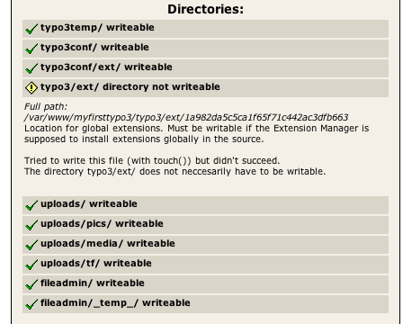
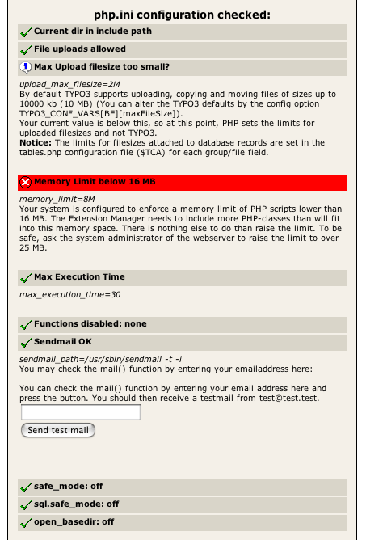

.. include:: /Includes.rst.txt
.. highlight:: php

=========================
Check Basic Configuration
=========================

<< back [outdated wiki link]

.. container::

   notice - This information is outdated

   .. container::

      While some details may still apply in specific situations, this
      page was written for obsolete `packages of
      TYPO3 <https://typo3.org/download/>`__ dating to 2007 or before.

.. container::

   warning - No longer supported TYPO3 version

   .. container::

      This page contains information for older, no longer maintained
      TYPO3 versions. For information about TYPO3 versions, see
      `get.typo3.org <https://get.typo3.org>`__. For information about
      updating, see the `Installation & Upgrade
      Guide <https://docs.typo3.org/m/typo3/guide-installation/master/en-us/>`__

=====================
Directories Writable?
=====================

The first section tells you if TYPO3 can write to the directories it
needs to.

|Typo3instbasicdir.png|

In this case TYPO3 **does not** have write permissions to the
**extension directory**. To change write permissions depends off which
operating system you have installed TYPO3 on.

Linux/Unix/Mac OS X
===================

Go to your TYPO3 source installation and show the information of the
directory **ext**. You'll probably find it under /var/lib/typo3/latest
(Debian), /usr/local/lib/typo3/latest (other Linux, Unix or Mac OS X).
Use the appropriate directory.

::

   cd /var/lib/typo3/latest/typo3
   ls -ld ext

Your output could look something like this:

::

   drwxr-xr-x   67 root     root     4096  Jul   4 22:53 ext

This means that the extension directory **ext** is owned by root and
belongs to the group root. Furthermore only the owner has write access
to the extension directory.

Two things need to be done:

1. Change the group to Apache user [outdated wiki link].

::

   chown [outdated wiki link] -R :www-data ext

2. Give the group write permissions.

::

   chmod [outdated wiki link] -R 775 ext

3. Do that with all the directories that TYPO3 does not have write
permissions to.

Windows
=======

#. Go to your TYPO3 source installation and show the information of the
   directory **ext**. It could be somewhere like
   *C:/Webserver/Typo3/Latest*.
#. Find the **ext** directory and **right click** on it.
#. Choose **properties**.
#. Make sure your webserver [outdated wiki link] has write permissions
   to this directory.

Once you have changed all permissions, check it by selecting **1. Basic
configuration** again and see if TYPO3 has write permissions to all
directories now.

=======
Php.ini
=======

The settings in php.ini [outdated wiki link] are always an issue
concerning the TYPO3 installation process. As you can see in the
following screenshot, there is one warning and one error to take care
of.

|Typo3instbasicphp.png|

Both *problems* can be addressed in the php.ini.

Memory
======

1. Open [outdated wiki link] the php.ini file.

2. Find [outdated wiki link] the entry **memory_limit**.

3. Change the value to 25M.

4. Save [outdated wiki link] and exit [outdated wiki link] php.ini.

5. Restart your webserver [outdated wiki link].

6. Choose **1. Basic Configuration** from the menu again to see if the
error message is gone.

Example (php.ini):

::

   memory_limit = 25M      ; Maximum amount of memory a script may consume (8MB)

"upload_max_filesize" and "post_max_size"
=========================================

"upload_max_filesize" and "post_max_size" should have the same values,
because they are connected.

1. Open [outdated wiki link] the php.ini [outdated wiki link] file.

2. Find [outdated wiki link] the entry **upload_max_filesize**.

3. Change the value to 10M.

4. Find [outdated wiki link] the entry **post_max_size**.

5. Change the value to 10M.

4. Save [outdated wiki link] and exit [outdated wiki link] php.ini

5. Restart your webserver [outdated wiki link].

6. Choose **1. Basic Configuration** from the menu again to see if the
error message is gone.

Example (php.ini):

::

   ; Maximum allowed size for uploaded files.
   upload_max_filesize = 10M
   ; Maximum size of POST data that PHP will accept.
   post_max_size = 10M

