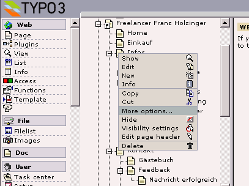
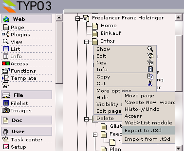
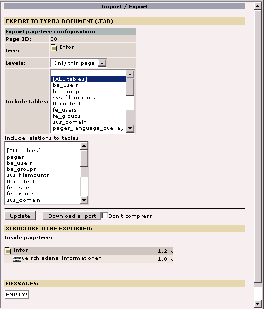
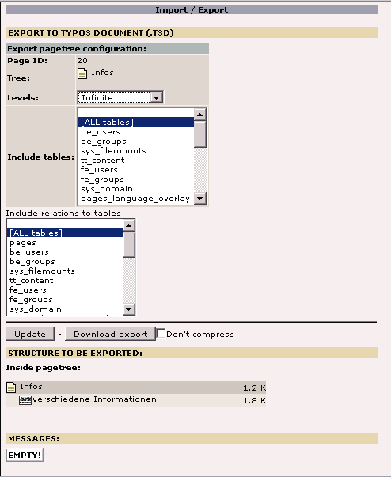
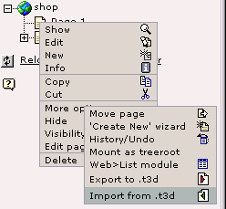
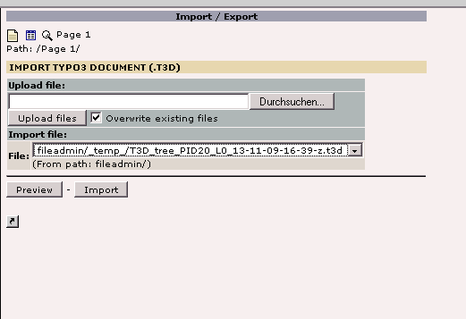
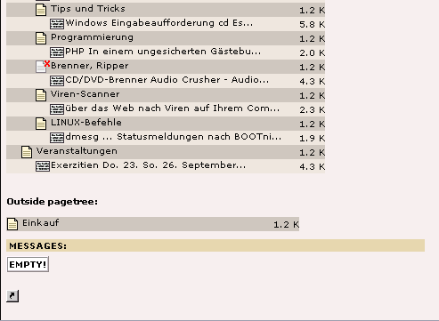

.. include:: /Includes.rst.txt
.. highlight:: php

==========================================================
Faq/copy parts of a running TYPO3 system to another server
==========================================================

.. container::

   **Content Type:** FAQ [outdated wiki link].

.. container::

   warning - No longer supported TYPO3 version

   .. container::

      This page contains information for older, no longer maintained
      TYPO3 versions. For information about TYPO3 versions, see
      `get.typo3.org <https://get.typo3.org>`__. For information about
      updating, see the `Installation & Upgrade
      Guide <https://docs.typo3.org/m/typo3/guide-installation/master/en-us/>`__

--------------

Maybe you have already done a lot of work on your Typo3 server and even
built more than one homepage with it. Now you want to copy parts of one
homepage to another server or you just want to save it as a backup copy.

Note that this method won't copy your CSS or any images. So you'll have
to move them manually later.

Prerequisites
=============

| If you do not have the following menu entries, then you must install
  the shy extensions 'Extra Click Menu Options' (extra_page_cm_options)
  and 'Import/Export' (impexp). You must have already created at least
  one page where the context menu can appear.
| And you must have installed all the extensions from your origin server
  on your destination server.

Export your data
================

On the page tree left click on the page from where you want to start the
copy. From there you select 'More options ...' and then 'Export to
.t3d'.

|HowtoCopyParts1.png|

**Select the start page**

|HowtoCopyParts2.png|

**Choose «Export to .t3d»**

If you know what you do, you can select the tables manually, from which
you want to export the entries correlated with the selected page...

|HowtoCopyParts3.png|

**Import/Export page**

... otherwise, if you want to save all your data starting from the
selected page and including all the subpages, you select 'ALL tables'
twice and 'Infinite' from the Levels popup menu.

|HowtoCopyParts4.png|

**Levels Infinite**

Click on the 'Download export' button. A dialog box will get opened and
ask you the path where to store the created compressed file. Insert the
filename of your choice and save it.

Import your data
================

Then you copy that file to your destination Typo3 server and open the
Typo3 page tree on the destination server. You will need to have at
least one page there. If not, you must create it now. Again you
left-click onto the start page, after which you want to restore the file
into it. Select 'More options ...' - 'Import from .t3d'.

|HowtoCopyParts5.png|

**Import the page tree**

The import/export page will be shown. You click the Browse button and
select the file you have just copied to the server. Click the 'Upload
files' button. Afterwards you have to choose this file again in the
'Import file:' / 'File:' part of this page.

|HowtoCopyParts6.png|

**Selection of the uploaded file**

Click on the 'Import' button and wait a moment. The screen will show the
list of the imported pages. Verify this to make sure you have not
forgotten anything.

|HowtoCopyParts7.png|

**Screen of generated pages**

| Done. That was it.

A few more things
=================

If you have also used your own template files or cascading style sheet
files (.css) you must copy them manually into the same path structure
like on the original Typo3 server. Do not forget to create a template
for the first page you have imported if necessary.

Copy your fileadmin, uploads and media folder manually. You can copy
your t3d or t3x file directly into the fileadmin folder. This becomes
necessary, when the file size is too big.

| If you wanted to copy a whole homepage the recently created 'Page 1'
  might disturb you now. The solution to get rid of the 'Page 1' now is
  to select the 'List' or 'Page' module, left click onto the recently
  imported start page and select 'Cut' or 'Copy'. Then left click to the
  place where you want to move the selected and subpart pages and select
  'Paste into ...'. This can be done everywhere in the page tree.
| After that you can delete your 'Page 1'.

Comments
========

With TemplaVoila 0.3.0/0.4.0 and Typo3 3.7.0/3.8.0 everything works
well, except that imported pages are blank or have strange content! That
is because the content elements on each page have been put into the
Non-used elements tab. Just copy them from there and everything is ok. /
Peter [outdated wiki link], 11 June 2005

In Typo3 v3.8.0- this function has been extended and look a little
different, but the principle is still the same. /Peter [outdated wiki
link]

