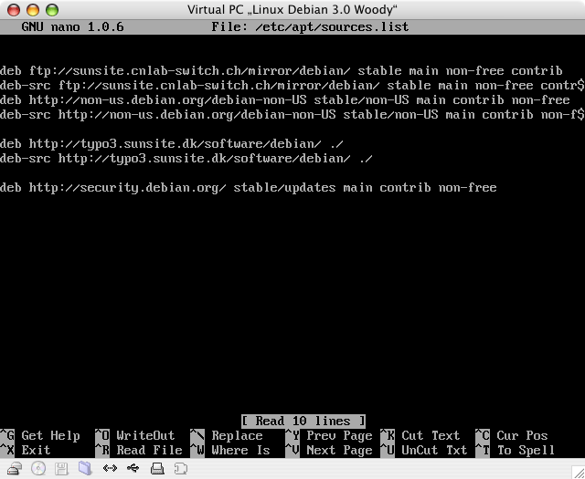
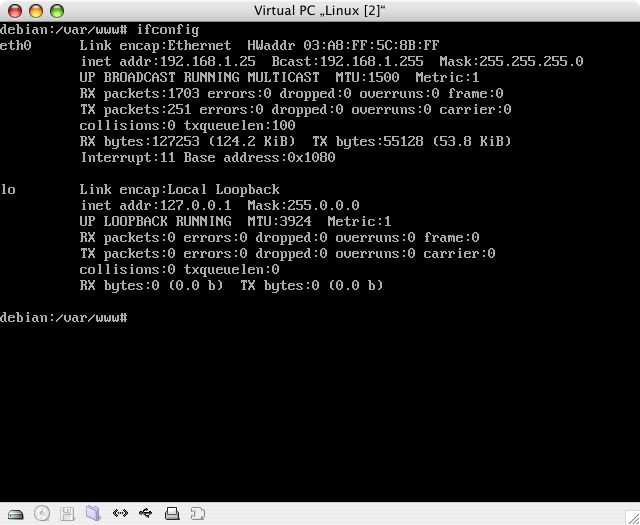
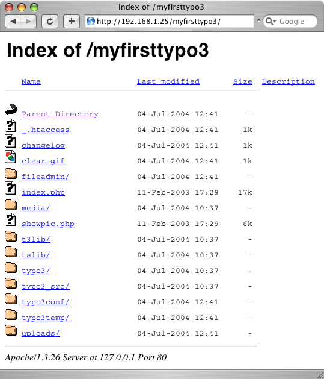
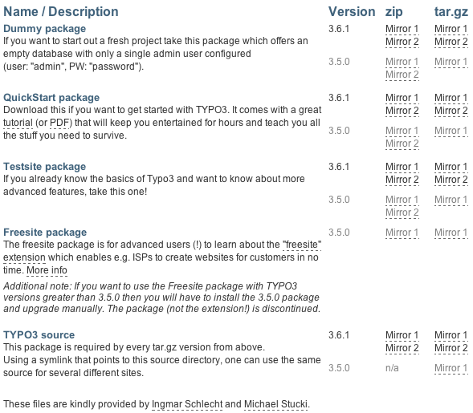

.. include:: /Includes.rst.txt
.. highlight:: php

======
Debian
======

<< Back to Typo3 Installation Basics [outdated wiki link]

.. container::

   notice - This information is outdated

   .. container::

      While some details may still apply in specific situations, this
      page was written for obsolete `packages of
      TYPO3 <https://typo3.org/download/>`__ dating to at least 2004.

Debian is an important, very secure and stable OperatingSystem and many
people use this page, so it's a HOT topic.

============
Requirements
============

For ready-to-go-installer
=========================

Debian 3.0 Woody
----------------

You need at least a clean installation of **Debian 3.0 Woody**. To
install Debian go here [outdated wiki link].

[NOTE] If you run **Debian Sid** you might run into **problems** with
the current GD libraries.

Root access
-----------

In order to install with the ready-to-go-installer you need **root
access** to the server. If you rent a **webspace** you don't get root
access (at least it is very unlikely) and have to install Typo3
**manually** (see below)

For manual installation
=======================

You need a running **LAMP installation** that meet the minimum
requirements [outdated wiki link] for Typo3.

What about Apache, MySQL and PHP?
=================================

You **don't need** Apache, MySQL and PHP installed. The installer
package can do this for you. However if you have already installed
Apache, MySQL and PHP you still can run the installer which **skips**
the installation process automatically.

========================
Ready-To-Go-Installation
========================

The ready-to-go-installer doesn't work with a webspace since it is
required to have root access. If you have root access than you probably
have your own webserver (even if rented), not a webspace.

Install Debian
==============

Install Debian on your webserver.

**[NOTE] These instructions are based on a clean install. All data will
be lost.**

Update sources.list
===================

1. Open sources.list

::

   nano /etc/apt/sources.list

2. Add the following lines to your sources.list

::

   deb http://typo3.sunsite.dk/software/debian/ [outdated link] ./
   deb-src http://typo3.sunsite.dk/software/debian/ [outdated link] ./

Your sources.list should look something like this:

|Debian sources.list.png|

3. Save and exit sources.list

::

   CTRL-X + y + [ENTER]

Update your Debian installation and get the Typo3 packages
==========================================================

1. Update with apt-get

::

   apt-get update

Depending on how long you haven't been updating your Debian some
packages will be update and some security updates will be made.

Even if you just installed Debian it's good to do it anyway.

2. Install Typo3 base

::

   apt-get install typo3-base

3. Get all recommended packages

::

   apt-get install typo3-env

This installs **all packages** that are **required** for a running Typo3
installation. Debian lists all the packages that will be installed
(about 46 packages if you have a clean Debian installation); among them
**Apache, PHP, MySQL, ImageMagick etc.** If you are already running a
**LAMP installation** then there will be less packages to be installed.

Confirm the installation of the packages:

::

   Do you want to continue? [Y/n] [ENTER]

Debian now **installs** all the packages that are required. This might
take a **few minutes**. After installation Debian starts the
configuration process (see Configuration Packages [outdated wiki link]).

4. Install Typo3-site-installer

::

   apt-get install typo3-site-installer

This Installer handels most of the installation process that is involved
in setting up Typo3. Some parts are going to be handled by Debian or the
appropriate Installer of a certain package.

Install a TYPO3 site
====================

In order to install a new TYPO3 site you need to set a directory where
you want the site to be installed to

::

   typo3-site-installer -d=/var/www/myfirsttypo3 -a

The **option -a** fixes the symlink [outdated wiki link] inside the site
directory to point to the TYPO3 core at **/var/lib/typo3/latest**. If
you have a look at /var/lib/typo3/latest you find it to be yet another
symlink [outdated wiki link] that points to **typo3_src-3.5.0**.

If a future version of TYPO3 you just change the **latest**-symlink
[outdated wiki link] to e.g. *typo3_src-3.7.0* and follow the update
procedure and all your websites that point to **latest** will be
updated.

Access your TYPO3 site
======================

In order to test if everything worked so far to continue with the TYPO3
installation [outdated wiki link] just access your newly install TYPO3
site with a browser:

::

   http://192.168.1.25/myfirsttypo3 [outdated link]

IP address
----------

To get your IP address, type

::

   ifconfig [ENTER]

at your console to get something like this:

|Debianconfigipaddress.png|

The value after **inet addr;** is your IP address. In our example it is
192.168.1.25.

Add PHP
-------

If you follow the installation process from the very beginning (Debian
installation) you probably end up with a directory listing at this
point.

|Debianinstdirlist.png|

This means that Apache does **not understand** PHP files.

#. We need to add index.php as an acceptable index file.
#. We need to tell Apache to load the PHP module

Those changes need to be done in the configuration file of Apache, the
httpd.conf. Before we make any changes we want to make a backup copy in
case we have to restore the current enviroment.

1. Go to the directory where httpd.conf is located.

::

   cd /etc/apache/conf

2. Make a backup copy.

::

   cp httpd.conf httpd.conf.bak

3. Open httpd.conf in a text editor.

::

   nano httpd.conf

4. Use the **Where Is** command.

::

   [CTRL] + [w]

5. Find the directive **DirectoryIndex** and type

::

   directoryindex [ENTER]

You end up at the first **DirectoryIndex** which probably is a comment,
indicated by a **#** at the beginning of the line. Find it again by
repeating 4 to end up at the directive or use the arrow keys to point to
the line where the directive is.

6. Add **index.php** to the directive. Your directive should look like
this:

::

   <IfModule mod_dir.c>
        DirectoryIndex index.html index.htm index.shtml index.cgi index.php
   </IfModule>

With this you let apache know that if you access a web page without
defining a file it should look for all those file names and serve them
to the browser if found.

The first found in line will be served first. If you have the files
index.html and index.php, with the above directive the index.html will
be served.

If you want the index.php to be the one to be served first then you'd
have to put the entry before index.html.

7. Find all entries with the value **php**.

::

   [CTRL] + [w] + php + [ENTER]

Find it till you end up at:

::

   #
   # And for PHP 4.x, use:
   #
   #AddType application/x-httpd-php .php
   #AddType application/x-httpd-php-source .phps

8. Remove the comment tags before the AddType directives, so it looks
like this:

::

   #
   # And for PHP 4.x, use:
   #
   AddType application/x-httpd-php .php
   AddType application/x-httpd-php-source .phps

9. Repeat the search for php as in 7 till you find this:

::

   # LoadModule php4_module /usr/lib/apache/1.3/libphp4.so

10. Remove the comment.

11. Save and exit httpd.conf.

::

   [CTRL] + [x] + y + [ENTER]

12. Restart Apache.

::

   apachectl graceful

Test your TYPO3 site
--------------------

If everything worked out fine you should be able to access your TYPO3
site with

::

   http://192.168.1.25/myfirsttypo3 [outdated link]

and get the following message:

::

   In the main source distribution of Typo3, the install script is disabled by a die() function call.
   Open the file typo3/install/index.php and remove/out-comment the line that outputs this message!

Now, you are ready to install TYPO3.

===================
Manual Installation
===================

Download the source package
===========================

Go to the the packages page of TYPO3.

::

   https://typo3.org/download/

|Typo3 installation basics packages.png|

1. In order to download the packages you need **wget**. If you followed
the Debian Installation instructions you need to install wget first.

::

   apt-get install wget

2. Position yourself to the TYPO3 directory of your webserver

::

   cd /var/lib/typo3

3. Download the Source Package

::

   wget http://typo3.sunsite.dk/unix-archives/3.7.0/typo3_src/typo3_src-3.7.0.tar.gz [outdated link]

Get the Source Package Ready
============================

1. Untar the source package.

::

   tar xzvfp typo3_src-3.7.0.tar.gz

2. Create a package directory to store the packages.

::

   mkdir packages

3. Move the source package to the package directory

::

   mv typo3_src-3.7.0.tar.gz packages

4. Change to the previous directory

::

   cd ..

5. Create Symlink **latest**.

::

   ln -s typo3_src-3.7.0 latest

Download the Dummy Package
==========================

1. Position yourself to the document root

::

   cd /var/www

4. Download the Source Package

::

   wget http://typo3.sunsite.dk/unix-archives/3.7.0/dummy/dummy-3.7.0.tar.gz [outdated link]

Get the Dummy Package Ready
===========================

1. Untar the source package.

::

   tar xzvfp dummy-3.7.0.tar.gz

2. Change the name of your new directory to the TYPO3 site directory

::

   mv dummy-3.7.0 myfirsttypo3

3. Move the package file to the packages folder created before.

::

   mv dummy-3.7.0.tar.gz /var/lib/typo3/packages

4. Go to the **myfirsttypo3 directory**.

::

   cd myfirsttypo3

5. Remove the **symlink** of typo3_src and create a new one with the
correct link.

::

   rm typo3_src
   ln -s /var/lib/typo3/latest typo3_src

Test your installation
======================

Use your browser to test your installation:

::

   http://192.168.1.25/myfirsttypo3 [outdated link]

More help
=========

-  in german: `linuxwiki.de <http://linuxwiki.de/Debian>`__,
   `debian.org <http://www.debian.org/devel/debian-desktop>`__

=============
Miscellaneous
=============

This section cover any additional topic about TYPO3 and debian related
package or information.

Image processing package for TYPO3
==================================

Debian Sid
http://lists.typo3.org/pipermail/typo3-debian/2004-August/000836.html

Debian Sarge
http://lists.typo3.org/pipermail/typo3-debian/2004-August/000835.html

Debian Woody
============

Running GIF enabled packages on Debian Woody [outdated wiki link]

