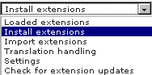
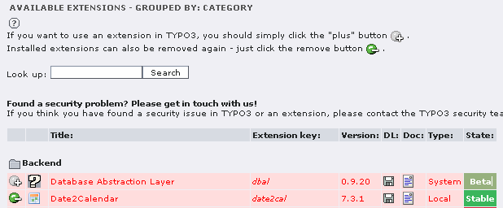
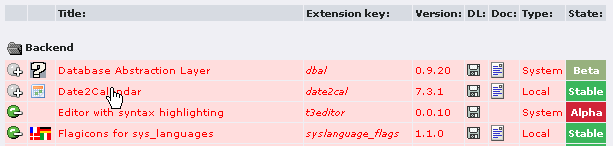
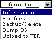
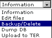
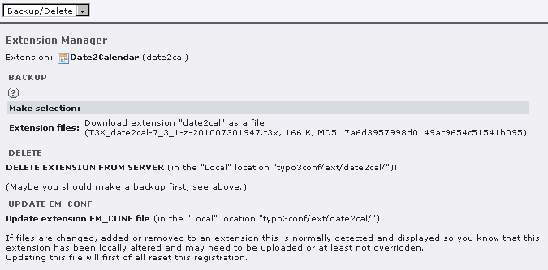
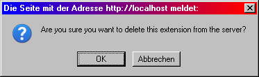
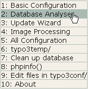

.. include:: /Includes.rst.txt
.. highlight:: php

.. _delete-extensions:

========================
How to delete extensions
========================

.. container::

   **Content Type:** HowTo [outdated wiki link].

.. container::

   notice - Newer documentation available

   .. container::

      `Installation and Upgrade
      Guide <https://docs.typo3.org/m/typo3/guide-installation/master/en-us/Index.html>`__
      contains information on installing, activating, deactivating and
      removing extensions for supported TYPO3 versions

.. container::

   warning - No longer supported TYPO3 version

   .. container::

      This page contains information for older, no longer maintained
      TYPO3 versions. For information about TYPO3 versions, see
      `get.typo3.org <https://get.typo3.org>`__. For information about
      updating, see the `Installation & Upgrade
      Guide <https://docs.typo3.org/m/typo3/guide-installation/master/en-us/>`__

=============================
Extension Manager terminology
=============================

In the context of the TYPO3 extension [outdated wiki link] manager
("EM"), the words "install" and "uninstall" differ from their mainstream
meaning. To avoid mixing these terms up with the other EM verbs, here is
a clarification:

-  **Import** means "downloading an extension from
   `TER <https://extensions.typo3.org/>`__ and copying it to
   *typo3conf/ext/*".
-  **Install** means "activating the already imported extension inside
   the extension manager and performing database changes mandated by the
   extension".
-  **Uninstall** means "deactivating an extension, but leaving it on the
   disk".
-  **Delete** means "removing extension files permanently from disk".

To deactivate an extension without deleting it completely, see the
article Uninstall Extensions [outdated wiki link].

================
Why this manual?
================

There are cases when you don't need an extension anymore, e.g. because
its function has been incorporated into to the TYPO3 core, or because
you want to test several similar extensions, have switched back and
forth between them and decided on one of them. In that case, you want to
purge it completely from your system.

In former versions of TYPO3 this has been problematic.

This manual explains how to remove extensions, using the extension
<ext>date2cal<ext> as an example (its functionality has been moved into
core and it is no longer needed).

How to delete an extension
==========================

Preparations
------------

It is assumed that you have backed up your complete TYPO3 installation
(including the SQL database), made sure that only admins can login and
informed all editors and users about the planned maintenance.

Read this manual to its end first.

Check extension dependencies
----------------------------

Deleting an extensions is not always easily revertible. Follow these
steps carefully:

Uninstall
---------

Follow all steps in Uninstall Extensions [outdated wiki link]. Don't
forget to backup the new *LocalConfiguration.php*.

Identifying files and tables
----------------------------

| Open the Extension Manager. Choose 'Install extensions'.
| |Extension Manager menu|

.. container::

   .. container::

      |image1|

      .. container::

         .. container::

         Extension Manager overview

You get an overview about imported (installable) extensions (see picture
on the right).

Look at the type of the extension: you can not - and should not try to!
- delete 'system' extensions.

| Click on the title of the extension you want to delete.
| |Extension manager, list of extensions, cursor on title of date2cal)|

| You get a window with details for this extension. In the menu choose
  "information".
| |Extension manager, extensions details, menu information)|

Below you find different entries telling you the directories in which
extension files are installed and which database tables belong to this
extension. Examples:

-  Type of install: Local - Local extensions (*typo3conf/ext/*)
-  Create directories: *typo3temp/tx_date2cal*
-  Database requirements: *tx_example_debuglog*

For most extensions it will be like this:

-  the extension files are in a subdirectory of *typo3conf/ext/*, for
   example *typo3conf/ext/date2cal/*
-  temporary files in a directory under *typo3temp/* named accordingly

Note all directories and database tables. It is possible that not all of
them will be deleted by the push of a button.

Delete the extension
====================

| Choose 'Backup/Delete'
| |Extension manager, extensions details, menu Backup/Delete)|

| You get the window:
| |Extension manager - Extension Details - Backup Delete - overview)|

You really made a backup? OK, then be brave and press 'DELETE EXTENSION
FROM SERVER'! There is a request for confirmation: |Extensions manager -
Extension Details - Backup Delete - confirmation request)|

After confirming, after a while you should see the message *"Removed
extension in path..."*.

Control and cleaning up
=======================

Click on |Typo3-sysext-t3skin-icons-gfx-goback.gif| to reach the upper
level of the extension manager. The extension should be gone.

LocalConfiguration.php
----------------------

Download the actual ``LocalConfiguration.php``, but do not overwrite
your old backup.

'**``$TYPO3_CONF_VARS['EXT']['extListArray']``'** now should:

-  no longer show the entry of the deleted extension.

Line
'**``$TYPO3_CONF_VARS['EXT']['extConf'][``**\ ``extension-key]``\ **'**
might still be there, but you may delete it. (in our example:
``$TYPO3_CONF_VARS['EXT']['extConf']['date2cal']...``.

Upload the cleaned ``LocalConfiguration.php``. (Alternatively you could
use the Install Tool on page 'All configuration'.)

Database
--------

| Open the Install Tool and start **Database Analyser**:
| |Install Tool - menu - mouse on DatabaseAnalyser|

| Scroll down to 'Update required tables - Compare' and click
  **Compare**
| |Install Tool - DatabaseAnalyser - Compare.png|
| Now you can view, pick and perform corrections.

| Start **phpmyadmin**.
| Check whether the former identified tables have really been deleted.
  If not, you may do it here.

Anyway, it's a good idea to clean up the database any now and then.
Before and after installations you should always do it. Module
Admin-Tools / DB Check, then in the menu 'Manage Reference Index'. Click
on **Click here to update reference index: Update Now!**

Files and Directories
---------------------

Check whether the identified directories and files have been deleted. It
might be that the directory under ``typo3conf/ext/`` has been deleted,
but files and directories in *typo3temp/* still exist. You might have to
delete them manually.

Empty the cache
===============

Empty the configuration and frontend cache.

Done!
=====

If your TYPO3 installation still works, you were probably successful
(check the entire site to be sure) and can now reset the maintenance
settings.

