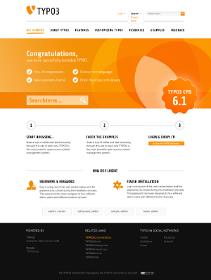

.. include:: /Includes.rst.txt

.. _distributionmanagement:

=================================
Blueprints/DistributionManagement
=================================

`<- Back to blueprints overview </Blueprints>`__ [deprecated wiki link]

====================================================
Blueprint: Distribution Management for TYPO3 6.2 LTS
====================================================

+----------------------+----------------------------------------------+
| Proposal             | Add possibility to install distributions     |
|                      | (packages) via the extension manager         |
+----------------------+----------------------------------------------+
| Owner/Starter        | Susanne Moog                                 |
+----------------------+----------------------------------------------+
| Participants/Members | -                                            |
+----------------------+----------------------------------------------+
| Status               | Draft, Discussion, Voting Phase,             |
|                      | **Accepted**, Declined, Withdrawn            |
+----------------------+----------------------------------------------+
| Current Progress     | Unknown, Started, Good Progress, Bad         |
|                      | Progress, Stalled, Review Needed, **DONE**   |
+----------------------+----------------------------------------------+
| Topic for Gerrit     | distributionmanager                          |
+----------------------+----------------------------------------------+

Target Versions/Milestones
==========================

-  Started during TYPO3 CMS 6.2 development

Goals / Motivation
==================

Up until now the introduction and government packages had to be
delivered as part of a whole TYPO3 installation as there was no easy way
to provide out of the box installations without delivering the core with
it. The new distribution management aims at making it possible to
deliver and install full packages as normal extension via the extension
manager. Therefor making maintenance of existing and creation of new
packages much easier.

Concept
=======

To be able to install a package we have to take care of the following
parts:

-  Deliver initial database data
-  Deliver fileadmin files
-  Deliver configuration for a package
-  Be able to hook into the process after saving configuration to
   trigger actions dependent on configuration values (for example color
   selection in the old introduction package)
-  Deliver custom dependent extensions (customized versions or
   extensions not available through TER)
-  Display available distributions in the extension manager
-  Send an user to the distribution installation page after initial
   installation (not finished)

Implementation Details
======================

Most of the following will work for every kind of extension, although
there are parts specific to distributions, like an automatic redirect to
the distribution welcome page after installation. To enable distribution
handling for your extension you will have to change its category to
**distribution**.

.. container::

   .. container::

      |Distribution.png|

      .. container::

         .. container::

.. container::

   .. container::

      |DistributionWelcome.png|

      .. container::

         .. container::

Delivering data
---------------

To deliver initial data within an extension you have to follow the
following conventions:

database data
^^^^^^^^^^^^^

**extension/Initialisation/data.t3d**: Put a .t3d export of your
database data called data.t3d in this location and it will be imported
(at root level) during installation

fileadmin files
^^^^^^^^^^^^^^^

**extension/Initialisation/Files/**: Add your files here, they will be
copied to fileadmin/extension/ during installation

Adding distribution configuration
---------------------------------

Distribution configuration is just normal extension configuration
delivered in ext_conf_template. After configuration is written the
signal "afterExtensionConfigurationWrite" is dispatched.

Delivering custom dependencies
------------------------------

An extension can work as its own extension repository. Add unpacked
extensions to **extension/Initialisation/Extensions** to provide
dependencies. Your main extension has to be dependent on these extension
as normal dependencies in ext_emconf. Extensions delivered inside an
extension have the highest priority when extensions need to be fetched.
Caution, these will **not** overwrite extensions already present in the
system.

Configuring the distribution display
------------------------------------

For your own distributions you should provide a preview image in
**Resources/Public/Images/Distribution.png** and a bigger welcome image
in **Resources/Public/Images/DistributionWelcome.png**.

Image size for the preview should be 220x150 pixels, for the welcome
image 300x400 pixels.

Issues and reviews
==================

`Related Gerrit patch
sets <https://review.typo3.org/#/q/status:merged+project:Packages/TYPO3.CMS+branch:master+topic:distributionmanager,n,z>`__

