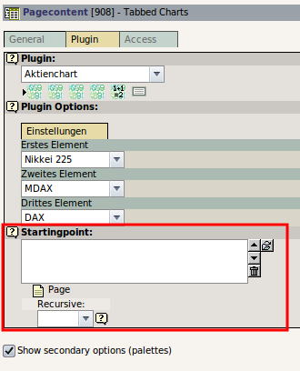

.. include:: /Includes.rst.txt

==========================================
Extension Development, add a startingpoint
==========================================

`Template:Head-Howto </wiki/index.php?title=Template:Head-Howto&action=edit&redlink=1>`__
[not available anymore]

.. container::

   warning - No longer supported TYPO3 version

   .. container::

      This page contains information for older, no longer maintained
      TYPO3 versions. For information about TYPO3 versions, see
      `get.typo3.org <https://get.typo3.org>`__. For information about
      updating, see the `Installation & Upgrade
      Guide <https://docs.typo3.org/m/typo3/guide-installation/master/en-us/>`__

<< Back to `Extension Development <extension-development>`__ << Back to
`Developer manuals <overview-developer-manuals>`__ page

`[edit] <https://wiki.typo3.org/wiki/index.php?title=Extension_Development,_add_a_startingpoint&action=edit&section=0>`__
[deprecated wiki link]

Startingpoint
=============

|Typo3-extension-startingpoint.png|

How to add a startingpoint
==========================

Remove **pages** from **subtypes_excludelist** in **ext_tables.php**:

::

   $TCA['tt_content']['types']['list']['subtypes_excludelist'][$_EXTKEY.'_pi1']
       = 'layout,select_key';

| 
| The current settings for pages and recursivity are in
  ``$this->cObj->data``. The plugin base class provides a method
  ```pi_getPidList()`` <https://typo3.org/fileadmin/typo3api-4.0.0/df/d32/classtslib__pibase.html#3872de7100aa7108bd747de366eb0e01>`__
  to transform both data in a comma separated string:

.. container::

   `PHP Script </wiki/Help:Contents#Syntax-Highlighting_for_PHP-Code>`__
   [deprecated wiki link]

.. container::

   ::

      $pidList = $this->pi_getPidList($this->cObj->data['pages'], $this->cObj->data['recursive']);
      //if "pages" contains 312 and 313, and 314 is below 313
      // and recursive is set to 1, $pidList will be
      // 312,313,314

| 
| Now we may use MySQL's ``IN`` operator to make sure we select only
  records on the desired pages. We also use
  `t3lib_DB::cleanIntList() <https://typo3.org/fileadmin/typo3api-4.0.0/de/d07/classt3lib__DB.html#7d45dad7dfa1fdb4bd0e6a09cd34ba61>`__
  [not available anymore] to stay safe of sql injections:

.. container::

   `PHP Script </wiki/Help:Contents#Syntax-Highlighting_for_PHP-Code>`__
   [deprecated wiki link]

.. container::

   ::

      // Get resource records:
      $res = $GLOBALS['TYPO3_DB']->exec_SELECTquery(
          "*", "tx_myext_table",
          "pid IN (" . $GLOBALS['TYPO3_DB']->cleanIntList($selectedPids) . ")" 
          . " AND my_criteria=" . $criteria//extend that as you like
      ); 

      //displaying retrieved records               
      while ($row = $GLOBALS['TYPO3_DB']->sql_fetch_assoc($res)) {
          $content.= "found record uo">.$row['uid']; 
      }

Speed improvements
==================

You can do like this if you want to hardcode the sql statement and avoid
recursion and gain some speed:

.. container::

   `PHP Script </wiki/Help:Contents#Syntax-Highlighting_for_PHP-Code>`__
   [deprecated wiki link]

.. container::

   ::

      $this->andWhere('uid' => '666');

      $res = $GLOBALS['TYPO3_DB']->exec_SELECTquery(
          '*,V.title VT,V.uid VU,S.title ST,S.uid SU,S1.uid S1U, S1.title S1T, S2.uid S2U, S2.title S2T',
          'pages WA INNER JOIN pages V ON WA.pid=V.uid INNER JOIN pages S ON V.pid=S.uid INNER JOIN pages S1 ON S.pid=S1.uid INNER JOIN pages S2 ON S1.pid=S2.uid',
          'S2.uid='..$GLOBALS['TYPO3_DB']->cleanIntList($parentUid).' AND WA.deleted=0 AND WA.hidden=0'.(count($this->andWhere)?' AND '.implode(' AND ',$this->andWhere):'').(count($this->orWhere)?' AND ('.implode(' OR ',$this->orWhere).')':''),
          'S1.uid','WA.pid','');

--`Chibox </User:Chi_hoang>`__ [deprecated wiki link] 15:38, 12 February
2008 (CET)


