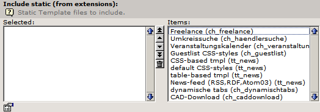

.. include:: /Includes.rst.txt

=====================================================
Extension Development, add static extension templates
=====================================================

.. container::

   **Content Type:** `HowTo <https://wiki.typo3.org/Category:HowTo>`__
   [deprecated wiki link].

.. container::

   notice - Newer documentation available

   .. container::

      `TypoScript Template Reference » Add TypoScript in your
      extension <https://docs.typo3.org/m/typo3/reference-typoscript/master/en-us/UsingSetting/AddTypoScriptWithExtensions.html>`__

.. container::

   warning - No longer supported TYPO3 version

   .. container::

      This page contains information for older, no longer maintained
      TYPO3 versions. For information about TYPO3 versions, see
      `get.typo3.org <https://get.typo3.org>`__. For information about
      updating, see the `Installation & Upgrade
      Guide <https://docs.typo3.org/m/typo3/guide-installation/master/en-us/>`__

Static extension templates
==========================

You can add external TypoScript templates to your extension. An external
TypoScript template could, for example, add default CSS for your
extension.

For example:

**1) setup.txt:**

.. container::

   `TS
   TypoScript <https://wiki.typo3.org/wiki/Help:Contents#Syntax-Highlighting_for_TypoScript>`__
   [deprecated wiki link]

.. container::

   ::

       plugin.tx_myext_pi1._CSS_DEFAULT_STYLE (
       
          body {
              margin-left: 0px;
              margin-top: 0px;
              margin-right: 0px;
              margin-bottom: 0px;
              background-image: url(typo3conf/ext/myext/res/fullwall.jpg); 
              background-repeat: repeat-x
          }
       )

setup.txt is the static template filename and can be found in the folder
pi1/static/css of your extension.

**2) ext_tables.php:**

.. container::

   `PHP
   Script <https://wiki.typo3.org/wiki/Help:Contents#Syntax-Highlighting_for_PHP-Code>`__
   [deprecated wiki link]

.. container::

   ::

       t3lib_extMgm::addStaticFile($_EXTKEY, 'pi1/static/css', 'myext default CSS');

in ext_tables.php of your extension calls
t3lib_extMgm::addStaticFile($extKey, $path, $title).
`more <https://typo3.org/fileadmin/typo3api-3.8.0/db/d23/classt3lib__extMgm.html#a51>`__
[not available anymore]

**3) "include static template (from extensions)" selector:**

+-----------------------------------------------------------------------+
| .. container::                                                        |
|                                                                       |
|    .. container::                                                     |
|                                                                       |
|       |image1|                                                        |
|                                                                       |
|       .. container::                                                  |
|                                                                       |
|          .. container::                                               |
|                                                                       |
|          Description                                                  |
+-----------------------------------------------------------------------+

With the "include static template (from extensions)" selector in the
template record you can add the static template to your typoscript
template.

