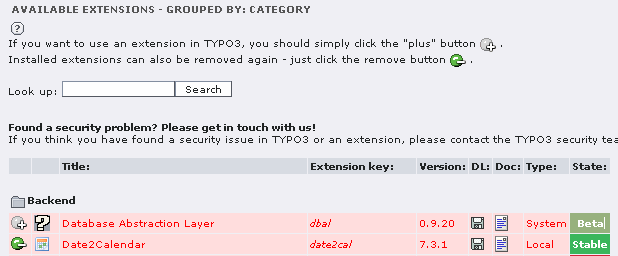

.. include:: /Includes.rst.txt
.. highlight:: php

===========================
How to uninstall extensions
===========================

.. container::

   **Content Type:** HowTo [outdated wiki link].

.. container::

   notice - Newer documentation available

   .. container::

      `Installation and Upgrade
      Guide <https://docs.typo3.org/m/typo3/guide-installation/master/en-us/Index.html>`__
      contains information on installing, activating, deactivating and
      removing extensions for supported TYPO3 versions

.. container::

   warning - No longer supported TYPO3 version

   .. container::

      This page contains information for older, no longer maintained
      TYPO3 versions. For information about TYPO3 versions, see
      `get.typo3.org <https://get.typo3.org>`__. For information about
      updating, see the `Installation & Upgrade
      Guide <https://docs.typo3.org/m/typo3/guide-installation/master/en-us/>`__

=============================
Extension Manager terminology
=============================

In the context of the TYPO3 extension [outdated wiki link] manager
("EM"), the words "install" and "uninstall" differ from their mainstream
meaning. To avoid mixing these terms up with the other EM verbs, here is
a clarification:

-  **Import** means "downloading an extension from
   `TER <https://extensions.typo3.org/>`__ and copying it to
   *typo3conf/ext/*".
-  **Install** means "activating the already imported extension inside
   the extension manager and performing database changes mandated by the
   extension".
-  **Uninstall** means "deactivating an extension, but leaving it on the
   disk".
-  **Delete** means "removing extension files permanently from disk".

See also the Delete Extensions [outdated wiki link] for a complete
discussion about removing an extension completely from disk and
database.

====================
Uninstall Extensions
====================

Check Dependencies
==================

First find out, which other extensions and functions of your
Typo3-Installation are dependent of the extension you want to deinstall.
Major dependeancies you can find out by checking the `Extension
Repository <https://extensions.typo3.org/>`__. Look for the extension
you want to deinstall and the others you have installed. Read for all of
them the chapters 'Dependencies' and 'Reverse dependencies'.

Contemplate, whether you made referrals to the extension in any setup,
config or other Typoscript-section. Think of the results of deleting
them and finally do it.

If you are not sure, or just testing, you might as well deinstall the
extension (which is without deleting) and see what happens. This could
lead to your backend no longer loading. In that case you can add the
extension again by going to the Install Tool and adding it to
``[EXT][extListArray]`` again. However, you can always undo it. Be sure
not to do it under time pressure.

Uninstall / Deinstall / Remove
==============================

There are at least 3 ways to uninstall an extension:

-  A - Using the Extension Manager
-  B - Using the Install Tool (if the Backend does not work)
-  C - Using ftp and an editor to edit LocalConfiguration.php (if
   neither Backend nor Install Tool work)

Each of them does not delete the extension, but prevents it from being
loaded by Typo3 further more. Choose A, B, or C

A - Using the Extension Manager
-------------------------------

| Open the Extension Manager ('Ext Manager'). From the menu choose
  'Install extensions'.
| |Extension Manager menu|

You get an overview about installed extensions.

.. container::

   .. container::

      |image1|

      .. container::

         .. container::

         ExtensionManager overview

On the left side you see an icon, which shows the status of each
extension, and what you can do:

-  |Extension Install Icon| The extension is not installed. (Click once
   to install)
-  |Extension UnInstall Icon| The extension is installed and running.
   (Click once to uninstall)

Next to the extension you want to deinstall click on |Extension
UnInstall Icon|. After some seconds the icon changes to |Extension
Install Icon|.

B - Using the Install Tool
--------------------------

| In the menu click on 'All Configuration'.
| |Install Tool - menu - mouse on All Configuration|
| Scroll down to section 'EXT:'
| |Install Tool - All Configuration - Extensions|
| Scroll further down to entry 'extlistArray'
| |Install Tool - All Configuration - Extensions - extension list|

| Here look for the entry of the extension you want to disable
  ('uninstall') and delete its extension_key with the following comma.
| In the end, scroll to the end of the page and press 'Write to
  LocalConfiguration.php'. |Install Tool - All Configuration - Button:
  Write to LocalConfiguration.php|

C - Using ftp and an editor
---------------------------

``For >= 6.2 LTS:``
^^^^^^^^^^^^^^^^^^^

| 1) Open the file ``typo3conf/PackageStates.php``
| 2) Search for your ``ext_key`` in the array.

::

   ... 
   'ext_key' => [
              'composerName' => '...',
              'state' => 'active',
              'packagePath' => '.../',
              'suggestions' => [],
          ],
   ...

| 3) Change 'state' => 'active' to 'state' => 'inactive'

.. _for-6.2-lts-1:

``For < 6.2 LTS:``
^^^^^^^^^^^^^^^^^^

| Download from folder ``typo3conf/`` the file
  ``LocalConfiguration.php``.
| Use an utf-8-capable(!) editor and open ``LocalConfiguration.php``.
| Search '**``$TYPO3_CONF_VARS['EXT']['extListArray']``'** and find the
  extension key, for example

::

   $TYPO3_CONF_VARS['EXT']['extListArray'] => array(
      'css_styled_content',
      'tsconfig_help',
      'context_help',
      'extra_page_cm_options',
      'impexp',
      'sys_note',
      'tstemplate',
      'tstemplate_ceditor',
      'tstemplate_info',
      'tstemplate_objbrowser',
      'tstemplate_analyzer',
      'func_wizards',
      'wizard_crpages',
      'wizard_sortpages',
      'lowlevel',
      'install',
      'belog',
      'beuser',
      'aboutmodules',
      'setup',
      'taskcenter',
      'info_pagetsconfig',
      'viewpage',
      'rtehtmlarea',
      't3skin',
      't3editor',
      'felogin',
      'static_info_tables',
      'templavoila',
      'indexed_search',
      'macina_searchbox',
      'tt_news',
      'sr_language_menu',
      'phpmyadmin',
      'sys_action',
      'sr_freecap',
      'captcha',
      'powermail',
      'powermail_sendpost',
      'wt_dynamictarget',
      'rgsmoothgallery',
      'rgfolderselector',
   ),

| Delete the entry and one comma.
| (You do **not** need to delete one of the entries from
  ``$TYPO3_CONF_VARS['EXT']['extConf']``)
| Save the file (without utf-8-BOM, if asked) and upload again.

Backup the new LocalConfiguration.php
=====================================

The file ``typo3conf/LocalConfiguration.php`` has been changed. Make a
backup of the new version. That's it. If your Typo3 is still running,
you are done.

Some notes
==========

To get more information about the extension, in extension manager click
on its title (3rd column).

In order to install the extension again, you may just click on
|Extension Install Icon| and follow the instructions (save changes).

If you want to purge the extension entirely from your installation and
the hard disk, read Delete Extensions [outdated wiki link].

---

Page started by DvSchuetz [outdated wiki link]

.. |Extension Manager menu| image:: files/ErwMan_Auswahlliste_InstallExtensions.png
   :target: /File:ErwMan_Auswahlliste_InstallExtensions.png

.. |Extension UnInstall Icon| image:: files/Extension_uninstall.gif
   :target: /File:Extension_uninstall.gif

