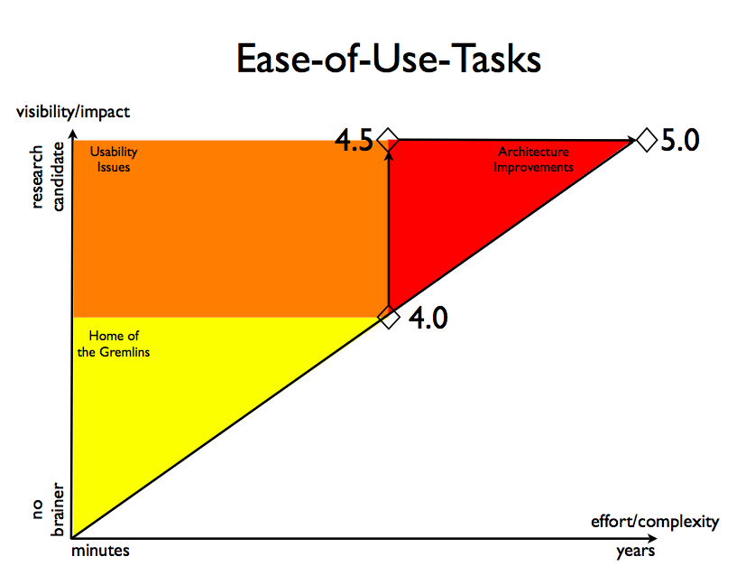

.. include:: /Includes.rst.txt
.. highlight:: php

==========================
Human-Computer-Interaction
==========================

.. container::

   This page belongs to the Human-Computer-Interaction - Team (category
   HCI [outdated wiki link])

See usability-design [outdated link] on forge.

ISO 9241-11 definition of "usability": *effectiveness, efficiency and
satisfaction with which a specified set of users can achieve a specified
set of tasks in a particular environment.*

The HCI team is responsible for two things:

-  The usability of 4.5
-  Future usability, preferably embedded into the development culture.

This page represents the working area for the HCI team. The initially
published information here is a summary of the first 3 weeks of mailing
list activity, collected by the interim team leader, Kasper Skårhøj.

See all pages that belong to HCI [outdated wiki link].

Focus
=====

I find it necessary to define what the focus of our group is since some
suggestions easily fall into other categories. The highlighted bullet is
our focus:

-  Architecture => go to "5.0 Core" team
-  **Improve ease-of-use, newbee appeal, human-factor => 4.5 (thats us!
   Our criteria!)**
-  General features and nice-to-haves => Any version as an extension or
   core implementation through bug-tracker)

From the Roapmap of 4.5 (May 2005) you find this nice graph:
|Ease-of-use-graph.png|

From the R&D results in May 2005 you also find these perspectives on
what "ease-of-use" means:

-  consistency
-  transparency
-  unique, descriptive names
-  user/task centered options
-  proconfiguring template users as editors, administrators, developers
   and as beginners, advanced, expert
-  Consolidate displaced functions in new central modules. (User
   Manager)
-  Substantially improve usability with the help of scientific testing
   and university experts.
-  Create pre-configured users narrowing options down to beginner,
   advanced and expert level for editors, administrators and developers,
   making all modules configurable.

(At this point I feel we should only look to this list as inspiration
since the most accurate definition of "ease-of-use" is the one we will
jointly discover on this team! -kasper)

Lifetime of our 4.5 work
========================

An objection to working on 4.5 and 5.0 simultaneously has been that we
waste time on 4.5. That is not the case if we do this right. Mainly
because the value of our work lies in knowledge about working usable
solutions for TYPO3, *not* the implementation itself (generally
speaking). This leads to the following system:

-  Ideas, concepts, experience, visual elements: All goe directly to 5.0
   development
-  Technical implementation

   -  Some will be the 4.x branch implementation only.
   -  Some will feed into 5.x (thats what we will want to do as the
      major development works), for example:

      -  Forms/Wizard framework?
      -  New backend interface (requires some MVC?)

         -  XUL possible
         -  Other client interaction?

Usability for 4.5
=================

In the process of working with usability for version 4.5, we have the
following work areas:

-  Usability No-brainers [outdated wiki link]: There are obvious
   improvements we can already name from our own experience (these are
   abundantly exposed on the HCI list already, on mailing lists and we
   could make a survey for the community). **This is where you can
   contribute your ideas offhand**. Also, contributed by creating a
   Usability Survey [outdated wiki link] for the community.
-  Usability Discoveries [outdated wiki link]: There are improvements we
   have not realized yet (these should be discovered through usability
   tests on the current system). **This is where we work systematically
   with analysis of the current system**.
-  Usability Innovation [outdated wiki link]: There are possible
   innovative ideas to be discovered (seeking inspiration outside our
   software?). **This is where we innovate new approaches**

Eventually all improvements needs to be tested (we change only to
improve, not for the sake of change).

Paradigms?
==========

"TYPO3 has got it's own style and IMHO we should try to keep it that
way, since this has been a part of the success story during the last few
years. Improving things should never lead to a loss of identity." JoH

I think the sentence above from JoH is very important to keep in mind!

Below is a compilation of statements we can refer to in the discussion
of what usability actually is and means for TYPO3:

-  Well taught, TYPO3 never is a problem (for any target group?)
-  Short term, long term thinking - do we sacrifice long term efficiency
   with improvements that appeal to novices?
-  Is a usable design one that keeps a user in a "Dependent" state - or
   makes them independent?
-  "Give a man a fish and feed him for a day, teach him to fish and feed
   him for a lifetime": Is it better to teach users the concept instead
   of the specific action?

Does these paradigms hold true depending on user profile?

-  once-a-month user? Should be guided
-  everyday editor? Should be trained in the concept so they help
   themselves.
-  Long-term developer? Should be trained
-  First-time-installed? Should be guided into the experience.

Usability is the function of. (-Alex/Erik)

-  A good working UI
-  Splendid teaching
-  Teachers who understand the users need

Defining target groups
======================

Approaches to software
----------------------

There seems to be two opposite approaches to using software. Some people
like a tool where they know all the options and can combine them quickly
into solutions. The user is in control and uses the tool as an artist to
do his job. He is an expert with the tool. Other people like a guided
process which doesn't require deep understanding. They use the tool so
rarely or for so diverse tasks that the time consuming wizard process
doesn't matter. They can use the software uneducated. Typically they are
novices. These two opposites could be expressed with these keywords:

-  Soundmixer - state - tool - user controls - educated - expert
-  Wizard or bot - process - robot - software guides - uneducated -
   novice

Does this make sense? (-kasper)

Target Groups
-------------

Big topic, gets its own page: Usability Target Groups [outdated wiki
link]

Interface must work for
-----------------------

-  Old users (so keep icon, location of things, menu to the left as
   option) (alternative: create the ability to turn off left menu as an
   option for those who wish to customize the BE in this way? -Alex)
   (alternative#2: may be too limiting if we have to keep all the same.
   Allow a new skin and extension that would give the new BE interface
   look, and so support the new look until major version change --
   David)
-  Novice users: Intuitive for first-timers
-  Expert users: Allow "keyboard short cuts".
-  Occasional users: Intuitive at first but can learn power of system.

Process
=======

To start the team, these questions has been asked, trying to address
each of the two team responsibilities:

Short term, TYPO3 4.5
---------------------

**How can we collaborate in the HCI team on improving usability? How can
we innovate on TYPO3s usability in a network community? How do we
identify true solutions from a pond of opinions?**

Input from HCI list, divided into "No-brainer", "Discovery" and
"Innovation" categories from above:

No-brainer
^^^^^^^^^^

-  Typical complaints (mailing lists)? (-Gaumond)
-  Improvements entered in usability category in bug-tracker so we can
   vote for them (-Martin Ficzel)

Discovery
^^^^^^^^^

-  Usage statistics collected inside system itself (-irene)

Innovation
^^^^^^^^^^

-  Research: Competitors golden eggs? (-Gaumond)
-  Consistency: Once learned functions / concepts should be used
   throughout system.

Long term, beyond specific versions
-----------------------------------

**How can we (the HCI team) sustain an improved usability and
consistency in TYPO3 over the next generations of the software?**

Not many reflections on this yet, 2nd priority for now. Might result
from experience with 4.5 development:

-  Paper-prototyping (-Gaumond)
-  Task oriented / Roles (-Gaumond)
-  Define "Personas" instead of "the elastic user" (-fabrizio branca)
-  View things though the eyes of the target user (end user / developer
   etc)
-  Don't be technical in concept, but technical in implementation.
-  Test the usability, improve the interface, test again and so forth.

Personas
^^^^^^^^

*Personas* are fictitious persons, an archetype of some user type,
described in detail so a developer can better evaluate the usability of
his work in the eyes of the users. Personas should be carefully
described. We might be able to do so later from the discussion of target
groups above (which is a more categorical concept). Personas might be a
part of the solution to long term usability aware development?

Technical Requirements
======================

When discussing concrete solutions we will need to know what
requirements to compatibility we operate within: (R&D committee has
final decision on this): All features must run in these browsers
regardless of platform (Kaspers suggestion):

-  Konqueror (latest stable)
-  Safari (latest stable)
-  Mozilla/Firefox (1.xx+?)
-  MSIE (6.xx+?)

Two-track principle for all basic functionality:

-  Modern, Ajax whistle and bells (client validated) [inaccessible,
   unreliable - but fun and fluent]
-  Conservative GET/POST (server validated) [accessible - but boring and
   slow]

Problems:

-  Typical ActiveX/JavaScript/security/firewall settings that could
   prevent features will require a fall back solutions?

Backend Accessibility (blind people etc)?
http://www.w3.org/WAI/intro/atag.php

Methods and actions
===================

What methods and actions are we going to go about for improving
usability:

-  Online-Survey (view draft: Usability_Survey [outdated wiki link])
-  Remote-Usability-Testing (Skype/VNC)
-  single observations (see Usability_Discoveries [outdated wiki link])

Resources
=========

Post links to external usability related resources, including a little
description of the content:

**10/90: Ten percent of features used by ninety percent users?** "Apple
products typically have lots of features hidden below the surface for
the power user to find, but leave the user interface unmarred by
frequently unused functions"
(http://www.ofb.biz/modules.php?name=News&file=article&sid=351)

**Summary of User Interface Design Principles** "Excellent article on
major UI principles."
http://www.sylvantech.com/~talin/projects/ui_design.html

**User Interface Design for Programmers** "Focused on programmers and
Windows…and why consistency and familiarity is so important for users."
http://www.joelonsoftware.com/uibook/fog0000000249.html

**Golden Rules for Bad User Interfaces** "Good to think about…and for
fun too."
http://www.sapdesignguild.org/community/design/golden_rules.asp

**Making a Better Open Source CMS** "Some insightful comments by a
usability expert." http://www.veen.com/jeff/archives/000622.html

**Don’t Make Me Think (Book)** "One of the best books on usability for
the web. Underlying principle is that a website should be so easy and
intuitive for the user that they don’t need to think about it. While the
book focuses on Front-end – many principles can apply to Backend."
http://www.sensible.com/chapter.html

**Designing Interfaces (Book)** "Excerpts from book that shows a lot of
patterns for “effective interaction design”"
http://designinginterfaces.com/Introduction [outdated link]

**uxmatters website** A good resource of UX articles not many but good.
Aims to produce a volunteer-driven, nonprofit Web magazine that delivers
compelling content about \* developing effective user experience (UX)
strategies \* designing digital-product user experiences that optimally
serve people’s needs and satisfy their desires
http://dev.uxmatters.com/MT/archives/000107.php [outdated link]

**Why usability in Open Source Software is poor** I would like to
recommend this read to everyone, I have started a small discussion on
the HCI list about it as well:
http://www.cs.waikato.ac.nz/~daven/docs/oss-wp.html - kasper

**OS-X HCI Guidelines** Grate Examples! >>
http://developer.apple.com/documentation/UserExperience/Conceptual/OSXHIGuidelines/index.html
[outdated link] - Jens Hoffmann

**Interface Design patterns** "Best guidelines for designers for
creating interface design patterns"
http://www.techved.com/blog/interface-design-patterns-a-designers-guide

HCI Team Structure
==================

What competences should the HCI team consist of:

-  Roles:

   -  Leader (can organize and lead the team)
   -  Usability experts/testers (have experience with and can perform
      usability tests pre and post production)
   -  Programmers (can implement features)
   -  Mailing list subscribers (can suggest freely)
   -  Just members (what can you do?)

Recruitment of test users / process: See "Online survey" thread on HCI
list.

Team Members
------------

Being a member of the HCI team is easy: Just sign yourself up here and
subscribe to the mailing list. If you enter your name in this list, be
prepared that you are asked to take responsibility on the team.

Enter your [name] - [email(at)domain(dot)tld] - [skills and interest
related to usability/HCI team]

-  Kasper Skårhøj - kasper2006(at)typo3(dott)com - Initiator, Interim
   team leader, usability terrorist for years (;-), interest in
   catalysing on the team

-  Cate Deans Smith - cdeans(at)diess(dot)com(dot)au - interested in
   proofreading documentation so that it is easily understood by the new
   and inexperienced user, and in monkey testing systems for the same
   purpose

-  Sebastian Erlhofer - erlhofer(at)mindshape(dott).de - interested in
   getting TYPO3 more intuitive for everybody and especially easy to use
   for editors (working on Usability_Survey [outdated wiki link] at the
   moment)

-  Andreas Balzer - typo3(at)andreas-balzer(dot)de - "interested in
   proofreading documentation so that it is easily understood by the new
   and inexperienced user[s]" (by Cate Deans Smith, some lines above :)
   ), and in performing usuability tests with people who want to take
   part.

-  Andreas Foerthner - Andreas(dot)Foerthner(at)netlogix(dot)de -
   interest in creating a WebDAV library to primary improve the
   usability of file handling and extending that to templates, pagetree,
   content or whatever in the long run. So let's say I'm a
   programmer ;-)

   -  Kuckuck [outdated wiki link] 10:55, 19 June 2006 (CEST) pleas
      don't, realy don't do one at your own, there are two existing
      libarys, one from ezPublish and one from PEAR...

      -  Andreas: We used the one from PEAR ;-) I meant a libray
         specially adopted for TYPO3

-  Patrick Gaumond - patrick(at)typo3quebec(dot)org - Newbie-friendly
   approach, wanting an even better TYPO3

-  Quentin Dewhurst - quentin(at)gest8(dot)com - LAMP Programmer and
   Typo3 user with HCI and usability skills, willing to contribute some
   time and effort.

-  Daniel Pötzinger info(-a-t-)poetz-media.de Interested in refacoring
   of Listview / Help in Discussions of Systemdesign

-  Oliver Wand - wand(at)itaw(dot)de - Due to a lot of experience with
   adaption of large companies to TYPO3 a lot of knowledge about the
   "daily problems" when it comes to handle content and Backend
   usability in general. Programming: Looking for the total PHP nerd,
   you should continue looking :-) Surely I know what PHP looks like and
   I wrote some customer specific extensions and still willing to deepen
   my knowledge.

-  Zach Davis - zach@castironcoding.com - PHP Programmer, long-time
   TYPO3 user, not bad with XHTML / CSS, English editing / writing
   skills -- looking to help however I can.

-  Marion Seitz - seitz(at)cvjm(dot)de - usability testing /
   proofreading any documents, editing them and translating them into
   German / defining different levels and needs of BE users

-  David Slayback - dave(at)webempoweredchurch(dot)org -- extension
   developer using TYPO3 for 2 years with strong interest in user
   interface design and improvement. I desire to help make TYPO3 much
   easier to use, and am willing to do whatever necessary to help -
   usability testing, prototype interfaces, thinking through issues, and
   discussion.

-  Lori Feiler - lorifeiler(at)comcast(dot)net - fairly new TYPO3 user
   (not too tainted by successful use ;-)), 16 years end-user doc writer
   where I focused on the user experience and improving the user
   interface. I would like to help as needed identifying FE & BE user
   issues, usability testing (small samples), navigation in BE, and
   context sensitive help requirements (for the ?'s)

-  Daniel Brüßler - info>>danielbruessler-dot-de - I help with the
   documentation of some projects and support documentation-writers.

-  Jens Hoffmann - jens.hoffmann(@)baiz(.)org - Designer / CSS Coding /
   providing Usability Ideas

-  Patrick Broens - patrick@netcreators.com - Extension developer /
   Graphic designer, Experience with interface design. Personal itch to
   redesign the whole framework user interface, prototyping

-  Sudara Williams - sudara@modernthings.net - Usability
   counter-terrorist ( ;) and a stirrer of the pot, inspired by the
   Rails world. Lets rip it out, put it back in, and call it a day.

-  Aassim El-Bouchtaoui - aassim.el-bouchtaoui@logicacmg.com -
   Interaction Designer,Enterprise CMS consultant. Why are the bigger
   commercial CMS even worse if it comes to usability? :-) 'd like to do
   expert reviews, usability testing and some cognitive walktroughs

