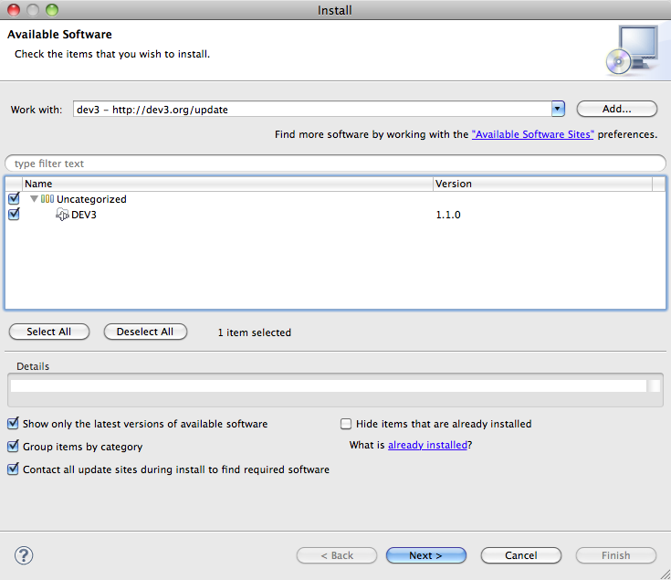
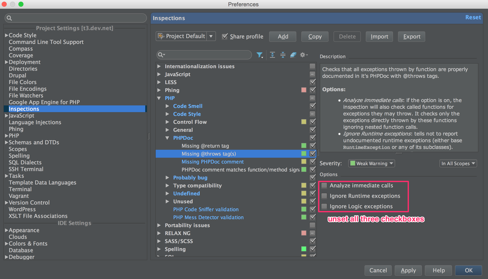

.. include:: /Includes.rst.txt
.. highlight:: php

.. _ide-for-typo3:

===========================
PHP Editors / IDE for TYPO3
===========================

| There are many ways to do TYPO3 development. This page tries to
  summarize the different approaches with their strengths and
  weaknesses. It also lists recommendations for proper setup in order to
  work with the TYPO3 Core (NOTE: these recommendations used to be part
  of the "TYPO3 v4 Core Coding Guidelines".

IDEs are ordered alphabetically.

.. container::

   notice - Reviewer needed

   .. container::

      Change the **{{review}}** marker to **{{publish}}** when all parts
      are reviewed (e.g. TypoScript). info [outdated wiki link]

Aptana
======

============= =====================================================
Download page http://www.aptana.org/studio/download [outdated link]
Type          *OpenSource*
Platform      Windows, Mac OS X, Linux
============= =====================================================

Strengths
---------

-  FTP and SSL integration
-  Typoscript syntax highlighting with the plugin on
   http://www.dev3.org/update/:
   |Dev3.png|

Weaknesses
----------

-  very slow
-  ...

Codelobster PHP Edition
=======================

================ ===========================
Product homepage http://www.codelobster.com/
Type             *Freeware*
Platform         Windows
================ ===========================

.. _strengths-1:

Strengths
---------

-  PHP, HTML, JavaScript, CSS code highlighting
-  PHP, HTML, JavaScript, CSS autocomplete
-  PHP, HTML, JavaScript, CSS context and dinamyc help
-  PHP Debugger
-  Compare feature
-  Code folding (collapsing)
-  Pair highlighting, pair selection, tags and attributes selection
   commands
-  Navigation by holding CTRL key for all links, includes definitions
-  Preview in all browsers
-  FTP/SFTP support
-  HTML/CSS code insector

.. _weaknesses-1:

Weaknesses
----------

-  ...

Recommended setup
-----------------

Codelobster has special plug-ins for Drupal CMS, Joomla CMS, Smarty
engine, JQuery library, CodeIgniter, CakePHP, Symfony, Yii and
WordPress.

Eclipse + PDT
=============

============= =====================================
Download page http://www.eclipse.org/pdt/downloads/
Type          *OpenSource*
Platform      Windows, Mac OS X, Linux
============= =====================================

.. _strengths-2:

Strengths
---------

-  Very complete, supports a huge number of languages and more (UML,
   etc.)
-  ...

.. _weaknesses-2:

Weaknesses
----------

-  Very slow
-  Unwieldy user interface

.. _recommended-setup-1:

Recommended setup
-----------------

| Open Eclipse preferences. In the “General”, “Editors”, “Text editors”:

-  clear “Insert spaces for tabs”
-  check “Show print margin” and set “Print margin column” to 80

To clear trailing whitespace on save, install “AnyEdit” Eclipse plugin
(find it on the Internet using your preferred search engine). Then in
“General”, “Editors”, “AnyEdit tools” check two options: “Remove
trailing whitespace” and “Convert tabs <-> spaces”. Also select “Spaces
to tabs”.

| In the “General”, “Workspace” set “New text file line delimiter” to
  “Other” and “Unix”.

Komodo IDE
==========

============= ==================================
Download page http://www.activestate.com/komodo/
Type          *Commercial*, $295 USD
Platform      Windows, Mac OS X, Linux
============= ==================================

.. _strengths-3:

Strengths
---------

-  Fast
-  Komodo sync permits to access its configuration to any Komodo IDE
-  Regular expression toolkit
-  Code Collaboration

.. _weaknesses-3:

Weaknesses
----------

-  Code completion sometimes fail
-  ...

.. _recommended-setup-2:

Recommended setup
-----------------

| In the Komodo IDE preferences select the “Editor” parameter group and
  from there select “Indentation”. Set options as follows:

-  Auto–indent style: Use Smart Indent
-  “Prefer tab characters over spaces” should be checked (in
   “Indentation” and “Language settings”/”PHP”)
-  “Number of spaces per indent” is set to 4
-  “Width of each tab character” is set to 4

| In the “Smart editing” group set “Show edge line / Highlight
  characters beyond edge line” and enter “80” in the “Eddge line
  column”.
| In the “Save options” group set “Clean trailing whitespace and EOL
  marker”.
| In the “New files” group set “Specify end-of-line (EOL) indicator for
  newly created files” to “Unix (\n)”.

Netbeans
========

+-----------------------------------+-----------------------------------+
| Download page                     | http://netbeans.org/downloads/    |
+-----------------------------------+-----------------------------------+
| Type                              | *OpenSource*                      |
+-----------------------------------+-----------------------------------+
| Platform                          | Windows, Mac OS X, Linux, Solaris |
+-----------------------------------+-----------------------------------+

.. _strengths-4:

Strengths
---------

-  FTP & SFTP support (Remote Projects)
-  All-In-One package
-  Fast
-  JavaScript code completion (cool for ExtJS...)
-  CSS code completion, integrated editor

.. _weaknesses-4:

Weaknesses
----------

-  Average code-completion
-  No mixed charsets in one project (so e.g. usage of UTF8 language
   files and Latin1 PHP files in one project is not possible - all files
   will be opened as in project setup defined, that leads to special
   characters wrongly displayed and saved)

.. _recommended-setup-3:

Recommended setup
-----------------

| Open the NetBeans preferences, move to the “Editor” preference panel
  and choose “Formatting”. Set options as follows:

-  From the menu “Category”, choose “Tabs And Indents”
-  Make sure the “Expand Tabs to Spaces” box is not checked
-  Set “Number of Spaces per Indent” to 4
-  Set “Tab Size” to 4
-  Set the “Right Margin” to 80

PhpStorm
========

+------------------+--------------------------------------------------+
| Download page    | http://www.jetbrains.com/phpstorm/               |
+------------------+--------------------------------------------------+
| Product homepage | http://blogs.jetbrains.com/webide/               |
+------------------+--------------------------------------------------+
| Type             | *Commercial,* personal license 87 €, free        |
|                  | license for Open Source project core members and |
|                  | for education                                    |
+------------------+--------------------------------------------------+
| Platform         | Windows, Mac OS X, Linux                         |
+------------------+--------------------------------------------------+

.. _strengths-5:

Strengths
---------

-  Good code analysis
-  Good search/code navigation (go to class, go to file feature with
   suggestions)
-  Good integration with version-control systems (even several VCS
   within the same project)
-  Fast
-  Flexible code formatting/beautification options
-  Atlassian IDE connector
-  Support for many newer technologies (SASS, LESS, Git, Github, ...)

.. _weaknesses-5:

Weaknesses
----------

-  ...

.. _recommended-setup-4:

Recommended setup
-----------------

PhpStorm has a lot of options, in particular for code formatting. It is
too much work to list them all. Instead here is a sample configuration
file:

`File:Standard.xml <files/Standard.xml>`__

Please unset all three checkboxes under "Settings > Inspections > PHP >
PHPDoc > Missing @throws tag(s)", see screenshot above

.. container::

   |PHPStorm Settings|

Usefull Add-Ons & additions
---------------------------

-  Live Templates for Fluid [outdated link]
-  XML Schema auto completion in PhpStorm [outdated link]
-  TypoScript Plugin for PHPStorm [outdated link]
-  Collection if Plugins by Kay Strobach [outdated link]

Waterproof PHPEdit
==================

+---------------+-----------------------------------------------------+
| Download page | http://w                                            |
|               | ww.phpedit.com/en/download/download-latest-versions |
|               | [outdated link]                                     |
+---------------+-----------------------------------------------------+
| Type          | *Commercial*, € 89                                  |
+---------------+-----------------------------------------------------+
| Platform      | Windows                                             |
+---------------+-----------------------------------------------------+

.. _strengths-6:

Strengths
---------

-  ...
-  ...

.. _weaknesses-6:

Weaknesses
----------

-  ...
-  ...

Zend Studio
===========

============= ================================================
Download page http://www.zend.com/en/products/studio/downloads
Type          *Commercial*, € 399
Platform      Windows, Mac OS X, Linux
============= ================================================

.. _strengths-7:

Strengths
---------

-  Based on Eclipse, shares the same strengths and weaknesses
-  Excellent integration with ZendServer

.. _weaknesses-7:

Weaknesses
----------

-  Based on Eclipse, shares the same strengths and weaknesses

