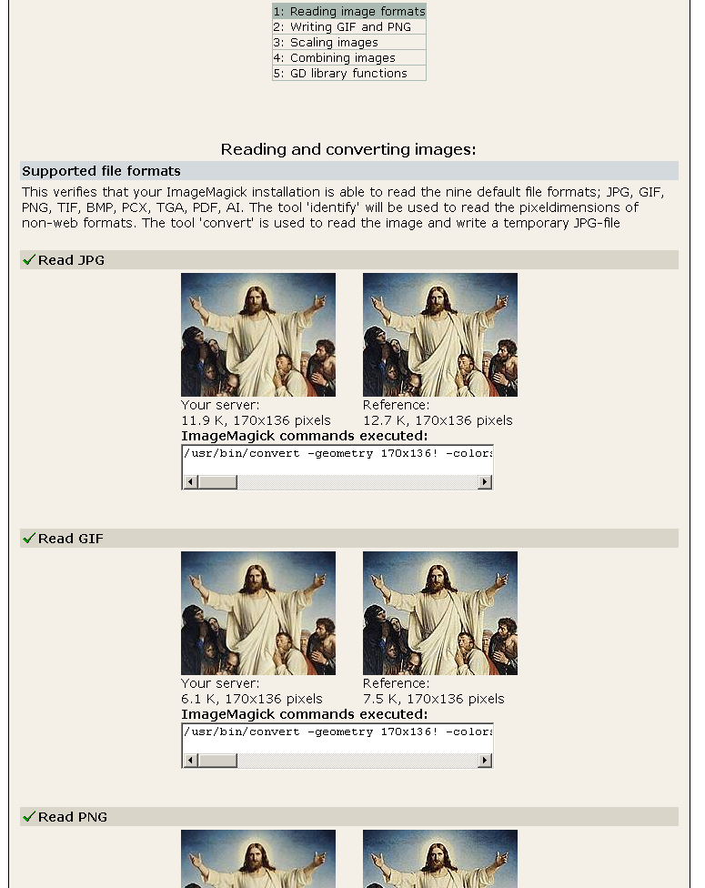

.. include:: /Includes.rst.txt
.. highlight:: php

================
Image Processing
================

This is a short guide of how to configure image processing in TYPO3.

Selecting a Configuration Preset
================================

Use the "Configuration Presets" section in the Install Tool to select a
predefined set of image processing settings for TYPO3 to use. With these
settings, you can enable and configure usage of your existing
GraphicsMagick or ImageMagick installation with just a few mouse clicks.

Test the setup
==============

After enabling usage of either GraphicsMagick or ImageMagick, the "Test
setup" section in the Install Tool can be used to run a number of image
related tests:

|ImageMagick reading image formats.png|

These tests are:

-  Reading image formats
-  Writing GIF and PNG
-  Scaling images
-  Combining images
-  GD library functions

