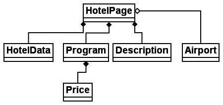
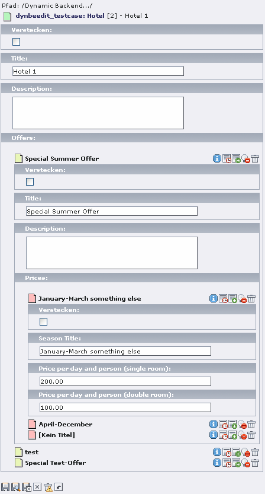

.. include:: /Includes.rst.txt

================================
Inline Relational Record Editing
================================

.. container::

   This page belongs to the Inline Relational Record Editing project
   (category `Project </Category:Project>`__ [deprecated wiki link])

.. container::

   .. container::

      |image1|

      .. container::

         .. container::

         **Example of data structure**
         A more complex structure covering data over more levels, that
         could be editable with Inline-Relational-Record-Editing

.. container::

   .. container::

      |image2|

      .. container::

         .. container::

         **Screenshot of extension dynbeedit 0.0.2**
         How it could work in TYPO3

`glossary-definition </Category:Glossary-definition>`__ [deprecated wiki
link]: IRRE (Inline Relational Record Editing) is part of the core since
TYPO3 4.1.0.

Main focus in abstract
======================

We want to provide a solution that makes editing of data and creating
relations to foreign records easier for the user. Unneccessary clicks on
using wizards should be prevented. This also includes the complete
reload of an input view. So the user should be able to make his
**changes on one view**, as far as possible. The relations between
objects can be 1:n and 1:1 (and n:m would possibly also come). The
implementation of these functions is done directly to the core
(basically to t3lib_TCEform) and should/could be ready for TYPO3 4.1 (if
the list of features grows, possibly TYPO3 4.2).

The results are published as diploma thesis of Oliver Hader at the
University of Appliead Sciences Hof - this thesis consists of a
practical part (implementing some/all of the features) and a theoretical
part (kind of documentation what was implemented, how it works and why
it was done in a certain way).

Examples
========

-  The
   `irre_tutorial <https://extensions.typo3.org/extension/irre_tutorial/>`__
   available in TER offers a good introduction and comes with nearly all
   kinds of different configuration options. Furthermore it contains a
   set of sample record data.

   -  Administration: Install Extension, Klick at the IRRE Tutorial icon
      in the "Web" menu, Klick at "Install sample data"

-  `irre_hotel <https://extensions.typo3.org/extension/irre_hotel/>`__
-  You could additionally use the elderly Test-Suite-Extension
   `T3X_irre_testsuite.t3x <http://inpublica.de/typo3/T3X_irre_testsuite.t3x>`__
   [not available anymore]

Documentation
=============

Have a look in the `TCA
Reference <https://docs.typo3.org/typo3cms/TCAReference/ColumnsConfig/Type/Inline.html>`__
(Section 3.4) for type "inline" to get an overview of the possible
configuration options in the TCA.

The whole project is further documented in the diploma thesis of Oliver
Hader. You can obtain it here:
https://typo3.org/documentation/article/inline-relational-record-editing-irre/
[not available anymore]

Feedback/Discussion
===================

| If you find any bugs please report them using the
  `bug-tracker <https://forge.typo3.org/projects/typo3cms-core/issues>`__.
| To discuss further development of Inline Relational Record Editing you
  can subscribe to the list typo3.projects.irre by using the
  `mailing-list <http://lists.typo3.org/cgi-bin/mailman/listinfo/typo3-project-irre>`__
  or the `news-group <news://lists.typo3.org/typo3.projects.irre>`__
  [not available anymore].

A closer look
=============

-  TCEforms is extendet by a new type called "inline" that calls
   getMainFields method to show the inline records
-  TCEmain has to handle comma separated lists of uids (like in select
   type), mm relations (like in select/group type) and additional the
   `foreign_field
   alternative </Inline_Relational_Record_Editing_1:n#Foreign_Field_in_Foreign_Table>`__
   [deprecated wiki link]
-  The Ajax object of the prototype JavaScript framework is creating
   dynamically new records and handles the inline structure
-  prototype/script.aculo.us is used for dynamic DOM handling like
   inline sorting and the integration of Drag&Drop, etc.
-  alt_doc_ajax.php (derived from alt_doc.php, SC_alt_doc) gets the Ajax
   calls, handles them and interacts with TCEforms

Functionality of Inline Relational Record Editing
=================================================

Here are the parts or tasks that should be part of the
"Inline-Relational-Record-Editing".

Database Storage
----------------

The standard of of storing 1:n relations in TYPO3 is to build up a comma
separated list which is stored in a table field of the database. Imagine
you have the tables "company", "addresse" and "person" and want to
relate them like "person works in company" and "person lives at
address". In the following there are some examples mentioned.

1:n relations
^^^^^^^^^^^^^

see `Inline Relational Record Editing
1:n <inline-relational-record-editing1-n>`__

Children of 1:n relations normally depend fully on their parent. That
would mean, if the parent is moved, copied or deleted, the child-records
are also moved, copied or deleted.

m:n relations
^^^^^^^^^^^^^

Inline Relational Record Editing supports to display and handle
MM-Records in a simple way. But the better way is to use an own
intermediate table, that is similar to the MM-table but doesn't equal -
so the own intermediate table has a proper uid and pid for example.

Attributes on relations
^^^^^^^^^^^^^^^^^^^^^^^

see `Inline Relational Record Editing
Attributes <inline-relational-record-editing-attributes>`__

Inline interaction with data
----------------------------

-  Sorting of inline-records is enabled if that table was defined to be
   sortable in $TCA: $TCA[<table>]['ctrl']['sortby'] - this could also
   be done with Drag&Drop functions
-  Create a new inline-record is of course possible, if
   $TCA[<table>]['ctrl']['sortby'] was defined it's possible to insert
   after an existing inline-record, like it could be done with the
   Web>List module
-  Deleting of data is done virtually if the inline-record never was
   stored to the database. If the inline-record has a proper uid, it's
   marked to be deleted later (on clicking the "save" button). If it's a
   1:n relation and the record to be deleted has children, also these
   children are triggered to be deleted by setting the "deleted='1'"
   flag to the involved records.

Relations
=========

**Other relating projects** to `Party Information
Framework </wiki/index.php?title=Party_Information_Framework&action=edit&redlink=1>`__
[not available anymore] (`edit
this </Template:NavigationPartyInformationFramework-Relations>`__
[deprecated wiki link], *in alphabetical order*)

-  `Commerce Shop
   Extension </wiki/index.php?title=Commerce&action=edit&redlink=1>`__
   [not available anymore] This extension use an 1:N relation for
   addresses and included an own addressmanagement, which should be part
   of the `Party Information
   Framework </wiki/index.php?title=Party_Information_Framework&action=edit&redlink=1>`__
   [not available anymore].
-  `Enhanced Rights Management </Enhanced_Rights_Management>`__
   [deprecated wiki link] - a pear class for a RBAC / Role Based Access
   Control.
-  Inline Relational Record Editing - 1:n relations for BackEnd-Forms --
   *Oliver Hader*
-  `Newloginbox </wiki/index.php?title=Newloginbox&action=edit&redlink=1>`__
   [not available anymore] development coordination - *Ingmar Schlecht
   and Stefan Strasser*
   The User list plugin (pi3) of Newloginbox is related to the Party
   Framework. If the Party Framework will ship with a user listing
   plugin, the pi3 of Newloginbox wouldn't be needed any more.
-  `Users Addresses </Users_Addresses>`__ [deprecated wiki link] -
   relations between fe_user and tt_address, best practice discussion -
   *Elmar Hinz*
-  dkd_feuser_belogin - relation between fe_user and be_user

Timeline
========

-  Proof-of-concept extension "dynbeedit": beginning of september
-  Programming-part of the project as new TCEform type: october 1st 2006
   - november 1st 2006
-  Code-Review by Ingmar Schlecht and Sebastian Kurfürst: november
   10th-12th 2006
-  Bug-Fixing and integration tests to the TYPO3 Core 4.1: until
   november 15th 2006
-  Publish on Core-Developer List for reviewing/accepting the changes:
   november 16th 2006
-  Bug-Fixing and necessary changes to meet conditions of the
   core-developers: until february 1st 2007
-  **"Big" Documentation of the work (=**\ `Diploma
   thesis <https://typo3.org/uploads/media/Inline_Relational_Record_Editing_01.pdf>`__\ **[not
   available anymore]): after all points above have been finished, until
   end of february 2007**

Current To-Do-List
==================

-  **Core-Features**

   -  refactoring and try to remove the "FIXME"s
   -  **OK** minitems in TCA configuration has to be evaluated in the
      forms view (TCEforms)
   -  **OK** use new t3lib_befunc::getRecordTitle of David Brühlmeier
      for header titles
   -  **OK** allow automatic sorting for child records, currently
      foreign_sortby writes only a manual sorting!
   -  **OK** import-/export-functionality bugfix for using intermediate
      tables and symmetric relations
   -  **OK** bugfixing RTE problems for cascaded inline fields over more
      levels (positioning, width, height)
   -  **OK** special bugfix for Internet Explorer issues
   -  **REMOVED** attributes on MM relations to handle attributes AND
      child record as well (two combined inline tables)
   -  **OK** bidirectional symmetric relations with attributes and
      sorting for each side of the relation
   -  **OK** attributes on a own intermediate table (foreign_field) with
      the possibility to edit embedded children directly, child-records
      are reusable (0:n) (inline releational editing over two levels)
   -  **OK** dynamically change header/label field of a record container
      while editing
   -  **OK** drag&drop sorting with script.aculo.us ("Sortable")
   -  **OK** check uniqueness on pointer tables (foreign_field), that
      are used as intermediate tables with attributes on client-side
   -  **OK** replace
      `xaJax </wiki/index.php?title=Xajax&action=edit&redlink=1>`__ [not
      available anymore] by prototype (handling of AJAX with JSON)
   -  **OK** recursively delete child records
   -  **OK** recursively undelete child records (history/undo)
   -  **OK** recursively copy child records
   -  **OK** handle 1:n with item list (comma separated)
   -  **OK** handle 1:n with pointer field on foreign table
      ("foreign_field")
   -  **OK** handle m:n/1:n allow usage of regular MM-tables (also
      bidirectional)

-  **Appearance-Features**

   -  add save button to each inline fields (i.e. with notificator that
      something was changed)
   -  change script.aculo.us effect-animations for deletion & sorting of
      records
   -  TSconfig if child-records should show up collapsed by default,
      etc.
   -  **OK** save expanded/collapsed state for child-records for each
      user in BE_USER->uc (like in pagetree)

-  **Related-Features**

   -  Implement the type "inline" for tx_kickstarter

Wishlist
========

Here a some **features** that should be discussed and maybe become part
of "Inline-Relational-Record-Editing" at some time.

-  Automatic saving of unsaved data (e.g. every 60 seconds, could be
   configured). It would be possible, but we need a concept/discussion
   about "how" to solve the whole problem.
-  Integration of conditions. So e.g. an selectbox becomes available or
   editable if a checkbox like "has_something" was checked before. This
   is kind of "eval" and could affect other fields. Another example in
   that case is the switching between different types of tt_content
   elements ("text", "text/image", ...)
-  Integration of clipboard-functionality (cut/copy/paste) - do we need?
   <- would be great!!!
-  Integration of workspaces and localization
-  Inline editing of images and/or files with possibly adding an
   descriptive field for each file where the author, date, title, etc.
   could be stored. Also the DAM concept could be used here. (see
   Bernhard Krafts extension:
   https://extensions.typo3.org/extension/kb_tca_section/)
   -- *Annotation: this is already possible with IRRE, the question was
   about a better integration for e.g. DAM - olly*
-  Interface to/for dynaflex for inline-sorting, moving, whatever.
-  Solution for handling many records in one view (just imagine you once
   have 200 inline records...)

Current Project Members
=======================

-  Project Leader, developer: `Oliver Hader </User:Ohader>`__
   [deprecated wiki link] <oh(at)inpublica(dot)de>
-  Reviewing for the Core: Ingmar Schlecht, Sebastian Kurfürst
-  Testing: Thomas Oppelt, Volker Graubaum, David Brühlmeier

