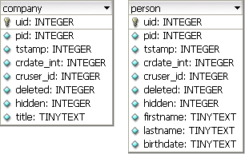
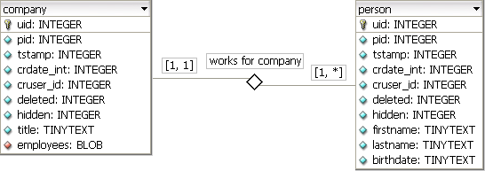
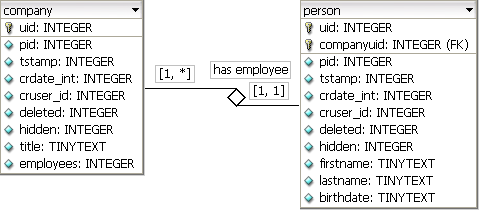
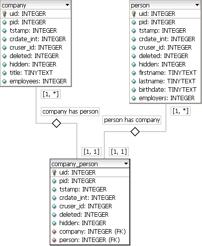

.. include:: /Includes.rst.txt

.. _inline-relational-record-editing1-n:

====================================
Inline Relational Record Editing 1:n
====================================

.. container::

   This page belongs to the `Inline Relational Record Editing
   project <inline-relational-record-editing>`__ (category
   `Project </Category:Project>`__ [deprecated wiki link])

============================================
Different kinds of storing and configuration
============================================

.. container::

   .. container::

      |image1|

      .. container::

         .. container::

         **Fig.1: Two unrelated tables**
         In this example we try to build relations between these two
         tables/objects.

The 1:n approach of Inline Relational Record Editing takes the already
existing situation of the TCEforms type "select" and tries to alter this
for a 1:n way. The big advantage would be, that related (child) records
can be edited directly.

The two tables, "company" and "person", that are shown in Fig.1 on the
right side, is the model we're working with in this example.

**Prerequisites on 1:n inline records:**

-  a relation exists between a parent (embedding object) and it's child
   (embedded object)
-  child records fully depend on their parent record
-  if the parent records is deleted the children also must disappear
-  from the view of the child record it has to be possible to know its
   parent

Comma separated list
====================

.. container::

   .. container::

      |image2|

      .. container::

         .. container::

         **Fig.2: Relation by comma separated list**
         A string of serialized uids of child records is stored in a
         field of the parent record.

The common way to store data from foreign tables using the select-type
is, to put a string of the serialized uids of the children into a
BLOB-field of the parent record. In the example shown in Fig.2, the uids
of the table "person" would have been stored into the field "employees"
of the "company" table. The sorting order of the child records is also
stored in that uid-list.

::

   company.employees = '13,18,21,35'

This is not a normalized way to store data - but it will be available in
"Inline Relational Record Editing", so select-types, that should handle
1:n data, could be upgraded to the new inline-type easily without
changing masses of records.

| 
| **An example of TCA configuration:**

::

   $TCA['company'] = Array(
     'ctrl' => ...,
     'interface' => ...,
     'feInterface' => ...,
     'columns' => Array(
       'hidden' => ...,
       'employees' => Array(
         'exclude' => 1,
         'label' => 'LLL:EXT:myextension/locallang_db.xlf:company.employees',
         'config' => Array(
           'type' => 'inline',
           'foreign_table' => 'person',
           'maxitems' => 10,
           'appearance' => Array(
             'collapseAll' => 1,
             'expandSingle' => 1,
           ),
         ),
       ),
     ),
     'types' => ...
     'palettes' => ...
   );

Foreign Field in Foreign Table
==============================

.. container::

   .. container::

      |image3|

      .. container::

         .. container::

         **Fig.3: Relation by a foreign field/key**
         The child record stores the uid of its parent record in a own
         field.

A better way in database normalization is, to store the uid of the
parent record in a own referencing field of the child records - as you
can see in the model shown in Fig.3. So, the children know the uid their
parent record. The field "employees" of the "company" table stores the
number of relations. This could be compared to the page-tree: The pages
reference to their parent page using the pid-field.

But this is only possible if the child records belong to only one type
of parent record ("company"). It another table, e.g. "association"
should contain records from the "person"-table, the child record does
not know it its parent is a "company" or an "association". If the tables
mentioned come in different extensions and so would developed by
different extension developers, it's not a good solution, to wildly
extend foreign extensions to be able to store the type-name of the
parent.

The field of the child, containing the uid of its parent, is defined
with **"foreign_field"** in TCA.

| 
| **Table: company**

+-------+-------+-------+-------+-------+-------+-------+-------+-------+
| **    | **    | **tst | **cr  | **c   | *     | **hid | **ti  | **e   |
| uid** | pid** | amp** | date_ | ruser | *dele | den** | tle** | mploy |
|       |       |       | int** | _id** | ted** |       |       | ees** |
+-------+-------+-------+-------+-------+-------+-------+-------+-------+
| 2     | 4     | 11613 | 11613 | 1     | 0     | 0     | Big   | 4     |
|       |       | 54302 | 54302 |       |       |       | Co    |       |
|       |       |       |       |       |       |       | mpany |       |
|       |       |       |       |       |       |       | Corp. |       |
+-------+-------+-------+-------+-------+-------+-------+-------+-------+

**Table: person**

+-------+-------+-------+-------+-------+-------+-------+-------+-------+-------+-------+
| **    | **co  | **    | **tst | **cr  | **c   | *     | **hid | **f   | **    | **b   |
| uid** | mpany | pid** | amp** | date_ | ruser | *dele | den** | irstn | lastn | irthd |
|       | uid** |       |       | int** | _id** | ted** |       | ame** | ame** | ate** |
+-------+-------+-------+-------+-------+-------+-------+-------+-------+-------+-------+
| 13    | 2     | 4     | 11613 | 11613 | 1     | 0     | 0     | John  | Doe   | 1979- |
|       |       |       | 54302 | 54302 |       |       |       |       |       | 02-03 |
+-------+-------+-------+-------+-------+-------+-------+-------+-------+-------+-------+
| 18    | 2     | 4     | 11613 | 11613 | 1     | 0     | 0     | Steve | M     | 1977- |
|       |       |       | 54302 | 54302 |       |       |       |       | iller | 07-13 |
+-------+-------+-------+-------+-------+-------+-------+-------+-------+-------+-------+
| 21    | 2     | 4     | 11613 | 11613 | 1     | 0     | 0     | Jane  | Kowal | 1981- |
|       |       |       | 54302 | 54302 |       |       |       |       | czcky | 11-06 |
+-------+-------+-------+-------+-------+-------+-------+-------+-------+-------+-------+
| 35    | 2     | 4     | 11613 | 11613 | 1     | 0     | 0     | Kate  | McG   | 1982- |
|       |       |       | 54302 | 54302 |       |       |       |       | uyver | 08-30 |
+-------+-------+-------+-------+-------+-------+-------+-------+-------+-------+-------+

| 
| **An example of TCA configuration:**

::

   $TCA['company'] = Array(
     'ctrl' => ...,
     'interface' => ...,
     'feInterface' => ...,
     'columns' => Array(
       'hidden' => ...,
       'employees' => Array(
         'exclude' => 1,
         'label' => 'LLL:EXT:myextension/locallang_db.xlf:company.employees',
         'config' => Array(
           'type' => 'inline',
           'foreign_table' => 'person',
           'foreign_field' => 'companyuid',
           'maxitems' => 10,
           'appearance' => Array(
             'collapseAll' => 1,
             'expandSingle' => 1,
           ),
         ),
       ),
     ),
     'types' => ...
     'palettes' => ...
   );

| 
| If the TCA of the foreign table is misconfigured, so that this
  **foreign field** is defined to be editable (e.g. type input),
  TCEforms takes care and it isn't rendered at all - but the
  inline-functions set a hidden form field, with the value of the parent
  record's uid.

| 
| **An example of misconfigured TCA - the foreign field "companyuid" is
  not rendered at all:**

::

   $TCA['person'] = Array(
     ...
     'columns' => Array(
       'companyuid' => Array(
         ...
         'config' => Array(
           'type' => 'input',
         ),
       ),
     ...
   );

| 
| If it is necessary, a own sorting field could be defined in TCA by
  setting **foreign_sortby** to that field of the database table that
  stores the sorting index.

The search order to determine a proper sortby field is (the function
takes the first value of these three, that was set):

#. $TCA[<table>][<colums>][<field>]['config'][**'foreign_sortby'**]
#. $TCA[<table>]['ctrl']['sortby']
#. $TCA[<table>]['ctrl']['default_sortby']

Another special configuration option is to set a **foreign_label**. So
if situation makes it necessary to use a different label as
$TCA[<table>]['ctrl']['label'] in an element of the "inline" type, you
can do so by setting this.

| 
| **An example of TCA configuration:**

::

   $TCA['company'] = Array(
     ...
     'columns' => Array(
       'employees' => Array(
         ...
         'config' => Array(
           'type' => 'inline',
           'foreign_table' => 'person',
           'foreign_field' => 'companyuid',
           'foreign_sortby' => 'sorting',
           'foreign_label' => 'lastname',
           'maxitems' => 10,
           'appearance' => Array(
             'collapseAll' => 1,
             'expandSingle' => 1,
           ),
         ),
       ),
     ),
     ...
   );

Intermediate Table (like used for MM-Relations)
===============================================

.. container::

   .. container::

      |image4|

      .. container::

         .. container::

         **Fig.4: Relation using an own intermediate table**
         Company records and person records are combined using a
         separate (intermediate) table.

In the section before it was mentioned, that a "person" possibly could
be a child of a "company" and another child possibly could be a child of
an "association". The only way to handle this is to use an intermediate
table, like it's also done for MM-Relations. So we must have a table
**company_person_mm** and another table **association_person_mm**.

The table names contain "_mm", but it's not really a MM-Relation - we're
talking about 1:n-Relations here. That means, that child records of the
"person"-table are not "reusable" - the one and same "person" cannot be
child of a "company" and an "association" at the same time.

| 
| **Table: company_person_mm**

+---------------+-----------------+----------------+-------------+---------------------+
| **uid_local** | **uid_foreign** | **tablenames** | **sorting** | **sorting_foreign** |
+---------------+-----------------+----------------+-------------+---------------------+
| 2             | 13              |                | 1           |                     |
+---------------+-----------------+----------------+-------------+---------------------+
| 2             | 18              |                | 2           |                     |
+---------------+-----------------+----------------+-------------+---------------------+
| 2             | 21              |                | 3           |                     |
+---------------+-----------------+----------------+-------------+---------------------+
| 2             | 35              |                | 4           |                     |
+---------------+-----------------+----------------+-------------+---------------------+

**Table: association_person_mm**

+---------------+-----------------+----------------+-------------+---------------------+
| **uid_local** | **uid_foreign** | **tablenames** | **sorting** | **sorting_foreign** |
+---------------+-----------------+----------------+-------------+---------------------+
| 4             | 15              |                | 1           |                     |
+---------------+-----------------+----------------+-------------+---------------------+
| 4             | 23              |                | 2           |                     |
+---------------+-----------------+----------------+-------------+---------------------+

Intermediate Table is the inline element
----------------------------------------

That would mean, when the parent is killed, only the relations between
the parent and the children would be deleted. The child records would
then still be alive. But if we use this possibility, we have to offer a
functionality to add these child objects to another object - and that
would mean, that we **reuse records**.

This also means, that the intermediate table must have a proper TCA
definition. See see
`attributes </Inline_Relational_Record_Editing_1:n#Attributes_on_Intermediate_Tables>`__
[deprecated wiki link] section down this page. The child records of the
"person"-table could **NOT** be edited inline.

| 
| **An example of TCA configuration:**

::

   $TCA['association'] = Array(
     'ctrl' => ...,
     'interface' => ...,
     'feInterface' => ...,
     'columns' => Array(
       'hidden' => ...,
       'members' => Array(
         'exclude' => 1,
         'label' => 'LLL:EXT:myextension/locallang_db.xlf:association.members',
         'config' => Array(
           'type' => 'inline',
           'foreign_table' => 'association_person_mm',
           'foreign_field' => 'uid_local',
           'maxitems' => 10,
         ),
       ),
     ),
     'types' => ...
     'palettes' => ...
   );

Regular child object is the inline element
------------------------------------------

That would mean, when the parent is killed, the relations between the
parent and the children would be removed and also these related children
were deleted. This meets our prerequisite from above, so that children
disappear if the parent is deleted.

Also the child records of the "person"-table could be edited inline.

| 
| **An example of TCA configuration:**

::

   $TCA['association'] = Array(
     'ctrl' => ...,
     'interface' => ...,
     'feInterface' => ...,
     'columns' => Array(
       'hidden' => ...,
       'members' => Array(
         'exclude' => 1,
         'label' => 'LLL:EXT:myextension/locallang_db.xlf:association.members',
         'config' => Array(
           'type' => 'inline',
           'foreign_table' => 'person',
           'MM' => 'association_person_mm',
           'maxitems' => 10,
           'appearance' => Array(
             'collapseAll' => 1,
             'expandSingle' => 1,
           ),
         ),
       ),
     ),
     'types' => ...
     'palettes' => ...
   );

