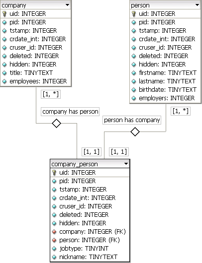
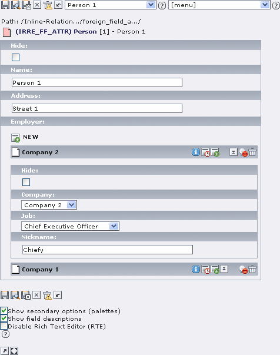
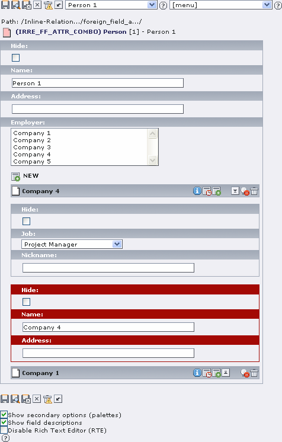
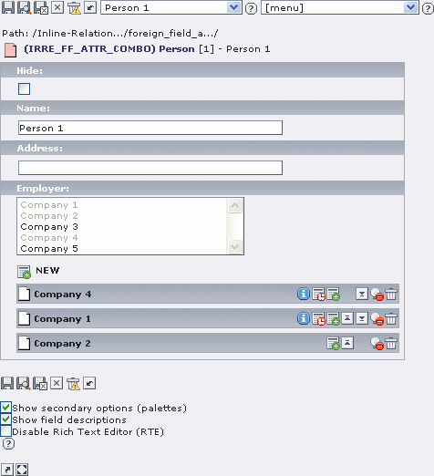

.. include:: /Includes.rst.txt
.. highlight:: php

===========================================
Inline Relational Record Editing Attributes
===========================================

.. container::

   This page belongs to the Inline Relational Record Editing project
   [outdated wiki link] (category Project [outdated wiki link])

==========
Attributes
==========

Setting attributes on relations is not that new. But the Inline
Relational Record Editing Project offers a way to edit these attributes
directly in one view and - if it is necessary - allow to edit each of
the related entities. So with this approach it is possible to manipulate
the parent, the relation, the attributes on the relations, and the
child.

Intermediate Table
==================

.. container::

   .. container::

      |image1|

      .. container::

         .. container::

         **Fig.1: Relation using an own intermediate table with
         attributes**
         Company records and person records are combined using a
         separate (intermediate) table **AND** each relations could have
         it's own attributes.

If we talk about intermediate table here, we always look at the UML
chart on the right side (see **Fig.1**). We have two objects - "person"
and "company". The relation between these two objects is stored on an
intermediate table "person_company". Each of the main entities has a
field on the intermediate table, storing the uid of the appropriate
object.

The fields "jobtype" stores a value from a small item-selector and the
"nickname" is used to store the accordant naming of a person inside a
company - both fields are attributes on the relation.

The intermediate table here has nothing to do with the know
MM-Relations. It works similarly, but here we can define some more
things and the intermediate table has proper uid, pid, tstamp, etc.,
MM-tables dont have these fields. So, on our own intermediate table we
can define the fields to store the uids of the respective parent record
- MM-tables use "uid_local" and "uid_foreign". Also we can define
different sortings for each view (person->company or company->person)
(for sorting see the Foreign Field of 1:n Relations [outdated wiki
link]).

The tables "person" and "company" have regular TCA definitions. Only the
special configurations are mentined below. The fields "person.employers"
and "company.employees" are of type "inline" and will store the number
of references that point to or away of them.

Bidirectional anti-symmetric relations
======================================

Bidirectional anti-symmetric relations are tables to that point to a
different table on the next level. For examples "company" pointing to
"person" is such a thing. But "company" pointing to "company" is not,
this is a symmetric relation [outdated wiki link]. For anti-symmetric
it's clear which one of the pointer uids belongs to its appropriate
table.

Configure the normal way
------------------------

.. container::

   .. container::

      |image2|

      .. container::

         .. container::

         **Fig.2: Normal Way**
         Define the relations to a child using a single-selector and
         manipulate the attributes.

The normal way means, that the relation between the two object "person"
and "company" can be created and each relation has serveral attributes
that can be edited. Only one side (the "parent") of a relation is
directly editable. In **Fig.2** a object of "person" is edited, so only
the fields of a "person" can be edited.

| 
| **TCA configuration of the regular object "person" and "company":**

::

   $TCA['person'] = Array(
     ...
     'columns' => Array(
       'hidden' => ...,
       'employers' => Array(
         'exclude' => 1,
         'label' => 'LLL:EXT:myextension/locallang_db.xlf:person.employers',
         'config' => Array(
           'type' => 'inline',
           'foreign_table' => 'person_company',
           'foreign_field' => 'person',
           'foreign_label' => 'company',
           'appearance' => Array(
             ...
           ),
         ),
       ),
     ),
     ...
   );

   $TCA['company'] = Array(
     ...
     'columns' => Array(
       'hidden' => ...,
       'employees' => Array(
         'exclude' => 1,
         'label' => 'LLL:EXT:myextension/locallang_db.xlf:company.employees',
         'config' => Array(
           'type' => 'inline',
           'foreign_table' => 'person_company',
           'foreign_field' => 'company',
           'foreign_label' => 'person',
           'appearance' => Array(
             ...
           ),
         ),
       ),
     ),
     ...
   );

| 
| **TCA configuration of the special intermediate table
  "person_company":**

::

   $TCA['person_company'] = Array(
     ...
     'columns' => Array(
       'hidden' => ...,
       'person' => Array(
         'label' => 'LLL:EXT:myextension/locallang_db.xlf:person_company.person',
         'config' => Array(
           'type' => 'select',
           'foreign_table' => 'person',
           'foreign_table_where' => ...,
           'size' => 1,
           'minitems' => 0,
           'maxitems' => 1,
         ),
       ),
       'company' => Array(
         'label' => 'LLL:EXT:myextension/locallang_db.xlf:person_company.company',
         'config' => Array(
           'type' => 'select',
           'foreign_table' => 'company',
           'foreign_table_where' => ...,
           'size' => 1,
           'minitems' => 0,
           'maxitems' => 1,
         ),
       ),
       'jobtype' => Array(
         'exclude' => 1,
         'label' => 'LLL:EXT:myextension/locallang_db.xlf:person_company.jobtype',
         'config' => Array(
           'type' => 'select',
           'items' => Array(
             Array('Project Manager (PM)', '0'),
             Array('Chief Executive Officer (CEO)', '1'),
             Array('Chief Technology Officer (CTO)', '2'),
           ),
           'size' => 1,
           'maxitems' => 1,
         ),
       ),
       'nickname' => Array(
         'exclude' => 1,
         'label' => 'LLL:EXT:myextension/locallang_db.xlf:person_company.nickname',
         'config' => Array(
           'type' => 'input',
           'size' => '30',
         ),
       ),
     ),
     ...
   );

Configure the combined way
--------------------------

.. container::

   .. container::

      |image3|

      .. container::

         .. container::

         **Fig.3: Combined Way**
         Define the relations to a child using a mulitple-selector and
         manipulate the attributes **AND** edit the related child
         directly.

The combined way offers a possibility to edit both sides of a relation
directly. To select from possible records to build relations, a selector
is defined in TCA via **foreign_selector** - it points to a field of the
intermediate table, that should be responsible for providing a
selector-box.

So, in the combination it is possible to edit the parent, the relation
between parent and child, the attributes on the relation and finally the
child itself. This means, every involved entity storing some data could
be manipulated directly. **Fig.3** shows the editing of a
"person"-record and the possibilities on the attributes and the
child-record (in this case "company") in one backend view.

To notify the editor, that he can directly edit a related child-record,
and that this changes will affect the real record and not only a copy or
virtual dataset, it is shown in a different color (in this example
**red**).

| 
| **TCA configuration of the regular object "person" and "company":**

::

   $TCA['person'] = Array(
     ...
     'columns' => Array(
       'hidden' => ...,
       'employers' => Array(
         'exclude' => 1,
         'label' => 'LLL:EXT:myextension/locallang_db.xlf:person.employers',
         'config' => Array(
           'type' => 'inline',
           'foreign_table' => 'person_company',
           'foreign_field' => 'person',
           'foreign_selector' => 'company',
           'foreign_label' => 'company',
           'appearance' => Array(
             ...
             'useCombination' => 1,
           ),
         ),
       ),
     ),
     ...
   );

   $TCA['company'] = Array(
     ...
     'columns' => Array(
       'hidden' => ...,
       'employees' => Array(
         'exclude' => 1,
         'label' => 'LLL:EXT:myextension/locallang_db.xlf:company.employees',
         'config' => Array(
           'type' => 'inline',
           'foreign_table' => 'person_company',
           'foreign_field' => 'company',
           'foreign_selector' => 'person',
           'foreign_label' => 'person',
           'appearance' => Array(
             ...
             'useCombination' => 1,
           ),
         ),
       ),
     ),
     ...
   );

Bidirectional symmetric relations
=================================

Symmetric relations refer among themselves on the same level. So a
"person" pointing to another "person" - because the second person is the
husband/wife of the first person - would be such a thing. The difficulty
is, that it's not clear which of the pointer uids belongs exactly to
which instance of a table and that a existing record on the intermediate
table should stay the same and not changing the pointer uids.

To get this working correctly with Inline Relational Record Editing, you
have to put some information into your TCA. Imagine we want symmetric
relations for the table "person". The keys beginning with **symmetric**
define behaviour for "the other side" of the relation. You can setup a
different sorting for each side of the relations by **foreign_sortby**
and **symmetric_sortby** - for wife and husband that wouldn't make any
sense, but if you have related news, you can build your individual
ranking of news-items.

| 
| **TCA configuration of the object "person":**

::

   $TCA['person'] = Array(
     ...
     'columns' => Array(
       'hidden' => ...,
       'spouse' => Array(
         'exclude' => 1,
         'label' => 'LLL:EXT:myextension/locallang_db.xlf:person.spouse',
         'config' => Array(
           'type' => 'inline',
           'foreign_table' => 'person_symmetric',
           'foreign_field' => 'person',
           'foreing_label' => 'spouse',
           'foreign_sortby' => 'sorting_person',
           'symmetric_field' => 'spouse',
           'symmetric_label' => 'person',
           'symmetric_sortby' => 'sorting_spouse',
           'appearance' => Array(
             ...
           ),
         ),
       ),
     ),
     ...
   );

| 
| **TCA configuration of the special intermediate table
  "person_symmetric":**

::

   $TCA['person_symmetric'] = Array(
     ...
     'columns' => Array(
       'hidden' => ...,
       'person' => Array(
         'label' => 'LLL:EXT:myextension/locallang_db.xlf:person_symmetric.person',
         'config' => Array(
           'type' => 'select',
           'foreign_table' => 'person',
           'size' => 1,
           'minitems' => 0,
           'maxitems' => 1,
         ),
       ),
       'spouse' => Array(
         'label' => 'LLL:EXT:myextension/locallang_db.xlf:person_symmetric.spouse',
         'config' => Array(
           'type' => 'select',
           'foreign_table' => 'person',
           'size' => 1,
           'minitems' => 0,
           'maxitems' => 1,
         ),
       ),
       'someattribute' => Array(
         ...
       ),
     ),
     ...
   );

Configure the uniqeness of relations
====================================

.. container::

   .. container::

      |image4|

      .. container::

         .. container::

         **Fig.4: Uniqueness handling**
         Items of the multiple-selector that already have been used to
         build a relation, are disabled (grey).

Regular MM-Relations (should) only allow one single relation between two
objects. But in case of using attributes, it could be possible that this
single relation is not enough - for instance if we have a attribute
"jobtype" and a person has different jobs inside a company, such as
"CTO" and "PM". So uniqueness-handling is only of interest **if
attributes are used**.

But to define, what is allowed and what is not allowed, it is necessary
to set up a "uniqeness-handling", that tells the system, which
duplicates are accepted. The evaluation only happens on the client-side
via JavaScript - because it is also the location where the Inline
Relational Record Editing handles to dynamic records.

The following example depends on the "person"<->"company" coherency from
above. The fields "person" (foreign_field) and "company"
(**foreign_unique**) have to build a unique relation. This also works on
configurations, that use a multiple selector by **foreign_selector** and
for the combination of attributes and the foreign table record [outdated
wiki link].

| 
| **TCA configuration of the regular object "person" and "company":**

::

   $TCA['person'] = Array(
     ...
     'columns' => Array(
       'hidden' => ...,
       'employers' => Array(
         'exclude' => 1,
         'label' => 'LLL:EXT:myextension/locallang_db.xlf:person.employers',
         'config' => Array(
           'type' => 'inline',
           'foreign_table' => 'person_company',
           'foreign_field' => 'person',
           'foreign_unique' => 'company',
           'foreign_label' => 'company',
           'appearance' => Array(
             ...
           ),
         ),
       ),
     ),
     ...
   );

