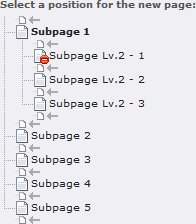
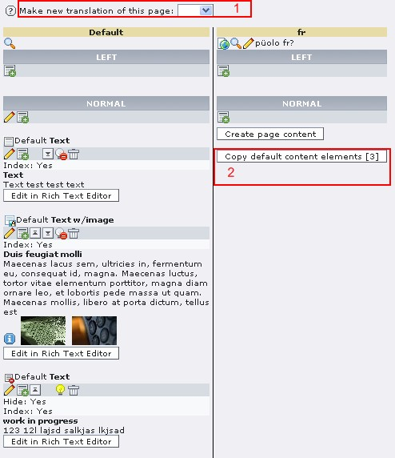

.. include:: /Includes.rst.txt

.. _ja-typo3-tutorial-for-editors:

=============================
Ja:TYPO3 Tutorial for Editors
=============================

.. container::

   notice - Note

   .. container::

      This manual was formerly named "typo3_tut", then "doc_tut_editors"
      and has now been renamed to "TYPO3 Tutorial for Editors".

.. container::

   +-----------------------------------+-----------------------------------+
   | **Extension detail information**  |                                   |
   | `typo3_tut <https://extensions.t  |                                   |
   | ypo3.org/extension/typo3_tut/>`__ |                                   |
   +-----------------------------------+-----------------------------------+
   |                                   | `tutorial </Category:Tutorial>`__ |
   |                                   | [deprecated wiki link]: This      |
   |                                   | basic tutorial for editors        |
   |                                   | explains how to add or change     |
   |                                   | content on an existing website in |
   |                                   | TYPO3. It provides the most basic |
   |                                   | step-by-step instructions to get  |
   |                                   | the job done.                     |
   +-----------------------------------+-----------------------------------+
   | **documentation state**           | `stable </C                       |
   |                                   | ategory:Stable>`__\ **[deprecated |
   |                                   | wiki link]** |document state      |
   |                                   | list|                             |
   |                                   | `licence                          |
   |                                   | OCL <http:/                       |
   |                                   | /www.opencontent.org/openpub/>`__ |
   +-----------------------------------+-----------------------------------+
   | **forgeproject**                  |                                   |
   +-----------------------------------+-----------------------------------+
   | **mailinglist**                   |                                   |
   +-----------------------------------+-----------------------------------+
   | usergroups                        | |list of usergroups| forEditors,  |
   |                                   | forBeginners                      |
   +-----------------------------------+-----------------------------------+
   | author(s)                         | editors: `Eikaa </User:Eikaa>`__  |
   |                                   | [deprecated wiki link],           |
   |                                   | `P                                |
   |                                   | sychomieze </User:Psychomieze>`__ |
   |                                   | [deprecated wiki link]            |
   |                                   | reviewer and publisher:           |
   |                                   | `P                                |
   |                                   | sychomieze </User:Psychomieze>`__ |
   |                                   | [deprecated wiki link]            |
   +-----------------------------------+-----------------------------------+
   | TER category                      | doc_tut                           |
   +-----------------------------------+-----------------------------------+
   | dependency                        |                                   |
   +-----------------------------------+-----------------------------------+

<< Back to `Extension manuals </Overview_Extension_manuals>`__
[deprecated wiki link] page

`[edit] <https://wiki.typo3.org/wiki/index.php?title=Ja:TYPO3_Tutorial_for_Editors&action=edit&section=0>`__
[deprecated wiki link]

| 
| この基本的なチュートリアルでは既存のTYPO3のウェブ･サイトにコンテンツを付け加えたり、変更したりする方法を説明します。その作業を成し遂げる為の手順を段階を追って説明します。このチュートリアルでは利用可能な全ての機能を説明するわけではなく、もっとも一般的なものだけです。他の言語に翻訳する手伝いをするにはこちらを参照のこと：
  https://docs.typo3.org/m/typo3/tutorial-editors/master/en-us/

続編:
`TYPO3_Tutorial_for_Editors_part2 </TYPO3_Tutorial_for_Editors_part2>`__
[deprecated wiki link]

ログイン
========

始めましょう。お使いのブラウザのJavaScriptとクッキーが有効になっていることを確認してください。

TYPO3にログインするには、ブラウザのアドレス欄に自分のウェブサイトのURLに“/typo3”を付けたものを入力します。例えば：

::

   http://www.example.com/typo3 [not available anymore]

次のような画面に変わるでしょう：

|Login screen.jpg|

ログインするには：

-  username欄に自分のユーザーネームを入力します [1]
-  password欄に自分のパスワードを入力します [2]
-  [Log In]ボタンをクリックするか[Enter]キーを押します。

TYPO3内のヘルプ
---------------

TYPO3の詳細に入る前に、もう一度このチュートリアルでは基礎的なトピックスのみを取り上げると強調しておきたいと思います。TYPO3には幾つかのオンラインヘルプの機能が備わっています：

-  ボタンや機能の上にマウスポインタを合わせると、短い説明が表示されます。
-  エレメントの隣にクエスチョンマークが付いているのが目に付くと思います。
   |Questionmark.jpg|
   このクエスチョンマークにマウスのポインタを合わせるとそのエレメントに関連したヘルプが表示されます。
-  Helpセクション内の\ **Manual**\ モジュールに機能の詳しい説明が存在します。

概要
====

あなたは今ウェブサイトの「バックエンド」と呼ばれるエリアにいます。通常、コンテンツに対するすべての変更はここで行われます。ページを直接変更することも可能ですが、このチュートリアルでは扱いません。

バックエンドは\ **3つの部分**
(図2参照)に分割されています。最初の部分[1]は\ **メニュー**\ で、やろうとする作業を選択するのに使います。2番目の部分[2]には\ **ページツリー**\ があり、ウェブサイトのページの階層構造をあらわしています。3つ目の部分[3]は\ **ワークエリア**\ です。4つ目のエリア[4]はバージョン4.2以降を使っている場合にのみ表示され、ドックヘッダーと呼ばれています。そこにはログインしているユーザーの名前(あなたです!)とログアウトボタン等が表示されているでしょう。

サイトを訪れた人が見る画面は\ **フロントエンド**\ =
あなたのサイトと呼ばれます。

|Backend cols.jpg|

図2

1番目の枠で「Page」を選ぶと図2のような画面が表示されるでしょう。

メニュー
--------

メニューは幾つかのモジュール毎にカテゴリーに分かれています。図2には\ **Web**,
**File, User tools, Admin tools**
と\ **Help**\ のカテゴリーと\ **Page**, **View**, **Versioning**,
**Filelist**\ やその他のモジュールや幾つかのhelpモジュールがあります。あなたが利用可能なカテゴリーやモジュールは管理者があなたのアカウントをどのように設定したかによって変わります。

一番利用されるのは\ **Web**
カテゴリーとそこに含まれる\ **Page**\ モジュールです。これでウェブページを作成したり編集したり、ページ毎のコンテンツ欄や異なった言語の管理をすることができます。

**View**\ モジュールはページツリーで現在選択されているページがフロントエンドでどんな風に見えるか表示します。

**List**\ モジュールはページ上に存在するデータベースレコードに低いレベルでアクセスする手段を提供します。

**Versioning**\ モジュールはバージョンとワークスペースを表示すます。

**Task Center** と / あるいは
**Setup**\ オプションがある\ **User**\ カテゴリが表示されていることが多いでしょう。

このチュートリアルではversioning, workspace, user, task center, あるいは
setupに関しては取り扱いません。

もう一つ非常に重要な\ **Filelist**\ モジュールがあります。サーバー上に画像やPDF等、あらゆる種類のファイルを保存しておくのに使います。

すべてのモジュールに関して、ヘルプカテゴリの\ **About
modules**\ モジュールの中で説明されています。カテゴリは名前の隣にある小さな+
/
-ボタン（訳注：画像では三角形のアイコンになってますが）で折りたたむことができることに注意してください。

ページツリー
------------

ページツリー上で色んなアイコンが表示されているのを確認してください：

|Pagetree.jpg|

図3

#. これは\ **標準的**\ ページです。
#. このページは\ **ショートカット**\ です。フロントエンドでこのページにアクセスすると別のページにリダイレクトされることを表しています。
#. このページはフロントエンドでは\ **表示されません**\ 。ページのプロパティで\ **Hide
   Page**\ が有効になっています。
#. こちらは\ **メニューに表示しない**\ タイプです。ページのプロパティで\ **Hide
   in Menu**\ が有効になっています。
#. これはページというよりは\ **フォルダ**\ です。ニュースやニュースレター、ゲストブックの登録など、あらゆる種類のアイテムが保存されます。
#. プラスのマークをクリックするとディレクトリのツリーが開き、マイナスのマークをクリックするとツリーをたたみます。
#. ページを作成したのにページツリーに現れない場合は、リロードして見てください。

|Iconname.jpg|

図4

アイコンをクリックした時とページの名前をクリックした時の違いに注目してください。アイコンをクリックするとページに限定されたオプションのメニューが表示されます。一方、ページの名前をクリックするとワークエリアにそのページロードされます。

コンテンツの取り扱い
====================

ではページモジュールのワークエリアに取り掛かりましょう。通常、大半の仕事がここで行われます。たくさんのアイコンやボタンがありますが、恐れないでください。やや冗長になっています。マウスのポインタを使ってどれでもアイコンの上に乗せると（クリックするのではなく）、簡単なヘルプテキストが表示されます。まず最初にコンテンツに関する作業について述べ、後でページに関する作業について述べます。

図5はページツリーでページの名前をクリックした後のpageモジュールのワークエリアを表示しています。\ *normal*\ コラムに3つの\ **コンテンツエレメント**\ があるのが分かるでしょう。

|Contentelements.jpg|

図5

1番目と3番目は\ **text**\ タイプ [1 と 3],2番目は\ **text with
image**\ タイプ
[2]です。コンテンツタイプの違いについては後ほど詳しく学びます。まずボタンについて見ていきましょう：

|Workingwithcontent.jpg|

図6

#. このアイコンはコンテンツエレメント全体を現しています。コンテンツタイプによってそれぞれアイコンが変わります。それをクリックするとそのコンテンツエレメントに特化したメニューがポップアップします。
#. ペンをクリックするとこのエレメントを編集できます。
#. 既存のコンテンツエレメントの後ろに新しいコンテンツエレメント(レコードとも呼ばれます)作成したり、コラムの先頭に作成するにはこのアイコンを利用します。あるいは
#. このアイコンで新しいコンテンツエレメントを作成し、どこに配置するか選ぶことができます。
#. コラムの中に一つ以上のエレメントがある場合は、これらの矢印を使ってそれらを動かすことができます。
#. エレメントを隠したり表示したりするには電球マークを使用します。3つ目のエレメントのメインアイコンがページアイコンと同様に非表示であることを示しているのに注意してください。
#. 非表示のエレメントを全部見るには、このオプションをチェックする必要があります。
#. 最後に、エレメントを丸ごと取り除くにはゴミ箱を利用します。

バージョン4.2では図7に見られるように、一般的なオプションがややあちこちに入れ替わっていますが意味は上のものと同じです：

| 
| |V42header.jpg|

図7

コンテンツの作成
----------------

新しいコンテンツエレメントを作成しようとしてクリックすると、選択可能な様々なコンテンツタイプが表示されます（図8）。選択可能なコンテンツタイプの種類は、あなたがTYPO3のサーバーにインストールした機能によって変わることに注意してください。

|Createelementselect.jpg|

図8

この画像では、まず作成したいコンテンツのタイプを選び[1]
、それからページのどこに配置するか（小さな灰色の矢印を使って）選びます[2]。2番目の選択肢はまだどこに配置するか指定していない場合にのみ表示されます。言い換えれば位置選択肢が表示されるには、ページの一番上にある\ **new
content**\ アイコン（図6のアイテム4）を使う必要があるということです。

コンテンツの編集
----------------

実のところ、コンテンツを編集するためのワークエリアは新規作成用のものと同じです。ここでは\ **text
w/
image**\ コンテンツエレメントを使う際の違いについて説明します。なぜなら\ **text**\ と\ **images**\ のコンテンツエレメントの両方を説明できるからです。

|Editcontenttop.jpg|

図8

一番上のエリアにはエレメントのヘッダ[図8-1]とタイプ[2]があります。タイプは変更できます。\ *text
w/
image*\ エレメントを\ *text*\ エレメントに変更すると、すべての画像を失うことになるので注意してください。

エレメントに加えた変更を保存するにはフロッピーディスクのアイコン[3]を使います。変更をフロントエンドで確認したい場合は虫眼鏡のついたフロッピーディスクを使ってください。そうすれば変更を保存し、ポップアップウインドウにあなたが作業中のページが表示されます。そのサイトのポップアップブロックを解除しておきましょう！

5番目のアイコン[5]は、変更を保存し、ページモジュールの通常のワークエリアに戻ります。

6番目のアイコン[6]は、変更を保存せずに、ページモジュールの通常のワークエリアに戻ります。

ゴミ箱[7]は、現在のコンテンツエレメントを削除します。

最後の小さな矢印のついたアイコン[8]は、このコンテンツエレメントに対して行われた最後の変更を取り消し（undo）ます。

リッチ・テキスト・エディタ
--------------------------

エディタについてはあまり説明が要らないと思います。たぶん今までに似たようなワープロソフトを使ったことがあるでしょう。サイトの設定によって、あなたが使えるボタンの種類は変わってきます。ここにあるのは一例です：

|Editcontentrichttexteditor.jpg|

図9

通常の\ **Rich Text Editor**
(RTE)の書式用オプションには次のようなものがあります：

#. **太字**\ と\ *イタリック*\ 書体
#. :sup:`上付き文字`\ と\ :sub:`下付き文字`
#. 数字付きと順位無しのリスト
#. 字下げ（インデント）
#. 特殊文字の挿入
#. テキストが範囲指定されていると、このオプションでハイパーリンクを作成できます。下記を参照
#. テーブルの挿入
#. 検索と置換
#. HTMLソースの表示。htmlの知識がある場合にのみ役に立つでしょう
#. 不必要なフォーマットの削除。（訳注：最近のものは箒のアイコンに変更になっています）例えばMSワードや別のWebサイトからコピーした際に
#. 取り消し（undo） / 取り消しの取り消し（redo）
#. 枠線の表示と非表示切り替え(テーブルのすべての行に対して)

リンクの作成
^^^^^^^^^^^^

|Rtelink.jpg|

図10

リッチテキストエディタで、単語を一つ以上選択し、\ **Link**\ アイコンをクリックすると、次のような選択が可能にないます：

#. サイト内のページにリンク。ページの名前をクリックするだけです
#. ファイルリストのファイルへのリンク。ファイルについてはあとでより詳しく説明します
#. 別のウェブサイトへのリンク。適切なフィールドにそのサイトのアドレス(URL)を入力し、\ **set
   link**
#. E-maiアドレスへのリンク。適切なフィールドに入力し\ **set link**

既に設定されているリンクを選択した場合、一番左端のオプション\ **Remove
Link**\ で削除することができます。

画像の取り扱い
--------------

画像を扱う際は、text with imageあるいはimages
onlyのコンテンツエレメントを利用するのが大半でしょう。それらの場合についてここで説明します。画像関連の作業をする時は、編集フォームのページの下にある\ **Show
secondary options**\ オプションを有効にしておくと便利です。

|Editcontentimages.jpg|

図11

#. ページ上で現在閲覧可能な画像の一覧です
#. 左側で画像を選択し、これらの矢印で順番を変更します
#. 左側で画像を選択し、一覧から削除します
#. サーバーの\ **filelist'**\ から画像を追加するにはこのフォルダのボタンを使います
#. このコンテンツエレメントで使う画像を直接アップロードするには、このフィールドを使えばいいです
#. テキストに対して画像を配置する場所を選択します
#. このエレメントのすべての画像に対して横幅そして/あるいは高さを指定します
#. 画像にリンクをセットします
#. 縮小前の画像を有効にします
#. 画像の解像度を指定します
#. 画像にキャプションをつけたい場合はここに入力します。画像が複数ある場合は、キャプション毎に改行します

**Alternative
Text:**\ 欄もあると思います。それぞれの画像に対し、一行ずつ簡単な説明を記入しておくのは一般的によいことです。アクセシビリティ要件(例えば合衆国の\ `Section
508 compliance <http://www.section508.gov>`__ [not available
anymore]のような)を満たすには特に重要です。

ファイルの取り扱い
==================

TYPO3にはサーバー上にファイルを保存しておける\ **filelist**\ モジュールがあります。ここに保存されたファイルはリッチテキストエディタの\ **link**\ The
files which are stored this way are available in the
**link**\ 欄や様々なコンテンツエレメントの画像欄で利用できます。ファイルをコンテンツエレメントに直接アップロードするのではなく、filelistを使うのはよい習慣です。必要になるたびに同じ画像を何度も何度もアップロードせずに、再利用できるので。

|Filelist.jpg|

図12

#. filelistモジュールを選択
#. ページツリーがファイルツリーに変わります。フォルダが一つかそれ以上あるのが見えるでしょう。フォルダのアイコンをクリックするポップアップメニューが表示され、名前部分をクリックするとワークエリアにフォルダの中身が表示されます。
#. ファイルの一覧でファイルのアイコンをクリックするとポップアップメニューが表示され、名前部分をクリックするとファイルが開きます。
#. このフォルダにファイルを追加するにはこのボタンを使います
#. このフォルダ内の画像のサムネイルを表示するには、このオプションをクリックします

もしあなたのサイトがこれとは全く違った表示になっているならば、おそらくあなたのサイトはファイルを管理するのに\ `Media
(DAM) (dam) <https://extensions.typo3.org/extension/dam/>`__
エクステンションを使っていると思われます。

ページの取り扱い
================

ページツリーについては既に学んだと思います。ここではページを新規作成したり、移動したり、隠したり、削除する方法を見ていきましょう。ページのアイコンをクリックした際に表示されるコンテキストメニューはこんな風です：

|Pagetreecontextmenu.jpg|

図13

最初の3つのオプションはよく使われる機能です：

**Show**\ はページをViewモジュールで(フロントエンドでの表示のように)開きます。\ **Edit**\ はPageモジュールで開きます。\ **New**\ はそのページに新しいコンテンツを作成したり、新しいページを作成したりできます。

**Info**\ は編集者にとってはあまり関係ありません。

**Copy**\ は驚くかもしれませんが、ページを丸ごとTYPO3のクリップボードにコピーします。コンピュータのオペレーティングシステムでおなじみのコピー＆ペーストに非常によく似ています。

**Cut**\ はそのページをペーストすることで、全く別の場所に移動できます。いったんページがカットされると、他のページのポップアップメニューには次のような二つが追加されます：

|Pasteoptions.jpg|\ **Paste
into**\ はクリックしたページの中にペーストされ、ページツリー上でそのページの子供として表示されます。

**Paste after**\ はページツリー上の同じ階層に配置します。

ここでは\ **Versioning**\ と\ **Send to
review/pub**\ については取り上げません。

**More options...**\ フィールドは\ **Move
page**\ という興味深いオプションを含むさらなるメニューをポップアップします。

|Movepage.jpg|

図14

繰り替えしましますが、ページのアイコン[1]をクリックするとメニューがポップアップし、More
Options [2]を選択すると別のメニューがポップアップします。Move page
[3]ではワークエリア上で、灰色の矢印[4]をクリックすることで、ページを移動したい場所を選ぶことができます。

ファイルやフォルダをドラッグ＆ドロップによって簡単に動かすこともできます。マウスでページをドラッグすることで移動できます。他のページの場所にドロップした場合は、ポップアップウインドウがあわられ、ドロップした先のページの下にコピーあるいは移動するか、中にコピーあるいは移動するか選択できるようになっています。簡単でしょう？

**Hide**\ オプションはフロントエンドではソノページにアクセスできないようにします。そして\ **Delete**\ オプションはページを丸ごと削除します。

ページの作成
------------

新しいページを追加するには2つの方法があります。

新規ページ作成方法　その1
^^^^^^^^^^^^^^^^^^^^^^^^^

|Pageicon.jpg|\ ページツリー上のページアイコンのどれかをクリックします

ドロップダウンメニューからnew

|Selectnew.jpg|\ を選びエンターを押します。

右側の'ワークエリア'に下のような画面が表示されます。

|Newrecord.jpg|

図16

**Page (inside)**\ をクリックすると

**New record**\ のページ情報がすぐに表示されるでしょう。

**Click here for wizard!** をクリックするか

あるいは

**Page (after)**\ をクリックしても

上と同様の\ **New record**\ 画面が表示されるでしょう。

新規ページ作成方法　その2
^^^^^^^^^^^^^^^^^^^^^^^^^

ページツリーでいずれかのページの名前をクリックします

すると右側のワークエリアに下のような画面が表示されます：

|Pagemoduleoptions.jpg|

図17

次に[New Page]ボタンをクリックします

|Newpagebutton.jpg|

そうすればレコードの新規作成画面が表示されるでしょう。

ここでしなければならないのはウェブサイトのページツリーのどの部分にページを追加したいか、選ぶことです。間違って別の場所を選んでしまっても、ページ移動オプション(編集オプションを選ぶと利用可能になります)を使って後で移動することができます。

どこに新しいページを配置するか決まったら、矢印で示された小さなグレイのファイルフォルダをクリックします。そうするとその場所に新しいページが挿入されます。

|Pagepositioning.jpg|

図18

ページを作成すると、ページの上部には図19にあるようなオプションが表示されます。

|Pageoptionstop.jpg|

図19

#. Edit page
   propertiesはワークエリアに表示/非表示のようなページ固有のオプションが表示されます。また、メニューではページでとは別のタイトルを表示するようにNavigation
   titleを入力することもできます。
#. ページを移動したいと思った時は、これらのオプションが届きやすいところにあります。お分かりのように、大抵の場合同じことを別の方法で行うことができます。
#. 新しいページを作成するのにこのボタンを使います。あるいはコンテキストメニューにあるものを使います。新しいページは、正式に公開する前にページのコンテンツを作成することができるように、デフォルトでは非表示になっています。フロッピーディスクのアイコンを使って新しいページを保存するのを忘れないようにしてください！

多言語対応
==========

もしあなたのサイトが多言語対応しているならば、同じページの色んな翻訳を追加したいと思うでしょう。そうするには次のようにする必要があります：

ページモジュールの上の部分に、ドロップダウンボックスがあり、図20のように\ **Languages**\ が選択できます。

|Languages.jpg|

図20

既に存在するページの翻訳ページを新たに作成したいと思った場合は、利用可能な言語が選択できる（図21参照）ドロップダウンメニューのある\ **Make
new translation of this page:** [1]
ボタンが表示されているでしょう。必要なものを選び、ページタイトル欄にページネームの新しい翻訳を入力し、保存します。

|Translate.jpg|

図21

そこで、元の言語のページのコンテンツを新しい言語へコピーできます[2]。新しい言語のバージョンでも表示したい画像がある場合は、この方法は非常に便利です。

全く新しいバージョンを作成することもできます。

この2コラムモードが分かりづらい場合は、先ほど言語を選択したドロップダウンメニューで\ **Columns**\ を選ぶことで、ワークエリアの元の表示に戻ることができます。

今使ったばかりのメニューの下の別のドロップダウンメニューを使って、図22にあるように異なる言語間で切り替え可能になっていることに注目してください。

|Translate2.jpg|

図22

.. |document state list| image:: files/Info.gif
   :target: /Template:Extension

.. |Editcontentrichttexteditor.jpg| image:: files/Editcontentrichttexteditor.jpg
   :target: /File:Editcontentrichttexteditor.jpg

.. |Newpagebutton.jpg| image:: files/Newpagebutton.jpg
   :target: /File:Newpagebutton.jpg

