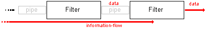

.. include:: /Includes.rst.txt

=============
MVC Framework
=============

.. container::

   notice - Note

   .. container::

      The lib/div extensions are not actively maintained and should be
      considered deprecated!!

.. container::

   error - This page is a candidate for deletion

   .. container::

      **Reason: outdated work in progress document**
      If you disagree with its deletion, please explain why at `Category
      talk:Candidates for speedy
      deletion </wiki/index.php?title=Category_talk:Candidates_for_speedy_deletion&action=edit&redlink=1>`__
      [not available anymore] or improve the page and remove the
      ``{{delete}}`` tag.

      This notice should remain for a minimum of 1 week after it was
      placed on the page. If a discussion is still ongoing, it should
      remain until a consensus is reached or a decision has been made
      about the removal, after which the page will either be deleted or
      this notice removed.

      Remember to check `what links
      here </Special:WhatLinksHere/MVC_Framework>`__ [deprecated wiki
      link] and the `the page
      history <https://wiki.typo3.org/wiki/index.php?title=MVC_Framework&action=history>`__
      [deprecated wiki link] before deleting.

.. container::

   This page belongs to the `Extension coordination team </ECT>`__
   [deprecated wiki link] (category `ECT </Category:ECT>`__ [deprecated
   wiki link])

.. container::

   This page belongs to the MVC Framework aka lib/div project (category
   `Project </Category:Project>`__ [deprecated wiki link])

+-----------------------------------+-----------------------------------+
| | *Title:*                        | | **lib/div**                     |
| | *Main editor:*                  | | Elmar Hinz                      |
| | *Project status:*               | | in alpha/beta development       |
| | *mailinglist:*                  | | t                               |
| | *manual*                        | ypo3.teams.extension-coordination |
| | *API-documentation*             | | `cu                             |
| | *using examples*                | rrent-version <https://docs.typo3 |
|                                   | .org/typo3cms/extensions/lib/>`__ |
|                                   | | the code is rich documented     |
|                                   | | `Apples </wiki/index.php?title  |
|                                   | =Apples&action=edit&redlink=1>`__ |
|                                   |   [not available anymore]/        |
|                                   |   `apples <https://extensions     |
|                                   | .typo3.org/extension/apples/>`__, |
|                                   |   `Bananas </Bananas>`__          |
|                                   |   [deprecated wiki link]/         |
|                                   |   `bananas <https://extensions.   |
|                                   | typo3.org/extension/bananas/>`__, |
|                                   |   `                               |
|                                   | Cherries </wiki/index.php?title=C |
|                                   | herries&action=edit&redlink=1>`__ |
|                                   |   [not available anymore]/        |
|                                   |   `cherries <https://extensions.t |
|                                   | ypo3.org/extension/cherries/>`__, |
|                                   |   `EFAQ                           |
|                                   |   Project </EFAQ_Project>`__      |
|                                   |   [deprecated wiki link]/         |
|                                   |   `efaq <https://extensio         |
|                                   | ns.typo3.org/extension/efaq/>`__, |
|                                   |   `                               |
|                                   | Articles </wiki/index.php?title=A |
|                                   | rticles&action=edit&redlink=1>`__ |
|                                   |   [not available anymore]/        |
|                                   |   `articles <https://extensions.t |
|                                   | ypo3.org/extension/articles/>`__, |
|                                   |   `ResultBrowser                  |
|                                   | </MVC_Framework/ResultBrowser>`__ |
|                                   |   [deprecated wiki link]          |
+-----------------------------------+-----------------------------------+

.. container::

   notice - Open Content License

   .. container::

      This document is published under the `Open Content
      License <http://www.opencontent.org/openpub/>`__
      The content is related to TYPO3 - a GNU/GPL CMS/Framework
      available from `typo3.org <http://typo3.org>`__

Keywords (Tags)
===============

`MVC </Category:MVC>`__ [deprecated wiki link], `PAC </Category:PAC>`__
[deprecated wiki link], `SPL </Category:SPL>`__ [deprecated wiki link],
`ECT </Category:ECT>`__ [deprecated wiki link], `lib </Category:Lib>`__
[deprecated wiki link], `div </Category:Div>`__ [deprecated wiki link],
`PHP </Category:PHP>`__ [deprecated wiki link], `OOP </Category:OOP>`__
[deprecated wiki link], `ORM </Category:ORM>`__ [deprecated wiki link],
`Action Pipeline </Category:Action_Pipeline>`__ [deprecated wiki link],
`Design Pattern </Category:Design_Pattern>`__ [deprecated wiki link]s

Abstract
========

This library for `extension </Category:Extension>`__ [deprecated wiki
link]s can by used to replace the tslib_pibase class. The design
implements the MVC pattern (Model View Controller) for TYPO3.
Structuring your code in the MVC way prepares it for a smooth migration
to TYPO3 5.0.

Team
====

General
-------

-  `Elmar Hinz <http://t3flyers.wordpress.com>`__ (project leader)
-  `Christian Welzel <http://www.camlann.de/de/typo3ecke.html>`__ [not
   available anymore] (kickstarter add-on, API and UML generation)
-  `Daniel Brüßler <http://www.patchworking.de>`__ (pear extension, wiki
   maintainance)
-  `Steve Ryan <http://syntithenai.com/>`__ [not available anymore]
   (object persistence framework extension)

Alpha Branch (focus research, PHP4)
-----------------------------------

-  `Elmar Hinz <http://t3flyers.wordpress.com>`__ (lead developer,
   research)
-  `Ries van Twisk <http://www.rvantwisk.nl/>`__ [not available anymore]
   (`Smarty </Category:Smarty>`__ [deprecated wiki link] view,
   ambassador)
-  `Steffen Kamper <http://www.sk-typo3.de/>`__
   (`Smarty </Category:Smarty>`__ [deprecated wiki link] view,
   typo3.org)

`Beta Branch </MVC_Framework/lib_div_Beta_Branch>`__ [deprecated wiki link] (focus stable API, PHP5)
----------------------------------------------------------------------------------------------------

-  `Jörg Schoppet <http://schoppet.de/>`__ (lead developer, migration to
   beta, PHP5)
-  `Robert Lemke <http://robertlemke.de/>`__ [not available anymore]
   (consultant for migration path to TYPO3 Neos)
-  `Fabien Udriot <http://omic.ch>`__ [not available anymore] (team)
-  `Johnny Peck <http://slipcasemedia.com>`__ [not available anymore]
   (team)
-  `Philip Almeida <http://lib.idohost.com>`__ (team)

Targets
=======

-  Cultivate the spirit of cooperation.
-  Offering an alternative to tslib_pibase with a modern API.
-  Providing a MVC framework extension for TYPO3 v4/v6.
-  Filling the technological gap between v4/v6 and Neos.
-  Shortening the migration path between V4/V6 and Neos extensions.
-  Spreading modern patterns of development within the TYPO3 community.
-  Incubator of ideas for Neos.

Components
==========

Library

-  `lib <https://extensions.typo3.org/extension/lib/>`__ with
   `ResultBrowser </MVC_Framework/ResultBrowser>`__ [deprecated wiki
   link]: Library for extensions
-  `div <https://extensions.typo3.org/extension/div/>`__: Static
   functions for extensions

Related extensions

-  `pear <https://extensions.typo3.org/extension/pear/>`__: Installer
   for pear components
-  `kickstarter_mvc </wiki/index.php?title=Kickstarter_mvc&action=edit&redlink=1>`__
   [not available anymore]/
   `kickstarter__mvc <https://extensions.typo3.org/extension/kickstarter__mvc/>`__:
   Kickstarter add-on for lib/div extensions - *please help with the
   documentation*
-  `object persistance
   framework <http://svn.syntithenai.com/svn/t3ext/persistence/>`__ [not
   available anymore] (Steve Ryan)

Collection

-  `ect <https://extensions.typo3.org/extension/ect/>`__: Declares
   dependencies from libraries and basic extensions

Overview of Technology
======================

-  `Object oriented
   programming <http://en.wikipedia.org/wiki/Object-oriented_programming>`__
-  `MVC <http://en.wikipedia.org/wiki/Model-view-controller>`__
   architectural pattern
-  `MVC Framework/Features of other
   Frameworks </MVC_Framework/Features_of_other_Frameworks>`__
   [deprecated wiki link] from Nick Weisser
-  `MVC Framework/Extending
   Extensions </MVC_Framework/Extending_Extensions>`__ [deprecated wiki
   link] - overview of several ways to do it
-  `PAC <http://en.wikipedia.org/wiki/Presentation-abstraction-control>`__
   architectural pattern
-  `Standard PHP Libray (SPL) <http://php.net/spl>`__
-  `PHP5 featured <http://www.php.net/manual/en/migration5.php>`__ [not
   available anymore]
-  PHP4 compatible
-  Using PEAR channels with
   `pear <https://extensions.typo3.org/extension/pear/>`__
-  `Coding
   Guidelines <https://docs.typo3.org/typo3cms/CodingGuidelinesReference/>`__
   [not available anymore]
-  `PHP template
   engine <http://en.wikipedia.org/wiki/Template_engine_%28web%29>`__
-  `Smarty template engine <http://smarty.php.net/>`__ [not available
   anymore] (wiki-keywords: `Smarty </Category:Smarty>`__ [deprecated
   wiki link] `template engine </Category:Template_engine>`__
   [deprecated wiki link])
-  Rapid startup with
   `kickstarter__mvc <https://extensions.typo3.org/extension/kickstarter__mvc/>`__,
   the add-on for the
   `kickstarter <https://extensions.typo3.org/extension/kickstarter/>`__
-  Forms library

Architecture and Design Patterns
================================

lib/div combines a special selection of architectural and design
patterns in a unique way. It implements modern conceptions that fit
perfectly into the existing architecture of TYPO3. It builds the
technological fundament for further layers like workflow management or
webbased development environments (ajax based drag'n'drop widgets).

Extensions and Plugins
----------------------

When we speak of a plugin we either mean the content type plugin in
special, or more general any component of functionality that can be
plugged into the T3 frontent in different ways. An extension can contain
multiple

plugins. All plugins are objects with a common outer interface:

.. container::

   `PHP Script </wiki/Help:Contents#Syntax-Highlighting_for_PHP-Code>`__
   [deprecated wiki link]

.. container::

   ::

       $outputString = $PLUGIN->main($inputString, $configuration, [$requestParameters], [$context]);

Where the parameters in [...] are optional. This is a refinement of the
traditional T3 plugin interface of the type tslib_pibase. They can be
used in the same places, in the same way. They can replace plugins of
the tslib_pibase type. Traditional plugins can be improved by the use of
lib/div style.

Model View Controller
---------------------

.. container::

   .. container::

      |image1|

      .. container::

         .. container::

         MVC for extensions with the lib/div library

MVC is an architectural pattern that decouples the data access and
business logic, the model, from data presentation, the view, by
introducing an intermediate component, the controller. The controller
reacts to the user interaction and moderates the tasks of the model and
the view.

A simple lib/div plugin consists of one controller class, one model
class and one view class. Typically the view class renders a HTML
template. More classes and templates can be used.

`MVC on
wikipedia <http://en.wikipedia.org/wiki/Model-view-controller>`__

The Tree of Plugins (TOP)
-------------------------

**or Presentation Abstraction Control (PAC)**

Lib/div uses the MVC pattern in a nested way. Each node (agent) of the
tree is a full MVC plugin. Plugin controllers can call sub-plugins. The
output of sub-plugins is nested into the own view.
`PAC </Category:PAC>`__ [deprecated wiki link] is an architecural
pattern that describes this aspect of the lib/div architecture
approximately. `PAC on
wikipedia <http://en.wikipedia.org/wiki/Presentation-abstraction-control>`__

http://upload.wikimedia.org/wikipedia/commons/4/4a/Pac-schema.png

(Source: http://en.wikipedia.org/wiki/Presentation-abstraction-control)

TODO: Replace the PNG with one more specific for lib.

Controllers and Actions
-----------------------

The user interacts with the application by clicking links and filling
forms. This user actions send parameters to the server. One of the
parameter is the action parameter. The lib/div controller is a
dispatcher object, which matches the incomming action parameters to
action methods. The action methods define the tasks of different objects
of model and view, that finally build the output string.

The `Action Pipeline </Action_Pipeline>`__ [deprecated wiki link]
-----------------------------------------------------------------

Generally you can vitalize the actions methods of lib/div with any code
you like, but the library also offers a standard system to build the
actions. This standad way is done by the use of objects, that share the
API due to inheritance from a common parent class (tx_lib_processor).

Different data has to be transported and processed along the request
cycle from the request to the response. This happens in form of a daisy
chain of processor objects, following the design pattern of `Pipes and
Filters <http://en.wikipedia.org/wiki/Pipeline_%28software%29>`__ . The
filters are the processing objects. We call them processors. Processing
in this wide sense includes for example the loading and storing taskes
of the data.

|Dataflow.png| (Source: http://de.wikipedia.org/wiki/Pipes_and_Filters)

If it is not sufficiant to process the data in a linear way, the flow of
data can be routed. The processors return result status, to which
different pipes can be assigned.

The pipes are the methods by use of which the processors are plugged to
each other. This methods are part of the inherited
`SPL </Category:SPL>`__ [deprecated wiki link] interfaces.

The flow of the action pipeline can be either controlled by plain PHP
actions or by the usage of a special controller, that can be fully
configured by TS.

Comparism to other frameworks
=============================

Apache Cocoon
-------------

http://cocoon.apache.org/images/cocoon-logo.gif

`on apache.org <http://cocoon.apache.org/>`__, `on
wikipedia <http://en.wikipedia.org/wiki/Apache_Cocoon>`__

Cocoon is a JAVA framework with a pipeline as the central piece of its
architecture. It chains components (processors) of the types *matchers,
generators, transformers, serializers, selectors, views, readers,
actions*. The pipe of components is configured in a so called *sitemap*.
The data is processed along the pipe as a string of XML. The main
transformation language is XSLT.

In lib/div the pipeline isn't the leading architectural charactristic
but an architectural pattern on a lower level:

::

    Cocoon: pipeline :: processor

::

    Lib/div: plugin-tree :: plugin :: controller :: action :: pipeline :: processor

This gives us more flexibility while still keeping the advantages of the
configurable pipeline architecutre.

Instead of the sitemap the order of the lib/div processors is coded in
PHP inside the action. Actions configurable by TS are planned, similar
to the Cocoon sitemap.

Both cocoon and lib/div work with templates (XML/XHTML) and array data
that come from and is stored to DB or other data sources. In Cocoon the
template is processed along the pipiline, while the array data is
intermixed by the processors. In lib/dib in contrary array data is
processed along the pipeline, they are typically mixed into the template
in one of the final processors. From that point on lib/div can be use in
the cocoon way. The translator does it. You could use the lib/div pipe
completely like cocoon.

The main processing language of lib/div is PHP not XSLT. Processing by
PHP is much faster and requires less resources. The knowlage of PHP is
wider spread than the knowlage of XSLT. For sure you can also use XSLT
transformations with lib/div.

To summerize: You could say, that the main architectural features of
cocoon are a subset of lib/div features, that you can make use of as far
as you want.

Roadmap
=======

Alpha branch
------------

General targets
^^^^^^^^^^^^^^^

-  A working architecture is ready.
-  The central parts of the API are stable and backward compatible from
   beta on.
-  Developers can start to build productive extensions.
-  Documentations to get started is available.
-  Basic kickstarter support is available.
-  A small team of developers is established.
-  PHP4 and PHP5 ready.

07/08/01: Next to last milestone (alpha ms -2)
^^^^^^^^^^^^^^^^^^^^^^^^^^^^^^^^^^^^^^^^^^^^^^

-  API documentation: lib and div
-  Hello world tutorial: apples
-  Fundamental tutorial: bananas
-  Basic kickstarter support available.

::

   (done 07/08/05 +4) 

07/08/08 Last milestone (alpha ms -1)
^^^^^^^^^^^^^^^^^^^^^^^^^^^^^^^^^^^^^

-  `MVC_Framework/ResultBrowser </MVC_Framework/ResultBrowser>`__
   [deprecated wiki link] `widget </Category:Widget>`__ [deprecated wiki
   link]
-  Basic kickstarter support is finished.

::

   (done 07/08/29 +21)
   (div 0.0.13, lib 0.0.25, apples 0.1.2, bananas 0.0.9, cherries 0.0.5, efaq 0.1.17)
   (Those tags only exist in SVN. They will not be published to TER, 
    due to the intermediate character of this version.)

07/08/15 Alpha final (alpha final)
^^^^^^^^^^^^^^^^^^^^^^^^^^^^^^^^^^

-  TS configuration of the `Action Pipeline </Action_Pipeline>`__
   [deprecated wiki link].
-  Feature freeze.

While working on the RC for BETA the ALPHPA branch will be maintained.
This branch will be uploaded to TER until the first official version of
BETA.

07/08/22 Alpha final 1 (alpha final 1)
^^^^^^^^^^^^^^^^^^^^^^^^^^^^^^^^^^^^^^

-  Bugfixes
-  Improving explode functionality
-  Checking smarty support.

07/09/1 Alpha final 2 (alpha final 2)
^^^^^^^^^^^^^^^^^^^^^^^^^^^^^^^^^^^^^

-  Bugfixes

07/09/8 Alpha final 3 (alpha final 3)
^^^^^^^^^^^^^^^^^^^^^^^^^^^^^^^^^^^^^

-  Bugfixes

`Beta Branch </MVC_Framework/lib_div_Beta_Branch>`__ [deprecated wiki link]
---------------------------------------------------------------------------

.. _general-targets-1:

General targets
^^^^^^^^^^^^^^^

See
`MVC_Framework/lib_div_Beta_Branch </MVC_Framework/lib_div_Beta_Branch>`__
[deprecated wiki link].

-  Performance optimization: Singleton patterns, etc.
-  The usibility is improved.
-  Concepts of rapid development are implemented.
-  Automatic form genaration and validation based on TCA and TS.
-  Full kickstarter support is available.

-  Basic classes for different types models and views are provided.
-  Concepts for extension expanding are implemented: services, hooks,
   chains of subcontrollers.
-  The add-on concept is advertised and implemented into TER.
-  Concept for migration to TYPO3 5.0 is started.
-  PHP 4 support is stopped.
-  PHP 6 support is started.
-  A "migration class" is provided, to connect classical tslib_plugins
   with lib/div for step by step migration.

-  Everything is documented.
-  Corporate Design is developed and implemented.
-  Developer community is grown.
-  Resposibilities are defined and shared.

07/08/22 Release candidate 1 (beta rc1)
^^^^^^^^^^^^^^^^^^^^^^^^^^^^^^^^^^^^^^^

-  Comparing V5 terms
-  Review of classnames and methods
-  Comparing V5 coding guidelines
-  Implementation of V5 coding guidelines as far as possible
-  Finishing lib/div coding guidelines
-  Testing and fixing

00000000999999999999900000000000000099999999999999

07/09/01 Release candidate 2 (beta rc2)
^^^^^^^^^^^^^^^^^^^^^^^^^^^^^^^^^^^^^^^

-  Testing and fixing

07/09/15 Release candidate 3 (beta rc3)
^^^^^^^^^^^^^^^^^^^^^^^^^^^^^^^^^^^^^^^

-  Testing and fixing

07/09/22 Beta initial release (beta initial)
^^^^^^^^^^^^^^^^^^^^^^^^^^^^^^^^^^^^^^^^^^^^

07/10/15 Milestone 1 (beta ms1)
^^^^^^^^^^^^^^^^^^^^^^^^^^^^^^^

-  First feedback collected.
-  More developes involved.
-  Distributing tasks.
-  Setting up the new roadmap.
-  Meeting with Neos team to design a migration path.

Milestone 2 (beta ms2)
^^^^^^^^^^^^^^^^^^^^^^

Milestone 3 (beta ms3)
^^^^^^^^^^^^^^^^^^^^^^

Milestone 4 (beta ms4)
^^^^^^^^^^^^^^^^^^^^^^

Milestone 5 (beta ms5)
^^^^^^^^^^^^^^^^^^^^^^

Stable branch
-------------

Release candidate 1 (stable rc1)
^^^^^^^^^^^^^^^^^^^^^^^^^^^^^^^^

-  Feature freeze
-  Testing and fixing

Release candidate 2 (stable rc2)
^^^^^^^^^^^^^^^^^^^^^^^^^^^^^^^^

-  Testing and fixing

Release candidate 3 (stable rc3)
^^^^^^^^^^^^^^^^^^^^^^^^^^^^^^^^

-  Testing and fixing

Stable release (stable)
^^^^^^^^^^^^^^^^^^^^^^^

Documents
=========

`external link </Category:External_link>`__ [deprecated wiki link]s

-  `Generated API - lib and div - version alpha-SVN-2007-08-17-2046
   (phpdocumentor) <http://www.camlann.de/apidoc/>`__ [not available
   anymore] -Christian Welzel
-  `Generated API - lib - version 0.0.21
   (phpdocumentor) <http://lib.idohost.com/phpdocumentor/>`__ [not
   available anymore] --Philip Almeida
-  `Generated API - lib - version 0.0.21
   (xref) <http://lib.idohost.com/xref/>`__ [not available anymore]
   --Philip Almeida
-  `Generated UML diagram - lib and div - version
   alpha-SVN-2007-08-17-2046 <http://www.camlann.de/apidoc/tx_libdiv.png>`__
   [not available anymore] -Christian Welzel
-  `lib-div-slideshow.pdf - Slideshow of the MVC design for extensions
   (527 K) <https://extensions.typo3.org/extension/lib/>`__
-  `Apples: Hello World
   Tutorial </wiki/index.php?title=Apples&action=edit&redlink=1>`__ [not
   available anymore]
-  `Bananas: Fundamental Tutorial </Bananas>`__ [deprecated wiki link]
-  `Web presentation of
   lib/div <http://www.tugle.de/know_how/tipps/typo3_und_das_mvc_konzept.html>`__
   [not available anymore] by Frank Thelemann from the TUG Leipzig
-  `lib/div manual for
   developers <https://docs.typo3.org/typo3cms/extensions/lib/>`__
-  `lib/div manual for template
   editors <https://docs.typo3.org/typo3cms/extensions/lib/>`__
-  `The Definitive Guide to TYPO3 - Neos - for
   Developers </wiki/index.php?title=Migrationpath_to_Neos&action=edit&redlink=1>`__
   [not available anymore]
-  `The Definitive Guide to TYPO3 - Migrationpath to Neos - A simple
   addressbook </wiki/index.php?title=Migrationpath_to_Neos&action=edit&redlink=1>`__
   [not available anymore]

Glossary and Coding Guidelines - ECT/MVC
----------------------------------------

-  `lib/div coding guidelines (first
   draft) <https://docs.typo3.org/typo3cms/extensions/lib/>`__
-  `ECT/Coding_Guidelines </ECT/Coding_Guidelines>`__ [deprecated wiki
   link]

Reference Extensions
====================

-  `Apples </wiki/index.php?title=Apples&action=edit&redlink=1>`__ [not
   available anymore]/
   `apples <https://extensions.typo3.org/extension/apples/>`__:
   Minimalistic "Hello World" demo
-  `Bananas </Bananas>`__ [deprecated wiki link]/
   `bananas <https://extensions.typo3.org/extension/bananas/>`__:
   Beginners example - the obligatory guestbook with a submit form and
   validation
-  `Cherries </wiki/index.php?title=Cherries&action=edit&redlink=1>`__
   [not available anymore]/
   `cherries <https://extensions.typo3.org/extension/cherries/>`__
-  `Articles </wiki/index.php?title=Articles&action=edit&redlink=1>`__
   [not available anymore]/
   `articles <https://extensions.typo3.org/extension/articles/>`__:
   Simple article extension, first prototype for a lib/div extension,
   documented in the book `TYPO3
   4.0 <http://www.galileocomputing.de/katalog/buecher/titel/gp/titelID-1230?GalileoSession=02163241A21wy-93nX4>`__
   (Galileo Press, summer 2006)
-  `EFAQ Project </EFAQ_Project>`__ [deprecated wiki link]/
   `efaq <https://extensions.typo3.org/extension/efaq/>`__: FAQ with
   multiple views to choice from, best practice example, `educational
   project </EFAQ_Project>`__ [deprecated wiki link] for advanced team
   based extension development
-  `MVC_Framework/ResultBrowser </MVC_Framework/ResultBrowser>`__
   [deprecated wiki link] is the first MVC-`widget </Category:Widget>`__
   [deprecated wiki link]. It's part of lib.
-  Realstate Search Interface
   (realty_search)\ `[1] <https://extensions.typo3.org/extension/realty__search/>`__
   (contact: philip.almeida): A search engine interface for Realty

Reference Websites
==================

Please add presentable (moderated) reference projects (maximum 20) based
on lib/div into this table:

+----------+----------+----------+----------+----------+----------+
| R        | Exte     | Progr    | Agency   | F        | Keywords |
| eference | nsion(s) | ammer(s) |          | inalized |          |
| Project  |          |          |          |          |          |
+----------+----------+----------+----------+----------+----------+
| h        | unp      | Elmar    | http://s | 12/2006  | do       |
| ttp://en | ublished | Hinz     | unbeam-b |          | cuments, |
| ob.info/ | e        |          | erlin.de |          | p        |
|          | xtension |          |          |          | rojects, |
|          |          |          |          |          | ad       |
|          |          |          |          |          | dresses, |
|          |          |          |          |          | category |
|          |          |          |          |          | tree,    |
|          |          |          |          |          | multiple |
|          |          |          |          |          | re       |
|          |          |          |          |          | lations, |
|          |          |          |          |          | re       |
|          |          |          |          |          | lational |
|          |          |          |          |          | based    |
|          |          |          |          |          | context  |
|          |          |          |          |          | links,   |
|          |          |          |          |          | re       |
|          |          |          |          |          | lational |
|          |          |          |          |          | based    |
|          |          |          |          |          | search,  |
|          |          |          |          |          | ajax,    |
|          |          |          |          |          | acces    |
|          |          |          |          |          | sibility |
+----------+----------+----------+----------+----------+----------+

Relations
=========

*Other relating projects to lib/div*

-  features of other frameworks: `MVC Framework/Features of other
   Frameworks </MVC_Framework/Features_of_other_Frameworks>`__
   [deprecated wiki link] - by Nick Weisser
-  subproject/ component:
   `MVC_Framework/ErrorObject </MVC_Framework/ErrorObject>`__
   [deprecated wiki link]
-  This will be the base for
   `Party_Information_Framework </wiki/index.php?title=Party_Information_Framework&action=edit&redlink=1>`__
   [not available anymore], I suppose --`Daniel
   Brüßler </User:Patchworker>`__ [deprecated wiki link] 20:31, 6
   January 2007 (CET)
-  the kickstarter addon
   `kickstarter__mvc <https://extensions.typo3.org/extension/kickstarter__mvc/>`__
-  maybe a relation to `TYPO3 Neos Content
   Repository </wiki/index.php?title=TYPO3_Neos_Content_Repository&action=edit&redlink=1>`__
   [not available anymore]

Todo
====

.. _general-1:

General
-------

-  Rapid model development. See object persistance framework.

.. _alpha-branch-1:

Alpha Branch
------------

-  Optional controller configuration by TS (similar to JAVA struts).
-  Final documentation.

Beta Branch
-----------

-  Migration to beta in general.
-  Improvement of the forms library.
-  Forms configuration generation by TS.
-  Result browser as a service for external extensions.
-  Adaptation of documentation for beta.
-  Adaptation of apples, bananas, cherries and efaq for the beta branch.

Wishlist
========

