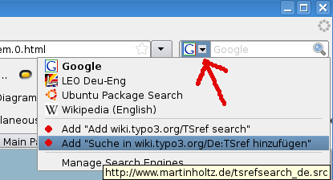
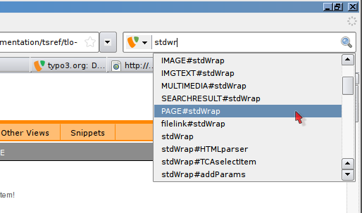
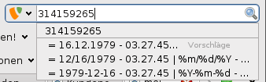
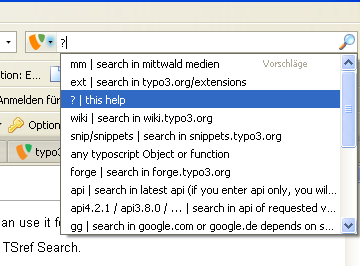

.. include:: /Includes.rst.txt

==========
OpenSearch
==========

.. container::

   notice - This information is outdated

   .. container::

.. container::

   notice - Note

   .. container::

      short reference: <TypoScript>, ext, wiki, forge, api, mm

.. container::

   Question:
   Does this work? The links are broken and the information has not been
   maintained for a while - Speters 2020-04-19

   .. container::

   *Please remove "{{Question}}" when the problem is solved. See*\ `all
   questions <https://wiki.typo3.org/Category:Wiki-Question>`__\ *[deprecated
   wiki link].*

.. container::

   Todo:
   When this page has been updated, the block "Browser Search" can be
   uncommented on
   `Template:Main_Page/SidebarMenu <https://wiki.typo3.org/Template:Main_Page/SidebarMenu>`__
   [deprecated wiki link] - Speters 2020-04-19

   .. container::

   *Please remove "{{Todo}}" when the problem is solved. See*\ `all
   todos <https://wiki.typo3.org/Category:Wiki-Todo>`__\ *[deprecated
   wiki link].*

.. _opensearch-1:

OpenSearch
==========

OpenSearch gives the possiblity to define the search-engine for your
`browser <https://wiki.typo3.org/Category:Browser>`__ [deprecated wiki
link]. You will know it from google or wikipedia, now you can use it for
TYPO3 related search.

If your Browser supports OpenSearch (IE and FF works) you can go to
http://www.martinholtz.de/index.php?id=219 [not available anymore] and
add the TSref Search.

The Search is in experimental status at this time, if you have a
suggestion, let us know:
https://forge.typo3.org/projects/show/team-docteam

You can use some prefixes like "forge" to search in forge.typo3.org or
"gg" to search in google. If you do not use a prefix you will be sent to
the wiki.typo3.org - search. But if your search term is in a list of
keywords (like
`IMAGE <https://docs.typo3.org/typo3cms/TyposcriptReference/ContentObjects/Image>`__,
`typolink <https://docs.typo3.org/typo3cms/TyposcriptReference/Functions/Typolink>`__
[not available anymore],
`stdWrap <https://docs.typo3.org/typo3cms/TyposcriptReference/Functions/Stdwrap>`__
[not available anymore]) you will be sent directly to the TSref Page.

|In this Example the search term "stdwr" was typed in. You get all
Objects and functions which has an property starts with "stdwr|

In this Example the search term "stdwr" was typed in. You get all
Objects and functions which has an property starts with "stdwr".

Using TSref Search
==================

If a keyword is found which is available on docs.typo3.org you will get
redirected there.

| 
| You can type in any TypoScript function or Object and you will be sent
  to the corresponding Wiki Page.

::

   # You type in
   IMAGE
   # then you will be sent to T3Doc:TyposcriptReference/ContentObjects/Image

   # You type in 
   stdWrap
   # then you will be sent to T3Doc:TyposcriptReference/Functions/Stdwrap [not available anymore]

So it is a shortcut for sending you to TSref/# that you typed in.

Searching in typo3.org/extensions/
----------------------------------

You can send a search request directly to typo3.org/extensions with the
prefix "ext".

::

   # You type in
   ext tt_news
   # will result in the same result as if you had typed in typo3.org/extensions/ search-box

Searching in wiki.typo3.org
---------------------------

The prefix "wiki" will search in wiki.typo3.org

Searching in forge
------------------

The prefix "forge" will search in forge.typo3.org

::

   # You type in
   forge docteam
   # will send the search request to forge.typo3.org

search in the api
-----------------

The prefix "api" will search in typo3.org/fileadmin/typo3api-4.0.0

::

   # You type in
   api typoLink

search in mittwald medien forum
-------------------------------

The prefix "mm" will send you to the mittwald medien forum (german only)

konvert timestamp in date format
--------------------------------

Just type in the timestamp and wait a few seconds for the suggestions.

|Opensearch pi suggestion.png|

which options are possible ?
----------------------------

::

   # Type only an
   ?
   # you will get all options as suggestion

|Screenshot: Type in ? and wait a second.|

At the moment these shortcuts are available:

::

   mm | search in mittwald medien
   ext | search in typo3.org/extensions
   ?/help/hilfe | this help
   wiki | search in wiki.typo3.org
   snip/snippets | search in snippets.typo3.org
   any typoscript Object or function f.e. "stdWrap" or "typolink"
   forge | search in forge.typo3.org
   api | search in latest api (if you enter api only, you will get an overview of available apis)
   api4.2.1 / api3.8.0 / ... | search in api of requested version
   gg | search in google.com or google.de depends on search-plugin language
   leo | search in dict.leo.org
   php | search in php.net/
   mysql | search on mysql.com
   wec | search on webempoweredchurch.com
   typo3forum | search in typo3forum.net
   list / list #listname# / f.e. list documentation ... | search in TYPO3 lists
   selfhtml | Search in selfhtml
   selfhtml css/html/js | suggestion of all properties available in selfhtml quickbar, f.e. selfhtml js onclick
   prototype | Search in prototype API on prototypejs.org/api/
   flickr | Search at flickr
   1234567890 | convert timestamp to an date - wait for suggestion!
   now() | the actual timestamp
   myip | your ip - wait for suggestion!
   ix | ix | search with ixquick
   comment | write a comment to this feature (this comment will be noticed and you will be sent to the wiki)

something is missing?
---------------------

perhaps, sometimes there will be a code completion via suggestion or a
documentation via suggestion?

The Search is in experimental status at this time, if you have a
suggestion, let us know:
https://forge.typo3.org/projects/show/team-docteam (and assign that
issue to Martin Holtz please:)

more info
=========

More about OpenSearch: http://en.wikipedia.org/wiki/OpenSearch

Opera and OpenSearch
====================

Currently the Opera browser does not support OpenSearch. But Opera
offers another possibility to add custom searches. To add the wiki to
your Opera do the following:

-  Go to any TYPO3 wiki page (you can do it on this one your reading at
   the moment)
-  Right click into the wiki search field on the left
-  Choose "Create Search..." from context menu
-  Enter a name for your search and a keyword
-  You are ready to use your new search
-  For testing your new search just open a new tab and enter in the
   address bar [your keyword][Space][your search] p.e. T3W TSref
-  FYI: This way you can create custom searches for nearly every page
   that has a search field. Just try it!

Help
====

You need help?

You are missing a function?

Something different?

Send me an E-Mail: typo3 @ martinholtz.de

