.. include:: /Includes.rst.txt
.. highlight:: php

======================================================
TemplaVoila/VideoTutorial/Overview with Image and Text
======================================================

HTML-Template
=============

First of all, you need some html for the content-element. I recommend to
take this for this tutorial:

::

   <!DOCTYPE html PUBLIC "-//W3C//DTD XHTML 1.0 Transitional//EN" "http://www.w3.org/TR/xhtml1/DTD/xhtml1-transitional.dtd">
   <html xmlns="http://www.w3.org/1999/xhtml">
   <head>
   <meta http-equiv="Content-Type" content="text/html; charset=utf-8" />
   <title>FCE - image with text</title>
   </head>
   <body>
       
Some Content - will be replaced with the image!

   </body>
   </html>

Give this HTML-Template a name and put it into the /fileadmin/templates
folder.

do the mapping
==============

To get started, go to the fileadmin and choose your template-folder.
There click on the icon of the templatefile we just created and wait
until the menu appears. Then choose the last entry which should be
"TemplaVoila".

|Overview fce 1.jpg|

Now you get into the TemplaVoila-Module. First of all, map the
root-element of this Flexible Content Element (FCE) which is the
body-tag of our template

|Overview fce 2.jpg|

Click on "map" and then you can choose wether you want to choose your
tag to map on a visual or a html-source view. I prefere the
HTML-Source-Mode to choose my mappings. So in the drop-down choose
"mode:html-source" as shown in this picture

|Overview fce 3.jpg|

Now click on the body-tag in the html-source and then choose Inner
(Exclude tag) and press "set" to store your root-mapping.

|Overview fce 4.jpg|

|Overview fce 5.jpg|

Now add a new field. This will make the editor able to choose an image
used in this element.

|Overview fce 6.jpg|

You can give the field every name you want, but i recommend to use the
same names i do because later i will post some TS which use exactly this
names. So please name this field "field_image" and click "add". Now a
mask appears where you can give the field a title and tell TV what kind
of a field this is. In this case it is an Element (Mapping Type) and the
Title (shown as Lable for the field in the backend) is Image. "The
Editing Type" is "Image field".

|Overview fce 7.jpg|

Now click "add" (or update) and then map this element.

|Overview fce 8.jpg|

Choose the div-container. This means, our image is put into this
container. This container makes us able to have class around the image
so we can use CSS to style it.

|Overview fce 9.jpg|

Here also use "Inner" as mapping type

|Overview fce 10.jpg|

As we want the editor to be able to choose a link for the image, we need
a possibility to enter a link in the backend. Therefore we create
another field called "field_link"

|Overview fce 11.jpg|

and name it "Link to page" and choose "link field" in the "editing type"

|Overview fce 11 1.jpg|

then click "add". This element does not have to have a mapping cause we
dont want to show it visual. We will combine image/link/text later.

Now we need some text displayed on the image and this should also be
used as Alt-Text for the image. so we add a field called "field_text"

|Overview fce 12.jpg|

and give it the title "Text on image (used as alt-tag too!) and choose
"plain input" as "Editing Type".

|Overview fce 11 2.jpg|

This, like the link, has not to mapped.

Now your mapping should look like this:

|Overview fce 13.jpg|

Click on "save as" choose a name for your FCE and select "content
element" as "Template Type" and save the FCE by clicking the "Create TO
and DS"-button. Now your Template is saved and you can find the FCE as
normal Contentelement when you create a new Content-Element on a page.

|Overview fce 14.jpg|

modifying the XML
=================

But we are not finished yet. We need to tell the FCE that the image is
combined with the text (which should displayed on the image), that this
text is also used as ALT-Tag and that the image is wrapped with the link
choosen in the element. Therefor we switch to the TV-Module and go to
our Storage-Folder and switch to the Tab "Flexible CE" and choose to
display the xml of our FCE.(click the pencil next to the " DS - Overview
Image" in the first row!)

|Overview fce 15.jpg|

Now search for the part where your image is build by using TYPOSCRIPT

|Overview fce 16.jpg|

Replace the original TYPOSCRIPT

::

   <TypoScript>
       10 = IMAGE
       10.file.import = uploads/tx_templavoila/
       10.file.import.current = 1
       10.file.import.listNum = 0
       10.file.maxW = 200
                               
       10.stdWrap.typolink.parameter.field = field_link
   </TypoScript>

with this one:

::

   <TypoScript>
   10= IMAGE
       10.file = GIFBUILDER
           10.file {
                   XY = 240,159
               
               quality = 100
                   format = jpg
               
           10 = IMAGE
           10.file.import = uploads/tx_templavoila/
           10.file.import.current = 1
           10.file.import.listNum = 0
               20 = TEXT
                   20.text.field= field_text
                   20.fontColor = #4b4b4d
                   20.fontFile = fileadmin/fonts/arialbd.ttf
                   
                   20.fontSize = 10                                                                
                   20.text.case = upper
                   20.offset = 14, 150               

           
             
           
               }
       10.stdWrap.typolink.parameter.field = field_link
       10.altText.field = field_text
   </TypoScript>

This makes the following: It creates a new image using the gifbuilder.
First we define the size and the format of the image. Then we choose the
(by the editor in the backend selected) image in the first layer (10 =
IMAGE) and the "field_text" in the second layer. This is put together in
an image and then is wrapped by the stdWrap.typolink (which is the link
selected by the editor) and the "field_text" as alt-Tag for the image.

Now save your xml and you should be done. Make sure, that you have the
choosen font (20.fontFile = ...) in the folder defined. Then clear your
cache and go to the page-module.

Now create a new Content-Element on a page and choose the one you
created as Content-Element-Type. The backend-mask should now look like
this:

|Overview fce 17.jpg|

Now you are done!

Choose what tags you need:

Keywords: TemplaVoila [outdated wiki link],tutorial [outdated wiki
link],mapping,TypoScript [outdated wiki link],xml

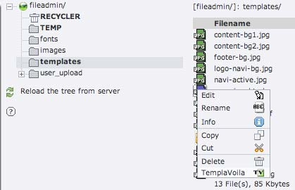
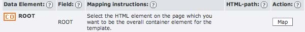
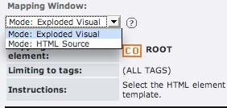
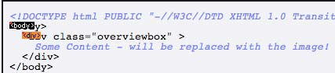
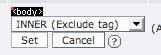
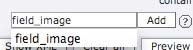
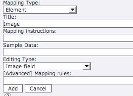
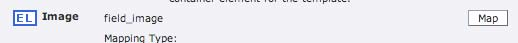
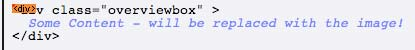
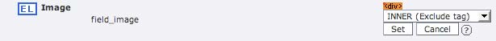
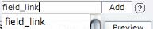
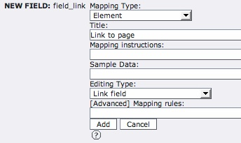
.. |Overview fce 12.jpg| image:: files/Overview_fce_12.jpg
   :target: /File:Overview_fce_12.jpg
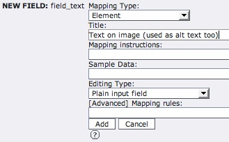
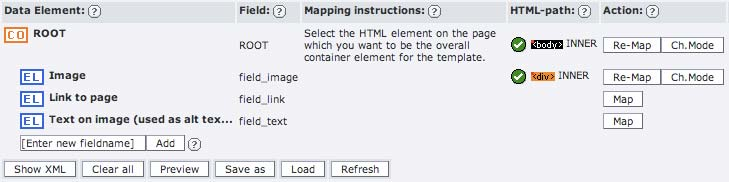
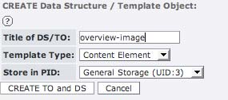
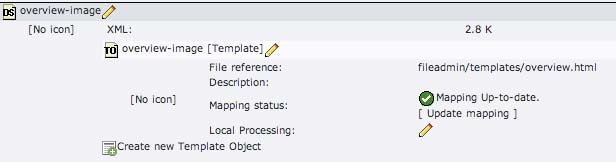
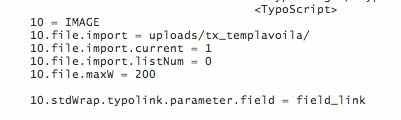
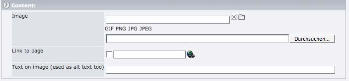
