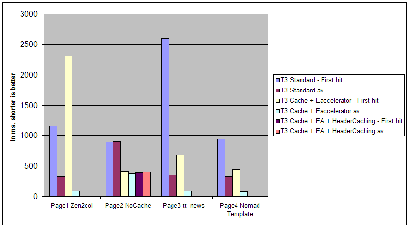

.. include:: /Includes.rst.txt
.. highlight:: php

==================
Performance tuning
==================

.. container::

   This page belongs to the Performance tuning for TYPO3 and database
   project (category Project [outdated wiki link])

<< Back to `Administrators <overview-administrator-manuals>`__ page

[edit] [outdated wiki link]

.. container::

   notice - This information is outdated

   .. container::

      Parts of this page may be outdated

There are many things to consider for a well performing TYPO3 site.

TYPO3 uses three applications to run - the HTTP server, PHP and the SQL
database. Each of these applications and the OS have large sets of
options.

To get best results, it is important to calibrate each of these three
applications to perform together as a strong team.

Besides the information on this page, there's an article about Testing
and tuning TYPO3 performance [outdated link] in the article section of
typo3.org.

First Steps
===========

Some of the optimization tasks listed in this article might take several
days and require fine tuning and testing. Before going that way you
might want to try two basic things that improve your website performance
regardless of setup. To install them you might need shell access to your
server, and in some cases superuser rights.

PHP Opcode Caching
------------------

PHP scripts are parsed into opcodes that are later run. Read more about
it in `Opcode_Cache <opcode-cache>`__.

Webserver proxy caching or static file caching
----------------------------------------------

No matter how much you tune your system, each request for a TYPO3 page
involves several SQL queries and heavy PHP logic. If your site has many
static pages that are rendered the same way several times, even with
TYPO3's cache you won't get a performance similar to static HTML files.
That's why you should either use a web server proxy cache [outdated wiki
link], or the static file cache extension
`nc_staticfilecache <https://extensions.typo3.org/extension/nc_staticfilecache/>`__.

Testing the performance
=======================

In order to understand the performance of your site and to analyze any
changes you make you should know ``ab``, the benchmarking tool from
Apache. By running ``ab -n 1000 -c 100 http://www.mysite.com/`` you are
asking ab to make 1000 requests, in 10 waves each with 100 concurrent
requests. Observing the processor time, memory and hard disk utilization
while performing ``ab`` benchmarks might help you understand where to
continue tuning.

Another tool a bit more realistic than ab would be **Siege** available
at http://www.joedog.org/siege-home/. This one can test more than one
URL (you can even use a text file)and have many options. It is still a
command line tool like ab.

A third tool would be the Java based **JMete**\ r
(http://jmeter.apache.org/) in conjuction with the "Stepping Thread
Group" extension
(https://code.google.com/p/jmeter-plugins/wiki/SteppingThreadGroup) you
can test scenari with increasing traffic (10 users then +10 each 10
seconds for example).

OS tuning
=========

Linux
-----

-  Turning off
   `accesstime <http://www.howtoforge.com/reducing-disk-io-by-mounting-partitions-with-noatime>`__
   recording can substantially reduce I/O load.

Linux [outdated wiki link] has a special mount option for file systems
called
`noatime <http://www.howtoforge.com/reducing-disk-io-by-mounting-partitions-with-noatime>`__
that can be added to each line that addresses one file system in
``/etc/fstab`` file. If a file system has been mounted with this option,
reading accesses to the file system will no longer update the atime
information associated with the file. Effectively, disabling noatime
eliminates a write operation when files are read, which can result in
measurable performance [outdated wiki link] gains. Note that the write
time of a file will still be updated each time the file is written to.
In our example below, we will set the noatime option to our ``/chroot``
file system.

Edit ``/etc/fstab`` and add the noatime option after the defaults option
in the line that refer to ``/chroot``:

``/dev/sda9          /chroot          ext3          defaults,noatime          1  2``

You don't need to reboot the system to make the change effective. Just
inform the file system about the modification by running the following
command:

.. container::

   Shell Script [outdated wiki link]

.. container::

   ::

      [root@typo3server] mount -oremount /chroot/

Then test your results with the following command:

.. container::

   Shell Script [outdated wiki link]

.. container::

   ::

      mount

If you see something like:
``/dev/sda9 on /chroot type ext3 (rw,noatime)``: congratulations!

-  `Tune disk performance using
   ``hdparm`` <http://gentoo-wiki.com/HOWTO_Use_hdparm_to_improve_IDE_device_performance>`__.
   In some cases this can improve disk throughput by a factor of 6 - 10!
-  Linux tuning guide [outdated link]

MySQL Tuning
============

Tools to analyse your MySQL performance
---------------------------------------

If you search Google for "mysql optimization", you get about 11.500.000
hits at the moment. A lot of those sites share good knowledge and
experience. But I didn't find one site which provided some out of the
box solutions to solve my specific performance problems. "So what?" you
might say, "Go snap your toolbox and search for the bottleneck".
Exactly! MySQL optimization is not trivial and demands benchmarking
while tuning in almost every case. Keep that in mind when websites
advise you how to tune your server parameters. This section is about
tools to analyse MySQL [outdated wiki link] performance.

Build-in tools
^^^^^^^^^^^^^^

MySQL itself comes with some very useful tools:

-  Slow Query Log

Helpful to find slow and therefore often CPU-consuming queries. To log
all queries which take more than two seconds, add the following lines to
your MySQL configuration file:

::

   long_query_time  =  2
   log-slow-queries = /var/log/mysql-slow.log

Get an overview about the number of slow queries with:

::

   mysql> SHOW STATUS LIKE '%slow_queries%';

-  MySQL status query

You can display a lot of statistics, counters, etc. with the following
query:

::

   mysql> SHOW STATUS;

You can gather tons of information with the ``SHOW`` query. The MySQL
Reference Manual [outdated link] is a good starting point to get an
overview.

-  EXPLAIN

Shows how MySQL processes a single query. Find out what indizes are
used, what kind of optimization MySQL did, etc.

For example:

::

   mysql> EXPLAIN SELECT DISTINCT tt_content.pid FROM tt_content
       -> WHERE tt_content.deleted=0 ORDER BY tt_content.tstamp DESC LIMIT 5\G
   *************************** 1. row ***************************
              id: 1
     select_type: SIMPLE
           table: tt_content
            type: index
   possible_keys: NULL
             key: parent
         key_len: 4
             ref: NULL
            rows: 3483
           Extra: Using where; Using temporary; Using filesort
   1 row in set (0.00 sec)

The chapter `Optimizing Queries with
EXPLAIN <http://dev.mysql.com/doc/refman/5.0/en/explain.html>`__ in the
MySQL docs will teach you how to read the EXPLAIN output.

3rd party tools
^^^^^^^^^^^^^^^

-  mytop

`mytop <http://jeremy.zawodny.com/mysql/mytop/>`__ is a nice tool to
monitor your DB utilization, similar to

::

   mysql> SHOW FULL PROCESSLIST;

but with the ability to constantly refresh the output (like *top* for
unix).

-  mysqlreport

Those guys from `hackmysql.com <http://hackmysql.com>`__ provide a set
of console tools to analyse MySQL. They have also good case studies, a
very detailed documentation and a section about query optimization.
Here's two of them:

`mysqlreport <http://hackmysql.com/mysqlreport>`__ prompts clearly
arranged status values of SHOW STATUS (memory usage, number of queries
done, ...)

mysqlsla [outdated link] analyses mysql logfiles, e.g. to easily find
slow queries. (indexed_search is a frequent offender.)

MySQL query cache
-----------------

What's the query cache good for?
^^^^^^^^^^^^^^^^^^^^^^^^^^^^^^^^

With the query cache turned on, MySQL stores SELECT queries and their
results inside the query cache (memory). Whenever the same query is
requested again, MySQL serves the result directly from the query cache.
This cuts down the response time for frequently used queries.

How to use it?
^^^^^^^^^^^^^^

| Set Query cache [outdated wiki link] to a value greater than 16M

To find out if query cache is available for your MySQL server, try:

::

   mysql> SHOW VARIABLES LIKE 'have_query_cache';
   +------------------+-------+
   | Variable_name    | Value |
   +------------------+-------+
   | have_query_cache | YES   |
   +------------------+-------+

If you get a return value of "Yes" query caching is available and you
may configure it.

Edit your MySQL configuration file (e.g. ``/etc/mysql/my.conf`` on
Debian, ``/etc/my.conf`` on RH types or ``my.ini`` on Win) and add the
following lines at section [mysqld]:

::

   # Enable caching
   query_cache_type = 1
   # Set query cache to 32 MB
   query_cache_size = 32M

If you have lots of different queries and lots of memory, choose a
higher value.

Benchmarking your query cache
^^^^^^^^^^^^^^^^^^^^^^^^^^^^^

One way to measure the effeciveness of your query cache, is the
*Hit:Insert ratio*. Compare the amount of queries, which have been
served from the query cache (*Hits*) with the amount of queries that
have been inserted into the query cache (*Inserts*). To get this value,
use mysqlreport (as mentioned above) or follow the example below (after
some warm up time of your database):

::

   mysql> SHOW STATUS LIKE '%Qcache%';
   +-------------------------+----------+
   | Variable_name           | Value    |
   +-------------------------+----------+
   | ...                     |          |
   | Qcache_hits             | 94192865 |
   | Qcache_inserts          | 12896776 |
   | ...                     |          |
   +-------------------------+----------+

   mysql> SELECT 94192865 DIV 12896776;
   +-----------------------+
   | 94192865 DIV 12896776 |
   +-----------------------+
   |                     7 |
   +-----------------------+

The ratio in this example is 7:1, which means seven of eight SQL SELECT
statements are served from the cache. The higher this ratio is, the more
effective is your query cache.

Spending more memory for the query cache might lead to a lower ratio,
because rarely used queries have better chance to stay inside the cache
without being hit. Once again: tuning MySQL is not trivial and needs
some good reading and time for benchmarking.

More docs on the query cache can be found in the developer zone at
mysql.com:
http://dev.mysql.com/tech-resources/articles/mysql-query-cache.html
http://dev.mysql.com/doc/refman/5.0/en/query-cache.html [outdated link]

or follow the explanations in the mysqlreportguide [outdated link]

PHP Tuning
==========

Output Buffering
----------------

To increase IIS' performance make sure to set output_buffering=On in
php.ini. Changed from output_buffering=4096 to output_buffering=On
increased throughput by factor 5.

apache benchmark (ap -n 100 -c10) before and after:

-  Requests per second: 0.48 [#/sec] (mean)
-  Requests per second: 2.14 [#/sec] (mean)

See http://bugs.php.net/bug.php?id=28524

Informal Tests with Eaccelerator in 2006
----------------------------------------

*By Patrick Gaumond*

I've done a small test to see the direct influence of few tricks to see
their impact. So you see what effect an accelerator [outdated wiki link]
has.

+---------+---------+---------+---------+---------+---------+---------+
|         | T3      | T3      | T3      | T3      | T3      | T3      |
|         | S       | S       | Cache + | Cache   | Cache + | Cache + |
|         | tandard | tandard | EA      | +EA     | EA +    | EA +    |
|         | First   | Average | First   | Average | Header  | Header  |
|         | hit     |         | hit     |         | Caching | Caching |
|         |         |         |         |         | First   | Average |
|         |         |         |         |         | hit     |         |
+---------+---------+---------+---------+---------+---------+---------+
| Page1   | 1152    | 332     | 2309    | 90      | 0       | 0       |
| Zen2col |         |         |         |         |         |         |
+---------+---------+---------+---------+---------+---------+---------+
| Page2   | 894     | 900     | 408     | 375     | 397     | 400     |
| NoCache |         |         |         |         |         |         |
+---------+---------+---------+---------+---------+---------+---------+
| Page3   | 2598    | 350     | 680     | 88      | 0       | 0       |
| tt_news |         |         |         |         |         |         |
+---------+---------+---------+---------+---------+---------+---------+
| Page4   | 935     | 325     | 439     | 81      | 0       | 0       |
| Nomad   |         |         |         |         |         |         |
| T       |         |         |         |         |         |         |
| emplate |         |         |         |         |         |         |
+---------+---------+---------+---------+---------+---------+---------+

|T3-Performance-Patrick.png|

Time is in milliseconds (ms.).

| 
| **Pseudo-Server**

| Windows XP SP2, 1GB RAM
| IBM Thinkpad T30
| Apache 2.054 Windows, PHP 5.04
| Eaccelerator 0.93 (EA in the chart)

| 
| **Notes**

| The first 3 pages done with the template Zen2Col [outdated wiki link]
| Page 4 is made with the Nomad template
| First column is always first hit
| The time in millisecond come from TYPO3 debug parsetime
| Cache emptied and Apache restarted between each configuration changes.
  Eaccelerator not restarted from page1 to page2, etc.
| Simulatestatic =1
| The client asking for pages was on another Windows XP PC running
  Firefox.

**Attention:** This was the first time I tried using Cache-Headers from
3.8 and I probably had an Apache misconfiguration. This page will be
updated once I'm more experienced with config.sendCacheHeaders=1 ...

**Few observations**

TYPO3 internal cache permit to save 600 ms. (2/3) of the processing
time. See page 1 vs. 2.

Eaccelerator cut the processing time to another 2/3 (330 ms. to 90 ms.)
so even the non-T3-cached page2 goes from 900 to 375 ms.

Quick conclusion is that `Eaccelerator <http://eaccelerator.net>`__ is a
must ! (note: In the case of Linux (debian) its not stable (still beta);
at least for PHP4 `Turck
MMcache <http://turck-mmcache.sourceforge.net/index_old.html>`__ is
still very robust) (`eAccelerator Windows
binaries <http://www.sitebuddy.com/PHP/Accelerators/eAccelerator_windows_binaries_builds>`__)

--------------

Testing TYPO3 caching vs. [FE][pageCacheToExternalFiles] in 2006
----------------------------------------------------------------

*By Patrick Gaumond* *Using the same hardware as the previous test and
ApacheBench with this line:*\ **
ab -n 100 -c 10 http://127.0.0.1/typo34rc2/index.php [outdated link]**

**Note:** I've received additional info of the feature by Kasper and it
was not meant to enhance individual page rendering time. The feature was
created mostly to avoid the gigantic cache of typo3.org That's it: 80
000 records (1GB) MySQl table. In future realease it will be disable by
default.

+-----------------------+-----------------------+-----------------------+
|                       | .. container::        | .. container::        |
|                       |                       |                       |
|                       |    Request per        |    Time per request   |
|                       |    seconds            |    (mean, in ms)      |
|                       |    (mean)             |    Lowest is better   |
|                       |    Higher is better   |                       |
+-----------------------+-----------------------+-----------------------+
| [FE][page             | .. container::        | .. container::        |
| CacheToExternalFiles] |                       |                       |
| = 0                   |    9.54               |    104.8              |
| | [                   |                       |                       |
| FE][compressionLevel] |                       |                       |
|   = 3                 |                       |                       |
|                       |                       |                       |
| Eaccelerator = Yes    |                       |                       |
+-----------------------+-----------------------+-----------------------+
| [FE][page             | .. container::        | .. container::        |
| CacheToExternalFiles] |                       |                       |
| = 1                   |    9.34               |    107.1              |
| | [                   |                       |                       |
| FE][compressionLevel] |                       |                       |
|   = 3                 |                       |                       |
|                       |                       |                       |
| Eaccelerator = Yes    |                       |                       |
| (same settings as     |                       |                       |
| position #4)          |                       |                       |
+-----------------------+-----------------------+-----------------------+
| [FE][page             | .. container::        | .. container::        |
| CacheToExternalFiles] |                       |                       |
| = 1                   |    9.19               |    108.7              |
| | [                   |                       |                       |
| FE][compressionLevel] |                       |                       |
|   = 0                 |                       |                       |
|                       |                       |                       |
| Eaccelerator = Yes    |                       |                       |
+-----------------------+-----------------------+-----------------------+
| [FE][page             | .. container::        | .. container::        |
| CacheToExternalFiles] |                       |                       |
| = 1                   |    7.07               |    141.5              |
| | [                   |                       |                       |
| FE][compressionLevel] |                       |                       |
|   = 3                 |                       |                       |
|                       |                       |                       |
| Eaccelerator = Yes    |                       |                       |
+-----------------------+-----------------------+-----------------------+
| No TYPO3 cache        | .. container::        | .. container::        |
| (                     |                       |                       |
| index.php?no_cache=1) |    2.66               |    376.6              |
| | [FE][page           |                       |                       |
| CacheToExternalFiles] |                       |                       |
|   = 1                 |                       |                       |
| | [                   |                       |                       |
| FE][compressionLevel] |                       |                       |
|   = 3                 |                       |                       |
|                       |                       |                       |
| Eaccelerator = Yes    |                       |                       |
+-----------------------+-----------------------+-----------------------+
| [FE][page             | .. container::        | .. container::        |
| CacheToExternalFiles] |                       |                       |
| = 1                   |    2.34               |    427.4              |
| | [                   |                       |                       |
| FE][compressionLevel] |                       |                       |
|   = 3                 |                       |                       |
|                       |                       |                       |
| Eaccelerator = NO     |                       |                       |
+-----------------------+-----------------------+-----------------------+
| [FE][page             | .. container::        | .. container::        |
| CacheToExternalFiles] |                       |                       |
| = 0                   |    2.34               |    426.6              |
| | [                   |                       |                       |
| FE][compressionLevel] |                       |                       |
|   = 3                 |                       |                       |
|                       |                       |                       |
| Eaccelerator = NO     |                       |                       |
+-----------------------+-----------------------+-----------------------+
| [FE][page             | .. container::        | .. container::        |
| CacheToExternalFiles] |                       |                       |
| = 1                   |    2.24               |    447.1              |
| | [                   |                       |                       |
| FE][compressionLevel] |                       |                       |
|   = 0                 |                       |                       |
|                       |                       |                       |
| Eaccelerator = NO     |                       |                       |
+-----------------------+-----------------------+-----------------------+

So it looks that at least on Windows, Apache 2 and TYPO3 4.0RC2, the new
[FE][pageCacheToExternalFiles] doesn't have an impact on a small
installation like the one used for my test.

If you have any comments or did similar tests with different results,
please write to me at patrick[at]typo3quebec.org .

Reverse proxies
===============

Reverse proxies decrease the load of the web server by caching
dynamically generated content.A nice example of a reverse proxy server
is `nginx <http://nginx.net/>`__.

To find logging inconsistencies, try mod_rpaf [outdated link] for apache
2 or mod_realip for apache 1.3

If you can't afford to use one of the above solutions, you might want to
try the
`nc_staticfilecache <https://extensions.typo3.org/extension/nc_staticfilecache/>`__
extension. It saves TYPO3 cacheable pages as static HTML files and
serves these directly using Apache's ``mod_rewrite``.

Articles on performance and TYPO3
=================================

-  https://typo3.org/fileadmin/t3n/articles/t3n_60_pi_s_with_typo3.pdf
   [outdated link]
-  https://typo3.org/documentation/article/testing-and-tuning-typo3-performance/
   [outdated link]

This article is also available in german:
http://www.yeebase.com/fileadmin/t3n/archiv/06-02/t3n_06-02_frisiert_und_aufgebohrt.pdf

-  https://typo3.org/documentation/article/using-cache-control-headers-in-typo3/
   [outdated link]
-  http://typo3bloke.net/post-details/eight_performance_tips_for_your_typo3_web_site/
   [outdated link]
-  `45+ Ultimate Ways to Speed Up Your TYPO3
   Performance <https://t3terminal.com/blog/typo3-speed-performance/>`__

TYPO3 performance Extensions
============================

-  `dmc_highperformance <https://extensions.typo3.org/extension/dmc_highperformance/>`__
   (Outdated? Last update: 22.08.2007)
-  Static File Cache - `Extension
   Home <http://typo3.fruit-lab.de/typo3-extensions/fl-staticfilecache.html>`__,
   `fl_staticfilecache <https://extensions.typo3.org/extension/fl_staticfilecache/>`__
   (Outdated? Last update 11.10.2009)
-  `nc_staticfilecache <https://extensions.typo3.org/extension/nc_staticfilecache/>`__
-  `mda_autopublish <https://extensions.typo3.org/extension/mda_autopublish/>`__
   (Outdated? Last update: 28.06.2005)
-  `kb_quickbe <https://extensions.typo3.org/extension/kb_quickbe/>`__
   (Outdated? Last update: 25.06.2006)
-  `kb_quickfe <https://extensions.typo3.org/extension/kb_quickfe/>`__
   (Outdated? Last update: 22.07.2006)
-  `typo3profiler <https://extensions.typo3.org/extension/typo3profiler/>`__

Related discussions in the TYPO3 community
==========================================

-  [TYPO3-dev] Testing TYPO3 caching vs. [FE][pageCacheToExternalFiles]
   `[1] <http://lists.typo3.org/pipermail/typo3-dev/2006-March/017105.html>`__
   TYPO3-dev [outdated link]

About: Comparison of DB and filesystem caching within TYPO3. *(Date:
3-4/2006)*

-  [TYPO3-dev] Typo3 Performance
   `[2] <http://lists.typo3.org/pipermail/typo3-dev/2007-February/022271.html>`__
   TYPO3-dev [outdated link]

About: DB indices for TYPO3 tables, Description of Celkos nested sets
for the Pagetree, testing+tuning tips. *(Date: 2-3/2007)*

-  [TYPO3-dev] Indexed Search Performance Improvement
   `[3] <http://lists.typo3.org/pipermail/typo3-dev/2007-February/022302.html>`__
   TYPO3-dev [outdated link]

About: Using the FULLTEXT feature of (MySQL) MyISAM tables for
indexed_search. *(Date: 2-3/2007)*

-  [TYPO3-dev] Typo3 Database design question (optimization / indices)
   `[4] <http://lists.typo3.org/pipermail/typo3-dev/2006-March/016967.html>`__
   TYPO3-dev [outdated link]

About: DB indices for TYPO3 tables. *(Date: 3/2006)*

-  [TYPO3-dev] Speeded up TYPO3 by 500% :)
   `[5] <http://lists.typo3.org/pipermail/typo3-dev/2006-June/018817.html>`__
   TYPO3-dev [outdated link]

About: Bernhard Kraft introducing his extension kb_quickindex, an
experiment which adds basic file-caching support to index.php

-  ...

Relations
=========

-  `MySQL configuration <mysql-configuration>`__ - *the basics: prepare
   for installation, settings, rights management*
-  TYPO3.org - improvements#better performance [outdated wiki link]

Links
-----

Articles by Dmitry Dulepov:

-  Eight performance tips for your TYPO3 web site [outdated link]
-  Cheap ways to increase performance of a TYPO3 web site [outdated
   link]
-  Search [outdated link] Dmitry's site for possible new articles

Articles by anders und sehr:

-  TYPO3 Performance Optimierung durch CDN [outdated link]

Blog/Article by NITSAN:

-  `30 Tips & Tricks for Optimum TYPO3 Website Speed and
   Performance <http://www.nitsan.in/blog/post/30-tips-tricks-for-optimum-typo3-website-speed-and-performance/>`__

Current Project Members
=======================

Wishlist
--------

-  List of typical TYPO3 performance traps, e.g. $TSFE->set_no_cache().
-  In-depth studies, e.g. how to find different types of bottlenecks and
   how to get rid of them. For example: find slow PHP statements with
   profiler, slow DB queries with DB logs, etc.

