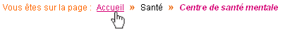

.. include:: /Includes.rst.txt

========
Rootline
========

lib.rootline
============

Full TS
=======

::

   lib.rootline=COA
   lib.rootline {
   10 = HMENU
   10 {
    special = rootline
    special.range = 0|-1
    1 = TMENU
        # no unneccessary scripting.
        1.noBlur = 1
        # Current item should be unlinked
        1.CUR = 1
        1.target = _self
        1.wrap = 
 | 

        1.NO {
            stdWrap [not available anymore].field = title
            ATagTitle.field = nav_title // title
            linkWrap = ||*| >> |*|
            }
        # Current menu item is unlinked
        1.CUR {
            stdWrap.field = title
            linkWrap = ||*| >> |*|
            doNotLinkIt = 1
            }
       }
   }

Another example using Constants, different languages and full CSS Design options
================================================================================

Rendering
---------

|Rootline.gif|

CONSTANT
--------

::

   # cat=rootline/ctext/a; type=string; label=rootline class
   rootlineClass = navigation

   # cat=rootline/ctext/a; type=string; label=rootline class
   rootlineMsgClass = navigationMsg

   # cat=rootline/ctext/a; type=string; label=rootlineActif class
   rootlineActifClass = navigationActif

   # cat=rootline/ctext/c; type=string; label=rootline texte lang0
   rootlineMsg_0 = Vous êtes sur la page : 

   # cat=rootline/ctext/d; type=string; label=rootline texte lang1
   rootlineMsg_1 = You are on page : 

   # cat=rootline/ctext/e; type=string; label=rootline texte lang2
   rootlineMsg_2 = Sie sind auf der Seite :

SETUP
-----

::

   ## Rootline [BEGIN]

   lib.rootline = HMENU

   # Rootline type
   lib.rootline.special = rootline
   //area of rootline, where I start, where I stop. ex: -6|-1
   lib.rootline.special.range = rootline

   # Premier niveau, textuelle
   lib.rootline.1 = TMENU
           
   ## DEFINE LANGUAGE [BEGIN]

   ## DEFAULT LANGUAGE
           lib.rootline.1.wrap = <ul ><li >{$rootlineMsg_0}</li> |</ul>

           
   ## LANGUAGE 1
       [globalVar = GP:L = 1]
           lib.rootline.1.wrap = <ul ><li >{$rootlineMsg_1}</li> |</ul>

       [global]
   ## LANGUAGE 2
       [globalVar = GP:L = 2]
           lib.rootline.1.wrap = <ul ><li >{$rootlineMsg_2}</li> |</ul>

       [global]
       

   ## DEFINE LANGUAGE [END]

   lib.rootline.1.NO{
       linkWrap = <li >|</li> 
       subst_elementUid = 1
   }

   //effects on current element
   lib.rootline.1.CUR = 1
   lib.rootline.1.CUR {
       linkWrap = <li >|</li>
       doNotLinkIt = 1
   }

   ## Rootline [END]

EXTERNAL CSS
------------

::

      #rootline li{
           list-style:none;
           float:left; 
           margin:0 7px 0 0px;     
       }
       
       #rootline li.navigationMsg{ color:#FF6700;}
       
       
       
       #rootline li.navigation{
           padding-right: 16px;
           background:url(path/to/my/image) no-repeat right; /* list-style between elements */
       }
       
       #rootline li.navigation a{
           color:#000000;
           text-decoration:none;
       }
       
       #rootline li.navigation a:hover{
           color:#D60075;  
           text-decoration:underline;  
       }
       
       #rootline li.navigationActif{
           color:#D60075;
           text-decoration:none;
           font-weight:bold;
           font-style:italic;      
       }   

           .clearBoth{clear:both;}

