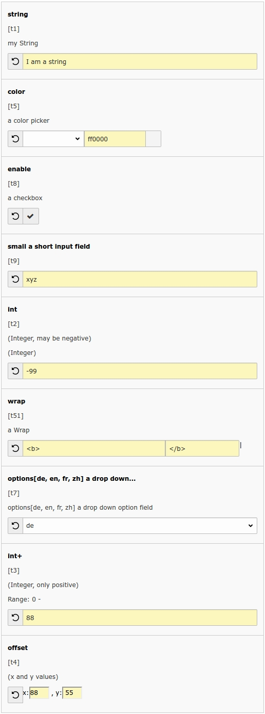

.. include:: /Includes.rst.txt
.. highlight:: php

====================
TypoScript Constants
====================

.. container::

   This page belongs to the `Core Team <core-team>`__ (category Core
   Team [outdated wiki link])

.. container::

   notice - Reviewer needed

   .. container::

      Change the **{{review}}** marker to **{{publish}}** when all parts
      are reviewed (e.g. TypoScript). info [outdated wiki link]

| This page is a draft designed to be included in the Core manual:
  TypoScript Syntax and In-depth Study

--------------

*To insert at the end of Chapter 1.2. Syntax, before "Includes"*

Constants
=========

Declaring and using constants
-----------------------------

TypoScript constants are declared in the "Constants" field of a
TypoScript template. Example:

.. container::

   TS TypoScript [outdated wiki link]

.. container::

   ::

      styles.content.imgtext.maxW = 600

To use that constant in a TypoScript template, use the following syntax:

.. container::

   TS TypoScript [outdated wiki link]

.. container::

   ::

      temp.myimage.width = {$styles.content.imgtext.maxW}

Since constant declarations are TypoScript, you can use comments,
operators and conditions.

Preparing for the constant editor
---------------------------------

The Web > Template module contains the Constant Editor. With this editor
it is possible to modify TypoScript constants in a user-friendly way.
But only properly declared constants will readily appear in the Constant
Editor. Here is an example:

.. container::

   TS TypoScript [outdated wiki link]

.. container::

   ::

      #cat=content,basic/cImage/a_maxw1; type=int+; label= Max Image Width: Maximum width in pixels a block of images inserted as content is allowed to consume.
      styles.content.imgtext.maxW = 600

| Let's check this syntax in depth: "cat" is the category of the
  constant definition. Several categories may be assigned though one is
  the standard. The category can consist of category, subcategory and a
  sorting
| "type" is the type of the constant and defines of what nature the
  input file will be
| "label" is a description label for the constant

Constant Types
^^^^^^^^^^^^^^

.. container::

   .. container::

      |Constant editor.png|

      .. container::

         .. container::

Example:

.. container::

   TS TypoScript [outdated wiki link]

.. container::

   ::

      # cat=basic/xxx/010; type=string; label= string: my String
      t1 = I am a string

      # cat=basic/xxx/011; type=int; label= int: (Integer, may be negative)
      t2 = -99

      # cat=basic/xxx/012; type=int+; label= int+: (Integer, only positive)
      t3 = 88

      # cat=basic/xxx/013; type=offset; label= offset: (x and y values)
      t4 = 88, 55

      # cat=basic/xxx/010; type=color; label= color: a color picker
      t5 = ff0000

      # cat=basic/xxx/011; type=wrap; label= wrap: a Wrap
      t51 = <b>|</b>

      # cat=basic/xxx/011; type=options[de,en,fr,zh]; label= options[de, en, fr, zh] a drop down option field
      t7 = de

      # cat=basic/xxx/010; type=boolean; label= enable: a checkbox
      t8 = 1

      # cat=basic/xxx/010; type=small; label= small a short input field
      t9 = xyz

Additionally a user defined field exists: "user" and a "comment" field
for non-editable values exist.

Constant categories
^^^^^^^^^^^^^^^^^^^

The constants main category defines the page in the constant editor on
which the constant will appear The following constant categories are
predefined:

-  'basic': Important constants for the template layout. For example:
   dimensions, image files and feature flags. You almost always want to
   configure these constants.
-  'menu': Menu setup. This includes font files, sizes, background
   images. Depends on the menu type.
-  'content': All constants related to the display of page content
   elements
-  'page': General configuration like meta-tags, link targets, etc.
-  'advanced': Configures advanced, rarely used functions.
-  'all': A list of all constants.

Custom main categories can be defined for extensions. Example:

.. container::

   TS TypoScript [outdated wiki link]

.. container::

   ::

      # cat=plugin.tx_lot3blog/color/210; type=color; label=Tagcloud Minimum Color

The subcategories define the section in which the constant should
appear. The following standard subcategories exist:

-  'enable': Enable features
-  'dims': Dimensions: widths, heights, pixels
-  'file': Files
-  'typo': Typography
-  'color': Colors
-  'links': Links and targets
-  'language': Language specific constants

Furthermore the following content-element-specific subcategories exist:

cheader, cheader_g, ctext, cimage, cbullets, ctable, cuploads,
cmultimedia, cmailform, csearch, clogin, csplash, cmenu, cshortcut,
clist, cscript, chtml

You can add your own subcategories by defining them the following way:

.. container::

   TS TypoScript [outdated wiki link]

.. container::

   ::

      ## Define custom categories
      # customsubcategory=your_subcat_name=LLL:EXT:your_extension/locallang.xlf:subcat_name

      ## Use your new subcategory
      plugin.your_extension {

          # cat=plugin.your_extension_mainconfig/subcat_name/0010; type=int+; label= Set your PID
          PID =
      }

Source: (German) TYPO3 Konstanten im Konstanteneditor anzeigen [outdated
link]

Helpful Links
=============

-  `Innovative TYPO3 Constant Editor -
   2.0 <https://t3terminal.com/blog/typo3-constant-editor/>`__

