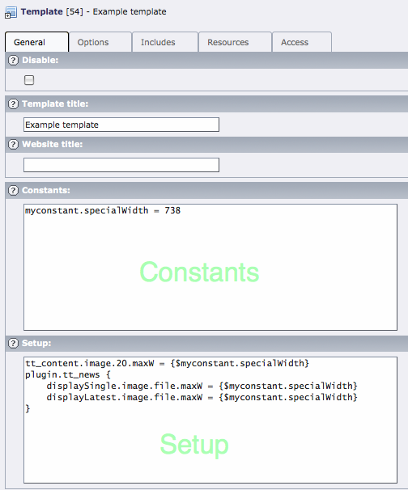
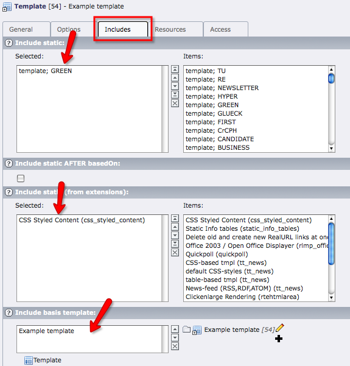

.. include:: /Includes.rst.txt
.. highlight:: php

====================
TypoScript Templates
====================

.. container::

   This page belongs to the Core Team [outdated wiki link] (category
   Core Team [outdated wiki link])

.. container::

   notice - Draft

   .. container::

      Change the **{{draft}}** marker to **{{review}}** when you need a
      reviewer for text and TypoScript. info [outdated wiki link]

To be inserted into TSref, as the first chapter just after the
Introduction.

--------------

==============================
TypoScript templates structure
==============================

Overview
========

A TypoScript ("TS") template has two parts: the actual script (this is
called the TypoScript "setup") and TypoScript constants. This is
described in further detail in doc_core_ts. It can also include other TS
templates from various sources. Lastly it can reference external files
containing TS.

This flexible but complex architecture can make it hard to get an
overview of an actual template structure. To help with this, TYPO3
provides some useful tools.

Organizing templates
====================

A good practice to maintain templates is to create libraries of
TypoScript code in a template and then include that template in another
one to reuse the code. This is the point of static templates.

Elements of a template
======================

As said above, a TypoScript template is divided into constants and
setup. The constants are simple values meant that can be substituted
inside the setup part. Constants are generally defined either to
emphasize some important values or to provide a single definition for
values that are used in multiple places. The setup part is the actual
template.

| |Constant and setup.png|

Constants are described in more depth in "TypoScript Syntax and In-depth
Study" (extension: doc_core_ts).

A template can also call on other templates of two kinds: so called
"static" templates and "basis" templates. Static templates are
predefined by the TYPO3 core or by extensions. Those provided by the
core are stored in the table ``static_templates``. They can be included
from the "Include static" field (see screenshot below). Static templates
may also be provided by extensions. They are selected in the "Include
static (from extensions)" field.

| Basis templates are just usual template records, included into other
  template records. They make it possible to split your TypoScript into
  smaller chunks to be included as needed.

| |Includes.png|

File inclusions
===============

Both the constants and the setup fields can refer to an external file
containing TypoScript by using the ``<INCLUDE_TYPOSCRIPT>`` directive.
An example:

.. container::

   TS TypoScript [outdated wiki link]

.. container::

   ::

      <INCLUDE_TYPOSCRIPT: source="FILE: fileadmin/typoscript.ts">

| More details about\ ``<INCLUDE_TYPOSCRIPT>`` can be found "TypoScript
  Syntax and In-depth Study" (extension: doc_core_ts).

Tools
=====

| The Web > Template module contains four tools that can greatly help
  with the creation and management of TypoScript templates. They are
  described hereafter.

Constants Editor
----------------

**TODO**

Info/Modify
-----------

**TODO**

TypoScript Object Browser
-------------------------

**TODO**

Template Analyzer
-----------------

**TODO**

Helpful Links
=============

-  `Myth: TypoScript Is a Scripting
   Language <https://t3terminal.com/blog/typoscript/>`__
-  `Innovative TYPO3 Constant Editor -
   2.0 <https://t3terminal.com/blog/typo3-constant-editor/>`__

