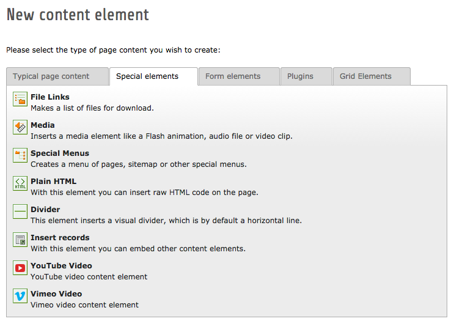
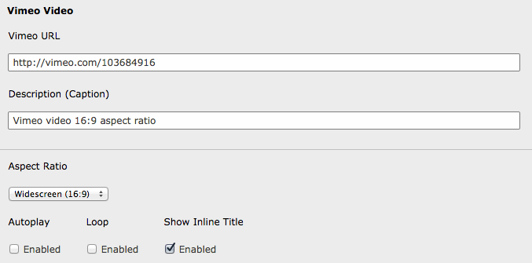

.. include:: /Includes.rst.txt
.. highlight:: php

==============
EXT/vimeovideo
==============

.. container::

   **Content Type:** Extension Documentation [outdated wiki link] (find
   more extensions in the Extension Repository [outdated link])
   Using the Wiki for extension documentation is no longer recommended.
   You should add the documentation in the git repository of your
   extension and render it on docs.typo3.org or on the Git hoster, e.g.
   GitHub, see `How to document an
   extension <https://docs.typo3.org/m/typo3/docs-how-to-document/master/en-us/WritingDocForExtension/Index.html>`__
   and `Publish your
   extension <https://docs.typo3.org/m/typo3/reference-coreapi/master/en-us/ExtensionArchitecture/PublishExtension/Index.html>`__.

.. container::

   +-----------------------------------+-----------------------------------+
   | **Extension detail information**  |                                   |
   | `                                 |                                   |
   | vimeovideo <https://extensions.ty |                                   |
   | po3.org/extension/vimeovideo/>`__ |                                   |
   +-----------------------------------+-----------------------------------+
   |                                   | Easy to use Vimeo video content   |
   |                                   | element. Pure CSS responsive      |
   |                                   | template.                         |
   +-----------------------------------+-----------------------------------+
   | **documentation state**           | **stable [outdated wiki link]**   |
   |                                   | |document state list|             |
   |                                   | `licence                          |
   |                                   | OCL <http:/                       |
   |                                   | /www.opencontent.org/openpub/>`__ |
   +-----------------------------------+-----------------------------------+
   | **forgeproject**                  |                                   |
   +-----------------------------------+-----------------------------------+
   | **mailinglist**                   |                                   |
   +-----------------------------------+-----------------------------------+
   | usergroups                        | |list of usergroups| forAdmins,   |
   |                                   | forDevelopers, forIntermediates   |
   +-----------------------------------+-----------------------------------+
   | author(s)                         | `Brightside – TYPO3 development   |
   |                                   | comp                              |
   |                                   | any <https://t3brightside.com>`__ |
   +-----------------------------------+-----------------------------------+
   | TER category                      | fe                                |
   +-----------------------------------+-----------------------------------+
   | dependency                        | TYPO3 8.7, fluid_styled_content   |
   +-----------------------------------+-----------------------------------+

<< Back to Extension manuals [outdated wiki link] page

[edit] [outdated wiki link]

===========
Vimeo Video
===========

Adds new content element for Vimeo videos.

Screenshots & Examples
======================

-  

   .. container::

      .. container::

         .. container::

            |image1|

      .. container::

         Add new content element

-  

   .. container::

      .. container::

         .. container::

            |image2|

      .. container::

         Content element options

In action:

-  https://kickstart8.t3brightside.com/content/ [outdated link]

Features
========

-  Video and options overview in page module
-  Regular content element settings (title, access, etc.)
-  Parses all kinds of dirty Vimeo links, youtu.be included
-  Video caption
-  Video aspect ratio (16:9, 4:3, configurable). Multiple aspect ratios
   and different video sizes on same page.
-  Autoplay (on/off)
-  Show info (on/off)
-  Loop (on/off)
-  Customizable HTML & TS template

Requirements
============

-  TYPO3 8.7 LTS
-  fluid_styled_content

Install
=======

-  Install the extension
-  Include default TypoScript template and modify if needed.
-  If using Gridelements Vimeovideo should be installed after installing
   Gridelements not before (initial save may not work otherwise, if
   adding via new content wizard)

TypoScript Setup
================

::

   Check typo3conf/ext/vimeovideo/Configuration/TypoScript/setup.ts

Page TSConfig
=============

For changing the settings default values change **Page > Properties >
Resources > Page TSConfig**.

**Note!** Field values will be saved into the database and affect newly
added content elements only. So, if you need to do it sitewise it's
better idea to manipulate the TypoScript and or HTML template.

::

    TCAdefaults.tt_content {
      tx_vimeovideo_autoplay = 0
      tx_vimeovideo_loop = 0
      tx_vimeovideo_title = 0
    }
    # 0 = off, 1 = on
    TCEFORM.tt_content.tx_vimeovideo_ratio.addItems {
      0 = HD Video Standard (16:9)
      1 = Standard TV (4:3)
    }
    # Check TypoScript and HTML template for adding more ratios

.. |document state list| image:: files/Info.gif
   :target: /Template:Extension
.. |list of usergroups| image:: files/Usergroups.gif
   :target: /File:Usergroups.gif

