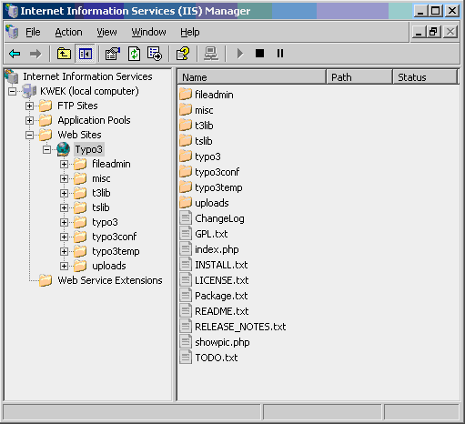
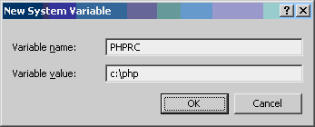

.. include:: /Includes.rst.txt

=======
Windows
=======

<< Back to `Getting
started <https://wiki.typo3.org/wiki/index.php?title=Getting_started&action=edit&redlink=1>`__
[not available anymore] page

`[edit] <https://wiki.typo3.org/wiki/index.php?title=Windows&action=edit&section=0>`__
[deprecated wiki link]

.. container::

   notice - This information is outdated

   .. container::

      While some details may still apply in specific situations, this
      page was written for packages of TYPO3 that are no longer current.

+-----------------------+-----------------------+-----------------------+
| | *Main editor:*      |                       | .. container::        |
|   Michael Perkhofer   |                       |                       |
| | *Major revision:*   |                       |    notice - Open      |
|   ## ### ####         |                       |    Content License    |
| | *Minor revision:*   |                       |                       |
|   See page's Last     |                       |    .. container::     |
|   modified date       |                       |                       |
| | *Prerequisites:*    |                       |       This document   |
|   Typo3 version,      |                       |       is published    |
|   Extensions, other   |                       |       under the `Open |
|   documents           |                       |       Content         |
|                       |                       |       Licens          |
|                       |                       | e <http://www.opencon |
|                       |                       | tent.org/openpub/>`__ |
|                       |                       |       The content is  |
|                       |                       |       related to      |
|                       |                       |       TYPO3 - a       |
|                       |                       |       GNU/GPL         |
|                       |                       |       CMS/Framework   |
|                       |                       |       available from  |
|                       |                       |       `typo3.org      |
|                       |                       | <http://typo3.org>`__ |
+-----------------------+-----------------------+-----------------------+

.. container::

   notice - Draft

   .. container::

      Change the **{{draft}}** marker to **{{review}}** when you need a
      reviewer for text and TypoScript.
      `info <https://wiki.typo3.org/Help:Contents#Teamwork_-_draft_review_publish_delete_merge_outdated>`__
      [deprecated wiki link]

Introduction
============

TYPO3 is platform independent, so you also can use it under Windows.

Ready to run
============

Xampp
-----

This is easy to install. See http://www.apachefriends.org/en/xampp.html

WampServer
----------

Easy to install and easy to use. See http://www.wampserver.com/en/

MoWeS Portable
--------------

MoWeS Portable (Former WOS Portable) is a free WAMP package (GNU/GPL)
that needs no installation and runs out of box. TYPO3 and ImageMagick
are already included.
(http://www.chsoftware.net/en/useware/mowes/mowes.htm [not available
anymore])

MySQL
=====

Download the Windows binaries of MySQL from http://www.mysql.com and
install MySQL on your Windows PC.

As of April 2005, choose any version >= 4.0.18 and < 4.1.x. An altered
syntax definition in MySQL 4.1.x no longer allows **DEFAULT '0'
autoincrement** values, which is heavily used in TYPO3 and almost every
extension that was built using the kickstarter.

Please note when using MySQL 5.x you need to set the sql-mode to MYSQL40
(edit your my.cnf or my.ini):

::

   #Set the SQL mode to strict
   #sql-mode="STRICT_TRANS_TABLES,NO_AUTO_CREATE_USER,NO_ENGINE_SUBSTITUTION"
   sql-mode="MYSQL40"

or if you have another databases on your server and you don't want to
change global MySQL configuration you can add this line to localconf.php

::

   $TYPO3_CONF_VARS['SYS']['setDBinit'] = 'SET sql-mode="MYSQL40"';

ImageMagick
===========

In TYPO3, ImageMagick (along with GD) is used to dynamically create or
manipulate images.

As stated in several documents, ImageMagick 4.2.9 is still the preferred
version, since it seems to be faster and more stable and also supports
the creation of GIF. This is why you may download such a precompiled
Win32 binary.

Nevertheless, many users reported that they happily use ImageMagick in
its recent version 6.x. So you may also download your copy from
www.imagemagick.org
`[1] <http://www.imagemagick.org/script/download.php>`__.

Over IIS6, It's neccesary create an application pool with "Local
Service" identity and associate it to the Web Server. That identity
gives full access rights to the CGIs and apps in that Web Server. That
gives the same security level than IIS5.

Edit: If you receive "error forking ... ImageMagick\convert.exe" etc. in
the Typo3-Installer (Image Processing-Setup), you shold read this:
`Windows security <https://wiki.typo3.org/Windows_security>`__
[deprecated wiki link]

Webserver
=========

Apache
------

Configure Apache to use PHP
^^^^^^^^^^^^^^^^^^^^^^^^^^^

Apache runs on every operating system including Windows. Most Web
hosting companies have Apache. It is easier to configure Apache and most
of the Web server examples on the Internet are for Apache.

IIS
---

IIS is shipped with some of the available Windows versions:

-  Windows 2000 - IIS 5
-  WindowsXP Pro - IIS 5.1
-  Windows Server 2003 - IIS 6
-  Windows Server 2008 - IIS 7
-  Windows Server 2008 R2 - IIS 7.5 (x64 only)

To install IIS, go to add/remove windows components in your control
panel and check to see that all of IIS is installed.

.. container::

   .. container::

      |TYPO3 run by IIS|

Configure IIS to use PHP
^^^^^^^^^^^^^^^^^^^^^^^^

Get PHP
'''''''

-  Download the php version of your choice, from http://www.php.net. If
   you want to get a specific version, use
   http://www.php.net/get/php-4.3.11-Win32.zip/from/a/mirror [not
   available anymore] and substitute 'php-4.3.11' with the the version
   you need. There might be the case, that Windows binaries for some
   specific extension, are not available for recent php versions.
-  Extract the content of the ZIP file to your harddisk (e.g. to c:\)
   and rename the 'php-4.3.10-Win32' folder (your version number might
   be different) to 'php', so we have our php installation in 'c:\php'.

The php.ini
'''''''''''

Go to c:\php, make a copy of 'php.ini-recommended', and name that copy
'php.ini'. After that, open 'php.ini' in a text editor. We shold keep a
look at the following values. Enter the correct directory, where the PHP
extensions are located:

::

   ; Directory in which the loadable extensions (modules) reside.
   extension_dir = "C:\php\ext\"

Fill out these settings, if you want to use the php mail() functions:

::

   [mail function]
   ; For Win32 only.
   SMTP = localhost
   smtp_port = 25

   ; For Win32 only.
   ;sendmail_from = me@example.com

To make use of the 'iconv' functions, needed for proper handling of
charsets (UTF-8, etc), and to use the curl functions, necessary if you
want to access the TER through a proxy server, we should enable the
apropiate PHP extensions. php_mbstring.dll and php_exif.dll might be
interesting to you, if you want to use some of the indexing features,
which the Digital Asset Management (DAM) extension offers.

::

   extension=php_mbstring.dll
   extension=php_exif.dll
   extension=php_iconv.dll
   extension=php_curl.dll

Additionally, its **very important to copy the \*.DLL's from
c:\php\dlls** to somewhere, where Windows can find them (e.g.
c:\windows\system32). These DLLs are important for some of the
extensions. (EDIT: Should this be the DLLs from the c:\php directory or
the c:\php\ext directory, because there's no such thing as a c:\php\dlls
directory? Also, isn't this in stark contrast to what's being said just
below this that nothing should be in the windows system folder? And
further, "Windows" does not need to find these extensions, PHP does, and
provided that extension_dir is properly setup in php.ini, why would PHP
need these dlls to be in the winnt\system32 dir for instance?)

Enviroment variables
''''''''''''''''''''

Two enviroment variables have to be set up. The usage of these variables
make it easier to maintian and update our PHP installation, because no
DLLs and no config file have to be in the Windows System Dir - everthing
to run PHP is located in our PHP install directory.

-  Go to Control Panel and open the System icon (Start -> Control Panel
   -> System)
-  Go to the Advanced tab
-  Click on the 'Environment Variables' button
-  Look into the 'System Variables' pane
-  Find the Path entry (you may need to scroll to find it)
-  Double click on the Path entry
-  Enter your PHP directory at the end, including ';' before (e.g.
   ;C:\php) and press 'OK'
-  Press 'new' and add a new variable, named 'PHPRC', with the value of
   your PHP install dir, eg. c:\php

.. container::

   .. container::

      |Add PHPRC variable|

PHP ISAPI plugin
''''''''''''''''

-  Start the Microsoft IIS Management Console (Control
   Panel=>Administrative Tools=>Internet Services Manager.
-  Then right click on your Web server node (this will most probably
   appear as 'Default Web Server'), and select 'Properties'.
-  Under 'Home Directory', click on the 'Configuration' button. Add a
   new entry to the Application Mappings. Use the path to the
   php4isapi.dll / php5isapi.dll as the Executable, supply .php as the
   extension, leave 'Method exclusions' blank, and check the 'Script
   engine' checkbox.
-  (If using IIS 6.0 on Windows 2003 it is also neccesary to either
   "allow all unknown ISAPI Extensions" or configure php as a separate
   allowed extension (safer) in "Web service Extensions".)
-  Stop IIS completely (NET STOP iisadmin)
-  Start IIS again (NET START w3svc)

Rewriting URLs
^^^^^^^^^^^^^^

To use TYPO3's 'simulate_static' or the 'RealURL' extension, we need an
IIS substitution for Apache's mod_rewrite. There is a number of ISAPI
plugins for IIS, which offer such a functionality:

-  http://iirf.codeplex.com/\ **(Ionic's Isapi Rewrite Filter is free)**
-  http://www.isapirewrite.com\ **(lite version is free)**
-  http://www.jdhodges.com/log/1309 [not available anymore]
-  http://www.opcode.co.uk/components/rewrite.asp
-  http://www.iisrewrite.com/en/ [not available anymore]
-  Microsoft solution included in **IIS 6.0** Resource Kit : RemapURL,
   available under
   http://www.microsoft.com/downloads/details.aspx?FamilyId=56FC92EE-A71A-4C73-B628-ADE629C89499&displaylang=en

Ionic's Isapi Rewrite Filter
''''''''''''''''''''''''''''

Ionic's Isapi Rewrite Filter (IIRF) is free. It's installation is really
simple.

-  Download zip file.
-  Extract iirf.dll to directory where IUSR_<hostname> has appopriate
   rights.
-  In the same directory create IirfGlobal.ini file and put this lines
   to it

::

   RewriteFilterPriority HIGH
   NotifyLog ON
   RewriteEngine ON

-  In root directory of your TYPO3 installation create iirf.ini file and
   put this lines into it

::

   RewriteEngine ON
   StrictParsing OFF
   UrlDecoding OFF

   StatusUrl /iirfStatus 

   RewriteLog X:\LogFiles\iirf\iirf
   RewriteLogLevel 1

   # Config for TYPO3
   RewriteRule ^/(typo3|typo3temp|typo3conf|t3lib|tslib|fileadmin|uploads|showpic\.php)$ - [L]
   RewriteRule ^/(typo3|typo3temp|typo3conf|t3lib|tslib|fileadmin|uploads|showpic\.php)/.*$ - [L]
   RewriteCond %{REQUEST_FILENAME} !-f
   RewriteCond %{REQUEST_FILENAME} !-d
   RewriteRule (.*) /index.php [I,U,L,QSA]

-  Instal iirf.dll as ISAPI filter in IIS.
-  Restart IIS.
-  Add this line into your localconf.php

::

   $TYPO3_CONF_VARS['SYS']['requestURIvar'] = '_SERVER|HTTP_X_REWRITE_URL';

About iirf ini.

-  StatusUrl - this sets addres of status page
   (http://localhost/iirfStatus [not available anymore]).
-  RewriteLogLevel - for debugging set logging level to 3, for
   production set it to 1.

| Now turn on url rewriting in TS and clean TYPO3 cache.
| I tested IIRF on IIS 5, 5.1 and 6. TYPO3 4.3.2 works great with IIRF
  v2.0.1.15 with IIS 5.1.
| Remember to forbid in URLScan using ini files by IIS.

ISAPI_Rewrite
'''''''''''''

I will explain how to setup ISAPI_Rewrite, since the lite version is
free and this lite version offers the functionality needed for the
necessary rewriting.

#. Download the plugin from http://www.isapirewrite.com and install it.
   The setup automatically installs the ISAPI plugin to our IIS.
#. Open isapi_rewrite's config file 'httpd.ini', which can be found in
   the isapi_rewrite installation directory (eg.
   c:\programme\Helicon\ISAPI_Rewrite) with your favourite text editor.
#. There are different ways, how to rewrite the URLs and feed them to
   TYPO3. I will explain the one, which comes nearest to that, what the
   original mod_rewrite version does - rewrite all requests to index.php
   and let the php script find out, what the client originaly wanted by
   parsing server variables.

::

   [ISAPI_Rewrite]

   RewriteCond HOST: www\.your-virtual-host\.tld
   RewriteRule ^/[^/]*\.html$  /index\.php [L]

ISAPI_Rewrite saves original path info + query string before any
manipulation on the URL in HTTP header named *HTTP_X_REWRITE_URL*. This
is really bad for us, because TYPO3 knows nothing about this variable. A
fix for that is done, by modifying one php file of the core: In TYPO3
3.7's *class.t3lib_div.php*, line 2567 make the following changes:

::

   case 'REQUEST_URI':
       // Typical application of REQUEST_URI is return urls, forms submitting to itselt etc. Eg:   returnUrl='.rawurlencode(t3lib_div::getIndpEnv('REQUEST_URI'))
       if (!$_SERVER['REQUEST_URI'])   {   // This is for ISS/CGI which does not have the REQUEST_URI available.
           //return '/'.ereg_replace('^/','',t3lib_div::getIndpEnv('SCRIPT_NAME')).
           //  ($_SERVER['QUERY_STRING']?'?'.$_SERVER['QUERY_STRING']:'');
           return $_SERVER['HTTP_X_REWRITE_URL'];
       } else return $_SERVER['REQUEST_URI'];

If you dont use TYPO3 3.7, the modification might be different.

In TYPO3 version 4.1 some code was added to class.t3lib_div.php to
handle this. Unfortunately it´s still buggy in 4.1 and 4.1.1. See:
https://forge.typo3.org/issues/17285

If this is too complicated to you, you can also use the following
httpd.ini for isapi_rewrite, which does rewriting to make simple
simulate_static work.

::

   [ISAPI_Rewrite]

   #Rewrite pages with parameters
   {{Tag|RewriteRule}} /(.*)\.(\d+)\.(\d+)\.html\?(.*) index\.php\?id=$2&type=$3&$4 [U]

   #Rewrite pages without parameters
   RewriteRule /(.*)\.(\d+)\.(\d+)\.html index\.php\?id=$2&type=$3 [U]

This rewrites eg. Testpage.10.0.html
(<title>.<page_id>.<page_type>.html) to
index.php?page_id=<page_id>&type=<page_type>

--------------

I found that the above suggestions did not work for RealURL, IIS 6 and
Typo3 3.8. The HTTP_X_REWRITE_URL was the rewritten URL, not the
original one. RealURL was expecting something like
'french/resources.html'.

I got it to work using a rule

::

   RewriteRule (.*).html  /index.php?iisrewr=$1\.html [L]

in the httpd.ini for ISAPI Rewrite. This puts the whole path, minus the
domain name into the query string. Then I modified
class.t3lib_div.php.getIndpEnv() as follows...

::

   case 'REQUEST_URI':
       if (strpos($_SERVER['HTTP_X_REWRITE_URL'], 'iisrewr')) {
            $startPos = strpos($_SERVER['HTTP_X_REWRITE_URL'], 'iisrewr') + strlen('iisrewr') + 1; //+1 for is for leading /
            return substr($_SERVER['HTTP_X_REWRITE_URL'], $startPos);
       }
       else if (!$_SERVER['REQUEST_URI'])  { // This is for ISS/CGI which does not have the REQUEST_URI available.
       //if (!$_SERVER['REQUEST_URI']) { // This is for ISS/CGI which does not have the REQUEST_URI available.
            return '/'.ereg_replace('^/','',t3lib_div::getIndpEnv('SCRIPT_NAME')).
              ($_SERVER['QUERY_STRING']?'?'.$_SERVER['QUERY_STRING']:'');
       } else return $_SERVER['REQUEST_URI'];
       break;

Note: If you have your own plugins or extensions from the TER that use
get variables in the query string, you need to make sure they are
included in the RealURL configuration for the postVarSets. The hack I
proposed does not work with URLs like /blah/dood.html?someVar=678 with
the get vars appended to the .html part of the URL.

--------------

I got it work with the solution above (IIS 6, Typo3 3.8) but my code in
class.t3lib_div.php.getIndpEnv() looks a little bit different:

::

   case 'REQUEST_URI':
       if (strpos($_SERVER['REQUEST_URI'], 'iisrewr')) {
           $startPos = strpos($_SERVER['REQUEST_URI'], 'iisrewr') + strlen('iisrewr') + 1; //+1 for is for leading /
           return substr($_SERVER['REQUEST_URI'], $startPos);
       } else if (!$_SERVER['REQUEST_URI'])  { 
           return '/'.ereg_replace('^/','',t3lib_div::getIndpEnv('SCRIPT_NAME')).
           ($_SERVER['QUERY_STRING']?'?'.$_SERVER['QUERY_STRING']:'');
       } else return $_SERVER['REQUEST_URI'];
   break;

This is my httpd.ini:

::

   ...
   RewriteRule (.*\.html)\??(.*)  /index.php?iisrewr=$1?&$2 [L]

I use this:

::

   # Stop rewrite processing if we are in the typo3/ directory
   RewriteRule ^/(typo3/|typo3temp/|typo3conf/|t3lib/|tslib/|fileadmin/|uploads/)(.*) /$1$2 [L]
   RewriteRule (.*\.html)\??(.*)  /index.php?iisrewr=$1?&$2 [L]

--------------

After unsuccessfully fiddling with many variations of the above on my
web host who has ISAPI_REWRITE installed I finally settled on the
following:

No source modifications seem to be required under v4.1.1 (the above
error seems to be fixed)

Include the following line in your localconf.php file:

::

   $TYPO3_CONF_VARS['SYS']['requestURIvar'] = '_SERVER|HTTP_X_REWRITE_URL';

Redefine the 404 error page on your server to be the root index.php file

This does two things: Makes the functionality work without needing to
ensure your host has the REWRITE module installed, and actually seems to
work better than the above because ISAPI_REWRITE has a major deficiency
compared to MOD_REWRITE in that it cannot tell if a file actually exists
on the server so you have to manually tell it which files and
directories not to process (typo3, etc). Under this scheme, the server
will automatically send the user the index.php only if the requested
file does not exist on the server, which is the behaviour we want.

IIS specific locales in your Typoscript Templates
-------------------------------------------------

Language Strings are different on Windows systems from Unix systems.
Typoscripts config.locale_all value has to be set with the corresponding
locale, you want to use (eg. 'german' instead of 'de_DE'). A list of
Language Strings can be found at:
http://msdn.microsoft.com/library/default.asp?url=/library/en-us/vclib/html/_crt_language_strings.asp
[not available anymore]

eAccelerator
============

e\ `accelerator <https://wiki.typo3.org/Category:Accelerator>`__
[deprecated wiki link] increases performance of PHP scripts by caching
them in precompiled state, so that the overhead of compiling is almost
completely eliminated. eAccelerator 's home is http://eaccelerator.net,
Windows binaries can be found at
http://dev.freshsite.pl/php-accelerators/eaccelerator.html [not
available anymore] or `eAccelerator Windows
binaries <http://www.sitebuddy.com/PHP/Accelerators/eAccelerator_windows_binaries_builds>`__

Download the DLL suitable to your PHP version, rename it to
*eaccelerator.dll* and copy it to the *extensions* directory of your PHP
installation. After this step, open the
`php.ini <https://wiki.typo3.org/Category:Php.ini>`__\ *[deprecated wiki
link]* and add the following lines:

::

   extension="eaccelerator.dll"
   eaccelerator.shm_size="0"
   eaccelerator.cache_dir="c:\tmp\eaccelerator"
   eaccelerator.enable="1"
   eaccelerator.optimizer="1"
   eaccelerator.check_mtime="1"
   eaccelerator.debug="0"
   eaccelerator.filter=""
   eaccelerator.shm_max="0"
   eaccelerator.shm_ttl="0"
   eaccelerator.shm_prune_period="0"
   eaccelerator.shm_only="0"
   eaccelerator.compress="1"
   eaccelerator.compress_level="9"

Be sure that the directory *C:\tmp* exists (of course you can choose a
different directory for cached php files, just enter the your choice to
the php.ini file). You can gain more speed, if you deactivate
compression, by setting *eaccelerator.compress="0"*.

After that, you have to restart IIS, to get eAccelerator running.

Prepare TYPO3
=============

As you might already know, TYPO3 installations consist of 2 parts (more
at https://typo3.org/download/):

-  The Core (It is the source; Where should we put the install? - Read
   about symlinks below, it is one possible solution, whatever suits
   one!)
-  one of the available Packages.

So, as a first step go to http://www.typo3.org and download the Core and
one Package, you like, e.g. the Dummy-Package, which contains a minimum
TYPO3 installation. These two packages should be glued together using
Unix Symbolic Links. Since we use Windows, we have to get around this.
We have three(?) choices here:

Consolidate a TYPO3 package with a Core package
-----------------------------------------------

(This is choice one, which excludes implementation of choice two) Just
copy all the files from the (Dummy) package directory, into the Core
directory. This methode is fast and easy, but has the drawback, that
updating and maintaining the Core will be very complicated.

Now you should be having working typo3, but empty one because of dummy
package.

Use Windows symbolic links
--------------------------

(Choice number two is using `symbolic
links <https://wiki.typo3.org/Category:Symbolic_links>`__ [deprecated
wiki link])

NEW: 16th of December 2005. Once again, quote "TYPO3 uses symlinks to
offer a much easier management of future maintenance and upgrades. With
symlinks your are able to install the TYPO3 core once and point to it
from every new website you create. That way as soon as a new version of
the TYPO3 core is out you simply upgrade the core and all the websites
are upgraded at the same time.". This new section assumes knowledge of
DOS and general computer knowledge so one can understand what is going
and eventually adjust it, if needed. Plus, please read 'rem' lines
within the batch files, there are comments and helpful hints as well!
Here are two separate batch files I've created. BTW, you need linkd from
http://www.dynawell.com/reskit/microsoft/win2000/linkd.zip [not
available anymore] (as a replacement for junction from sysinternals).
I've used linkd instead of junction. The batch scripts assume that
you've placed the [petri.co.il/download_free_reskit_tools.htm linkd
freeware] in the WINNT directory. For XP or 2003 change WINNT for
WINDOWS. I've used on winxp sp2. Also, this doesnt cover apache2, php
4.4.1 and MySQL 4.1.14 installation and configuration. I assume you have
it all set. Now:

My directory structure within c:/www:

::

   15.12.2005  01:37    <DIR>          .
   15.12.2005  01:37    <DIR>          ..
   15.12.2005  01:57    <DIR>          t3_dummy
   14.12.2005  14:25    <DIR>          t3_quickstart
   14.12.2005  22:55    <DIR>          t3_quickstart_celo
   15.12.2005  01:57    <DIR>          t3_source
   14.12.2005  22:29    <DIR>          t3_testsite
   13.12.2005  21:50    <DIR>          temp

t3_source is the directory where typo3 3.81 source was extracted. this
is what I have initially inside t3_source directory:

::

   15.12.2005  01:57    <DIR>          .
   15.12.2005  01:57    <DIR>          ..
   12.11.2005  12:40            93.913 ChangeLog
   12.11.2005  12:40            18.007 GPL.txt
   12.11.2005  12:40                 0 index.php
   12.11.2005  12:41             4.987 INSTALL.txt
   12.11.2005  12:40               459 LICENSE.txt
   13.12.2005  23:06    <DIR>          misc
   12.11.2005  12:40             2.001 NEWS.txt
   12.11.2005  12:41               647 Package.txt
   12.11.2005  12:41               403 README.txt
   12.11.2005  12:41             1.212 RELEASE_NOTES.txt
   12.11.2005  12:40                 0 showpic.php
   15.12.2005  01:27    <DIR>          t3lib
   12.11.2005  12:40            53.959 TODO.txt
   15.12.2005  01:57    <JUNCTION>     tslib
   15.12.2005  01:57    <DIR>          typo3

to get this structure, use this batch file (name it for example
typo3_source.bat):

::

   rem winxp sp2,typo3 3.8.1,apache 2.0.55,php 4.4.1
   rem You can use this batch script regardless of your current path (as long as you
   rem are in the same partition as the web root folder of apache)!
   rem This batch file should be executed once
   rem and that is after unpacking typo3 source tar.gz archive
   rem Assumed root web folder is \www
   rem %1 indicates the name of the folder where typo3 source data reside
   rem %1 that would be the folder where you've extracted typo3
   rem example of execution: typo3_source t3_source
   rem that means you *must* have extracted typo3 3.81 source into /www/t3_source
   rem otherwise it wont be successfull!

   ECHO Typo3 source in \www\%1
   cd \www\%1
   del tslib
   linkd tslib typo3\sysext\cms\tslib
   cd typo3
   del t3lib
   del gfx
   del thumbs.php
   linkd t3lib ..\t3lib
   linkd gfx ..\t3lib\gfx
   copy ..\t3lib\thumbs.php thumbs.php
   cd t3lib\fonts
   rem copy arial.ttf and verdana.ttf to here
   rem or copy
   del arial.ttf
   del verdana.ttf
   copy %SystemRoot%\fonts\arial.ttf .
   copy %SystemRoot%\fonts\verdana.ttf .

NOTE: This batch file should be executed once.

Second phase: get the dummy package and extract it. this is what i have
inside \\www\t3_dummy after extraction:

::

   15.12.2005  01:57    <DIR>          .
   15.12.2005  01:57    <DIR>          ..
   12.11.2005  12:40                46 clear.gif
   15.12.2005  01:58    <DIR>          fileadmin
   12.11.2005  12:40            18.361 index.php
   12.11.2005  12:41             4.987 INSTALL.txt
   15.12.2005  01:57    <JUNCTION>     media
   12.11.2005  12:41               608 Package.txt
   12.11.2005  12:41             8.118 README.txt
   12.11.2005  12:41             1.212 RELEASE_NOTES.txt
   12.11.2005  12:40             7.883 showpic.php
   15.12.2005  01:57    <JUNCTION>     t3lib
   15.12.2005  01:57    <JUNCTION>     tslib
   15.12.2005  01:57    <JUNCTION>     typo3
   15.12.2005  01:58    <DIR>          typo3conf
   15.12.2005  01:58    <DIR>          typo3temp
   15.12.2005  01:57    <JUNCTION>     typo3_src
   15.12.2005  01:58    <DIR>          uploads
   12.11.2005  12:40             4.957 _.htaccess

notice, there are 5 junctions, to get that use this batch file:

::

   rem winxp sp2,  typo3 3.8.1, apache 2.0.55, php 4.4.1
   rem You can use this batch script regardless of your current path (as long as you
   rem are in the same partition as the web root folder of apache)!
   rem This batch file should be executed for each newly created site
   rem Assumed root web site folder \www
   rem %1 indicates the name of the folder for the newly created site
   rem %1 that would be the folder where you've extracted dummy package
   rem %2 is the name of the typo3 source directory - assumed that is a directory in /www
   rem example of execution: typo3_source t3_dummy typo3_3.81_source
   rem that means you *must* have extracted typo3 3.81 source into /www/t3_source
   rem and typo3 3.81 dummy into /t3_dummy otherwise it wont be successfull!

   ECHO Website name %1
   cd \www\%1
   del typo3_src
   linkd typo3_src ..\%2
   del tslib
   del t3lib
   del typo3
   del media
   del index.php
   del showpic.php

   linkd typo3 ..\%2\typo3
   linkd tslib ..\%2\tslib
   linkd t3lib ..\%2\t3lib
   linkd media ..\%2\tslib\media

   copy tslib\index_ts.php index.php
   copy tslib\showpic.php showpic.php

NOTE, VERY Imporant: Do not delete Junction directories from explorer or
any other GUI based tool in windows because Junction is a hardlink
(linux/unix type of), which means if you delete a junction directory you
will ALSO delete the directory it is linked with, unlike shortcut type
of link you are used to. To delete a junction, go to the proper folder,
for example type:

::

   cd \www\t3_dummy
   linkd typo3_src /D

and now typo3_src, which is a junction to the t3_source within the dummy
site is deleted, and yet t3_source remains untouched.

Please, test it further and do not fully rely on this one. It is made as
it is inorder to ease your life and help you to get thru the
configuration process. If still having troubles look for more either on
the official site or thru the newsgroups/mailinglists. Hope you have
fun ;-)

Older help: Read this document
`Symlinks_on_Windows <symlinks-on-windows>`__ These are 2 differents
batch that you can copy-paste into a new text file and rename as you
like. Put the batch file in your main TYPO3 directory before running it.

The batch consider that you place the `junction
freeware <http://www.sysinternals.com/Utilities/Junction.html>`__ [not
available anymore] in the WINNT directory. For XP or 2003 change WINNT
for WINDOWS.

| 
| Quickstart Batch

::

   rem We recursively create a junction
   "C:\WINNT\junction.exe" -s .\typo3\t3lib\ .\t3lib\
   "C:\WINNT\junction.exe" -s .\typo3\gfx\ .\t3lib\gfx\
   "C:\WINNT\junction.exe" -s .\tslib\ .\typo3\sysext\cms\tslib\

   rem here we copy the fonts instead of symlinking them
   copy .\t3lib\fonts\vera.ttf .\t3lib\fonts\verdana.ttf
   copy .\t3lib\fonts\nimbus.ttf .\t3lib\fonts\arial.ttf

   rem copy thumbs.php to typo3
   copy .\t3lib\thumbs.php .\typo3\thumbs.php

| 
| This gives the following directory structure:

::

   21.04.04 10:00 <DIR> .
   21.04.04 10:00 <DIR> ..
   21.04.04 09:48 <DIR> misc
   21.04.04 09:49 <DIR> t3lib
   21.04.04 10:00 <JUNCTION> tslib
   21.04.04 10:00 <DIR> typo3

For the Dummy batch use this one:

::

   rem We recursively create a junction

   "C:\WINNT\junction.exe" -s .\typo3_src\ ..\typo3_src\
   "C:\WINNT\junction.exe" -s .\t3lib\ ..\typo3_src\t3lib\
   "C:\WINNT\junction.exe" -s .\typo3\ ..\typo3_src\typo3\
   "C:\WINNT\junction.exe" -s .\tslib\ ..\typo3_src\typo3\sysext\cms\tslib\
   "C:\WINNT\junction.exe" -s .\media\ ..\typo3_src\tslib\media\

This gives the following directory structure:

::

   21.04.04 10:00 <DIR> .
   21.04.04 10:00 <DIR> ..
   20.04.04 23:16 clear.gif
   21.04.04 09:44 <DIR> fileadmin
   20.04.04 23:16 index.php
   21.04.04 10:00 <JUNCTION> media
   20.04.04 23:16 showpic.php
   21.04.04 10:00 <JUNCTION> t3lib
   21.04.04 10:00 <JUNCTION> tslib
   21.04.04 10:00 <JUNCTION> typo3
   21.04.04 09:44 <DIR> typo3conf
   21.04.04 09:44 <DIR> typo3temp
   21.04.04 10:00 <JUNCTION> typo3_src
   21.04.04 09:44 <DIR> uploads

| 
| Even better:

http://www.pearlmagik.com/winbolic/

Use Winbolic, it has a GUI and is really nice to navigate and
create/remove NTFS junctions/Shell links.

NOT Using Windows symbolic links
--------------------------------

Choice number three(?). It is an other much more easier way to make it
works in windows.

1. Move ./typo3_src/typo3 to ./typo3. **This should be the only folder
you have to move.**

2. Setting ReWrite in apache. (EDIT: Is there any way to do this in IIS?
If not, then that should be specified.)

::

   RewriteRule ^typo3/gfx/(.*)$ typo3_src/t3lib/gfx/$1 [L]
   RewriteRule ^typo3/thumbs.php(.*)$ typo3_src/t3lib/thumbs.php$1 [L]
   RewriteRule ^media/(.*)$ typo3/sysext/cms/tslib/media/$1 [L]
   RewriteRule ^showpic\.php$ typo3/sysext/cms/tslib/showpic.php [L]
   RewriteRule ^tslib/(.*)$ typo3/sysext/cms/tslib/$1 [L]
   RewriteRule ^(.*/?t3lib)/(.*)$ typo3_src/t3lib/$2 [L]

3. Create index.php

::

   <?php
    include('typo3/sysext/cms/tslib/index_ts.php');
   ?>

4. Open typo3_src/index.php, typo3/init.php, typo3_src/t3lib/thumbs.php.
replace a few path constant(e.g. t3lib and tslib)

You can keep the folder structure almost unchanged, and you can make it
work and safe. Much more easier to maintance and using with your
SVN/CVS.

I have tried to keep typo3_src/typo3 static, but failed. A lot of
foldar/path discovery depends on it. Moving it is the easiest way to do.

Appendix
========

